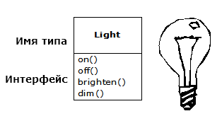

# Введення в об'єкти
 
Виникненням комп'ютерної революції ми зобов'язані машині. Тому наші мови програмування намагаються бути ближче до цієї машини.
 
Але в той же час комп'ютери не стільки механізми, скільки засоби посилення думки («велосипеди для розуму», як любив говорити Стів Джобс), і ще один засіб самовираження. В результаті інструменти програмування все менше схиляються до машин і все більше тяжіють до наших голів, так само як і до інших форм вираження людських прагнень, як-то: література, живопис, скульптура, анімація і кінематограф. Об'єктно-орієнтоване програмування (ООП) - частина перетворення комп'ютера в засіб самовираження.
 
Ця глава познайомить вас з основами ООП, включаючи розгляд основних методів розробки програм. Вона, як і книга взагалі, має на увазі наявність у вас досвіду програмування на процедурній мові, не обов'язково *C*.
 
Дана глава містить підготовчий і додатковий матеріали. Багато читачів вважають за краще спочатку уявити собі загальну картину, а вже потім розбиратися в тонкощах ООП. Тому багато ідей в цьому розділі служать тому, щоб дати вам цілісне уявлення про ООП. Проте багато людей не сприймають загальної ідеї до тих пір, поки не побачать конкретно, як все працює; такі люди нерідко грузнуть в загальних словах, не маючи перед собою прикладів. Якщо ви належите до останніх і горите бажанням приступити до основ мови, можете відразу перейти до наступної глави - пропуск цієї глави не буде перешкодою для написання програм, або вивчення мови. І все ж трохи пізніше вам варто повернутися до цієї глави, щоб розширити свій кругозір і зрозуміти, чому так важливі об'єкти і яке місце вони займають при проектуванні програм.
 
## Розвиток абстракції
 
Всі мови програмування побудовані на абстракції. Можливо, труднощі розв'язуваних завдань безпосередньо залежить від типу і якості абстракції. Під словом «тип» я маю на увазі: «Що конкретно ми абстрагуємо?» Мова асемблера є невеликою абстракцією від комп'ютера, на базі якого вона працює. Багато так званих «командних» мов, що були створені слідом за ним (такі, як *Fortran, BASIC* і *C*), представляли собою абстракції наступного рівня. Ці мови мали значну перевагу в порівнянні з асемблером, але їх основна абстракція, як і раніше змушує думати вас про структуру комп'ютера, а не розв'язуваної задачі. Програміст повинен встановити зв'язок між моделлю машини (в «просторі рішення», яке представляє місце, де реалізується рішення, - наприклад, комп'ютер) і моделлю завдання, яку і потрібно вирішувати (в «просторі завдання», яке є місцем існування завдання - наприклад, прикладної області). Для встановлення зв'язку потрібні зусилля, відірвані від власне мови програмування; в результаті з'являються програми, які важко писати і важко підтримувати. Мало того, це ще створило цілу галузь «методологій програмування».
 
Альтернативою моделювання машини є моделювання розв'язуваної задачі. Ранні мови, подібні *LISP* і *APL*, вибирали особливий підхід до моделювання навколишнього світу («Усі завдання вирішуються списками», або «Алгоритми вирішують все» відповідно). *PROLOG* трактує всі проблеми як ланцюжок рішень. Були створені мови програмування, заснованого на системі обмежень, і спеціальні мови, в яких програмування здійснювалося за допомогою маніпуляцій з графічними конструкціями (область застосування останніх виявилася занадто вузькою). Кожен з цих підходів хороший в певній галузі вирішуваних завдань, але варто вийти з цієї сфери, як використовувати їх стає важко.
 
Об'єктний підхід робить крок вперед, надаючи програмісту засоби для подання завдання в його просторі. Такий підхід має досить загальний характер і не накладає обмежень на тип розв'язуваної проблеми. Елементи простору завдання і їх уявлення в просторі рішення називаються «об'єктами». Ймовірно, вам знадобляться і інші об'єкти, що не мають аналогів в просторі завдання. Ідея полягає в тому, що програма може адаптуватися до специфіки завдання за допомогою створення нових типів об'єктів так, що під час читання коду, вирішального завдання, ви одночасно бачите слова, що її описують. Це більш гнучка і потужна абстракція, що перевершує за своїми можливостями все, що існувало раніше.
 
> Деякі розробники мов вважають, що саме по собі об'єктно-орієнтоване програмування не є достатнім для вирішення всіх завдань програмування, і виступають за поєднання різних парадигм програмування в одній мові. Такі мови називають *мультипарадигмальними* (multiparadigm). Дивіться книгу Тімоті Бадда Multiparadigm Programming in Leda (Addison-Wesley, 1995).
 
Таким чином, ООП дозволяє описати завдання в контексті самого завдання, а не в контексті комп'ютера, на якому буде виконано рішення. Втім, зв'язок з комп'ютером все ж зберігся. Кожен об'єкт схожий на маленький комп'ютер; у нього є стан і операції, які він дозволяє проводити. Така аналогія непогано поєднується із зовнішнім світом, який є «реальність, дана нам у об'єктах», що мають характеристики і поведінку.
 
Алан Кей підвів підсумок і вивів п'ять основних рис мови *Smalltalk* - першої вдалої об'єктно-орієнтованої мови, одного з попередників *Java*. Ці характеристики являють собою «чистий», академічний підхід до об'єктно-орієнтованого програмування:
 
1. **Все є об'єктом.** Уявляйте собі об'єкт як вдосконалену змінну; він зберігає дані, але ви можете «звертатися із запитами» до об'єкту, вимагаючи у нього виконувати операції над собою. Теоретично абсолютно будь-який компонент розв'язуваної задачі (собака, будівля, послуга і т.п.) може бути представлений у вигляді об'єкта.
2. **Програма - це група об'єктів, що вказують один одному, що робити передаючи повідомлення.** Щоб звернутися із запитом до об'єкта, ви «посилаєте йому повідомлення». Більш наочно можна уявити повідомлення як виклик методу, що належить певному об'єкту.
3. **Кожен об'єкт має власну «пам'ять», що складається з інших об'єктів.** Іншими словами, ви створюєте новий об'єкт за допомогою вбудовування в нього вже існуючих об'єктів. Таким чином, можна сконструювати як завгодно складну програму, приховавши загальну складність за простотою окремих об'єктів.
4. **У кожного об'єкта є тип.** В інших термінах, кожен об'єкт є екземпляром класу, де «клас» є аналогом слова «тип». Найважливіша відмінність класів один від одного якраз і полягає у відповіді на питання: «Які повідомлення можна надсилати об'єкту?»
5. **Всі об'єкти певного типу можуть отримувати однакові повідомлення.** Як ми незабаром переконаємося, це дуже важлива обставина. Так як об'єкт типу «коло» також є об'єктом типу «фігура», справедливим є твердження, що «коло» здатне приймати повідомлення для «фігури». А це означає, що можна писати код для фігур і бути впевненим в тому, що він підійде для всього, що потрапляє під поняття фігури. *Взаємозамінність* представляє одне з найпотужніших понять ООП.
 
Буч запропонував ще більш лаконічний опис об'єкта:
 
*Об'єкт має стан, поведінку і індивідуальність.*
 
Суть сказаного в тому, що об'єкт може мати в своєму розпорядженні внутрішні дані (які і є станом об'єкта), методи (які визначають поведінку), і кожен об'єкт можна унікальним чином відрізнити від будь-якого іншого об'єкта - кажучи більш конкретно, кожен об'єкт має унікальний адрес в пам'яті.

> Це вірно з деякими обмеженнями, оскільки об'єкти можуть реально існувати на інших машинах і в різних адресних просторах, і також можуть зберігатися на диску. У цих випадках, індивідуальність об'єкта повинна визначатися чимось іншим, ніж адресою пам'яті.
 
## Об'єкт має інтерфейс
 
Ймовірно, Аристотель був першим, хто уважно вивчив поняття ***типу***; він говорив про «класи риб і класи птахів». Концепція, що всі об'єкти, будучи унікальними, в той же час є частиною класу об'єктів з подібними характеристиками і поведінкою, була використана в першій об'єктно-орієнтованій мові Simula-67, з введенням фундаментального ключового слова **class**, яке вводило новий тип в програму.
 
Мова *Simula*, як можна здогадатись з її імені, була створена для розвитку і моделювання ситуацій, подібних до класичної задачі «банківський касир». У вас є групи касирів, клієнтів, рахунків, платежів і грошових одиниць - багато «об'єктів». Об'єкти, ідентичні у всьому, крім внутрішнього стану під час роботи програми, групуються в «класи об'єктів». Звідси і прийшло ключове слово **class**. Створення абстрактних типів даних є фундаментальним поняттям в усьому об'єктно-орієнтованому програмуванні. Абстрактні типи даних діють майже так само, як і вбудовані типи: ви можете створювати змінні типів (звані об'єктами, або екземплярами в термінах ООП) і маніпулювати ними (що називається посилкою повідомлення, або запитом; ви робите запит, і об'єкт вирішує, що з ним робити). Члени (елементи) кожного класу мають подібність: у кожного рахунку є баланс, кожен касир приймає депозити, і т.п. У той же час всі члени відрізняються внутрішнім станом: у кожного рахунку баланс індивідуальний, кожен касир має людське ім'я. Тому всі касири, клієнти, рахунки, перекази та інше можуть бути представлені унікальними сутностями всередині комп'ютерної програми. Це і є суть об'єкта, і кожен об'єкт належить до певного класу, який визначає його характеристики та поведінку.
 
Таким чином, хоча ми реально створюємо в об'єктних мовах нові типи даних, фактично всі ці мови використовують ключове слово «клас». Коли бачите слово «тип», думайте «клас», і навпаки.
 
> Деякі люди розрізняють ці два поняття, вказуючи, що тип визначає інтерфейс, а клас - це конкретна реалізація інтерфейсу.
 
Оскільки клас визначає набір об'єктів з ідентичними характеристиками (елементи даних) і поведінкою (функціональність), клас насправді є типом даних, тому що, наприклад, число з плаваючою комою теж має ряд характеристик і особливості поведінки. Різниця полягає в тому, що програміст визначає клас для представлення деякого аспекту завдання, замість використання вже існуючого типу, що представляє одиницю зберігання даних в машині. Ви розширюєте мову програмування, додаючи нові типи даних, відповідні вашим потребам. Система програмування прихильна до нових класів і приділяє їм точно таку ж увагу, як і вбудованим типам.
 
Об'єктно-орієнтований підхід не обмежений побудовою моделей. Погодьтесь ви, чи ні, але будь-яка програма є моделлю системи, що ви розробляєте, використання ООП-технології легко зводить великий комплекс завдань до простого рішення.
 
Після визначення нового класу ви можете створити будь-яку кількість об'єктів цього класу, а потім маніпулювати ними так, як ніби вони є елементами розв'язуваної задачі. Насправді однією з основних труднощів в ООП є встановлення однозначної відповідності між об'єктами простору завдання і об'єктами простору рішення.
 
Але як змусити об'єкт виконувати потрібні вам дії? Повинен існувати механізм передачі запиту до об'єкту на виконання певної дії - завершення транзакції, малювання на екрані і т.д. Кожен об'єкт вміє виконувати тільки певне коло запитів. Запити, які ви можете посилати об'єкту, визначаються його інтерфейсом, причому інтерфейс об'єкта визначається його типом. Найпростішим прикладом може стати електрична лампочка:
 

 
``` java
Light It = new Light();
It.on();
```
 
Інтерфейс визначає, які запити ви маєте право робити до певного об'єкту. Однак десь повинен існувати і код, який виконує запити. Цей код, поряд з прихованими даними, являє собою реалізацію. З точки зору процедурного програмування, це не так вже й складно. Тип містить метод для кожного можливого запиту, і при отриманні певного запиту викликається потрібний метод. Процес зазвичай об'єднується в одне ціле: і «відправка повідомлення» (передача запиту) об'єкту, і його обробка об'єктом (виконання коду).
 
В даному прикладі існує тип (клас) з ім'ям **Light** (лампа), конкретний об'єкт типу **Light** з ім'ям **It**, і клас підтримує різні запити до об'єкту **Light**: вимкнути лампочку, включити, зробити яскравіше, або пригасити. Ви створюєте об'єкт **Light**, визначаючи «посилання» на нього (**It**) і викликаючи оператор **new** для створення нового екземпляра цього типу. Щоб послати повідомлення об'єкту, слід вказати ім'я об'єкта і зв'язати його з потрібним запитом знаком точки. З точки зору користувача заздалегідь певного класу, цього цілком достатньо для того, щоб оперувати його об'єктами.
 
Діаграма, показана вище, використовує формат *UML (Unified Modeling Language)*. Кожен клас представлений прямокутником, всі описувані поля даних поміщені в середній його частині, а методи (функції об'єкта, якому ви посилаєте повідомлення) перераховуються в нижній частині прямокутника.
 
Часто на діаграмах *UML* вказують тільки ім'я класу і відкриті методи, а середня частина відсутня. Якщо ж вас цікавить тільки ім'я класу, то можете пропустити і нижню частину.
 
## Об'єкт надає послуги
 
У той момент, коли ви намагаєтеся розробити, або зрозуміти структуру програми, часто буває корисно представити об'єкти як «постачальників послуг». Ваша програма надає послуги користувачу, і робить вона це за допомогою послуг, що надаються іншими об'єктами. Ваша мета - зробити (а ще краще відшукати в бібліотеках класів) той набір об'єктів, який буде оптимальним для вирішення вашого завдання.
 
Для початку запитайте себе: «якби я міг за помахом чарівної палички виймати об'єкти з капелюха, які б з них змогли вирішити мою задачу прямо зараз?» Припустимо, що ви розробляєте бухгалтерську програму. Можна уявити собі набір об'єктів, що надають стандартні вікна для введення бухгалтерської інформації, ще один набір об'єктів, що виконують бухгалтерські розрахунки, об'єкт, який відповідає за друк чеків і рахунків на різних принтерах. Можливо, деякі з таких об'єктів вже існують, а для інших об'єктів варто з'ясувати, як вони могли б виглядати. Які послуги могли б надавати ті об'єкти, і які об'єкти знадобилися б їм для виконання своєї роботи? Якщо ви будете продовжувати в тому ж дусі, то рано чи пізно скажете: «Цей об'єкт досить простий, так що можна сісти і написати його», або «Напевно такий об'єкт уже існує». Це розумний спосіб розділити рішення задачі на окремі об'єкти.
 
Подання об'єкта в якості постачальника послуг є додатковою перевагою: воно допомагає поліпшити зв'язанність (*cohesiveness*) об'єкта. Хороша зв'язанність - найважливіша якість програмного продукту: вона означає, що різні аспекти програмного компонента (такого як об'єкт, хоча сказане також може відноситися до методу, або до бібліотеки об'єктів) добре «стикуються» один з одним. Однією з типових помилок, що допускаються при проектуванні об'єкта, є перенасичення його великою кількістю властивостей і можливостей. Наприклад, при розробці модуля, який відає роздруківкою чеків, ви можете захотіти, щоб він «знав» все про форматування і друк.
 
Якщо подумати, швидше за все, ви прийдете до висновку, що для одного об'єкта цього занадто багато, і перейдете до трьох, або більше об'єктів. Один об'єкт буде являти собою каталог всіх можливих форм чеків, і в нього можна буде запросити про те, як слід роздрукувати чек. Інший об'єкт, або набір об'єктів стануть відповідати за узагальнений інтерфейс друку, що «знає» все про різні типи принтерів (але нічого не «розуміє» в бухгалтерії - такий об'єкт краще купити, ніж розробляти самому). Нарешті, третій об'єкт просто буде користуватися послугами описаних об'єктів, для того щоб виконати завдання. Таким чином, кожен об'єкт являє собою пов'язаний набір пропонованих їм послуг. У добре спланованому об'єктно-орієнтованому проекті кожен об'єкт добре справляється з одним конкретним завданням, не намагаючись при цьому зробити більше необхідного. Як було показано, це не тільки дозволяє визначити, які об'єкти варто придбати (об'єкт з інтерфейсом друку), але також дає можливість отримати в результаті об'єкт, який потім можна використовувати десь ще (каталог чеків).
 
Подання об'єктів в якості постачальників послуг значно спрощує завдання. Воно корисно не тільки під час розробки, а й коли хто-небудь спробує зрозуміти ваш код, або повторно використовувати об'єкт - тоді він зможе адекватно оцінити об'єкт за рівнем сервісу, що надається, і це значно спростить інтеграцію останнього в інший проект.
 
## Прихована реалізація
 
Програмістів корисно розбити на *творців класів* (ті, хто створює нові типи даних) і *програмістів-клієнтів*

> Вдячний за цей термін моєму другу Скотту Мейерсу.
 
(споживачі класів, які використовують типи даних в своїх додатках). Мета програмістів-клієнтів - зібрати якомога більше класів, щоб займатися швидкою розробкою програм. Мета творця класу - побудувати клас, що відкриває тільки те, що необхідно програмісту-клієнту, і ховає все інше. Чому? Програміст-клієнт не зможе отримати доступ до прихованих частин, а значить, творець класів залишає за собою можливість довільно їх змінювати, не побоюючись, що це комусь зашкодить. «Таємна» частина зазвичай і сама «тендітна» частина об'єкта, яку легко може зіпсувати необережний, або недосвідчена програміст-клієнт, тому приховування реалізації скорочує кількість помилок в програмах.
 
У будь-яких відносинах важливо мати кордони, які б не переступав ніхто з учасників. Створюючи бібліотеку, ви встановлюєте стосунки з програмістом-клієнтом. Він є таким же програмістом, як і ви, але буде використовувати вашу бібліотеку для створення додатка (а може й бібліотеки вищого рівня). Якщо надати доступ до всіх членів класу кому завгодно, програміст-клієнт зможе зробити з класом все, що йому заманеться, і ви ніяк не зможете змусити його «грати за правилами». Навіть якщо вам згодом знадобиться обмежити доступ до певних членів вашого класу, без механізму контролю доступу це здійснити неможливо. Вся структура класу відкрита для всіх бажаючих.
 
Таким чином, першою причиною для обмеження доступу є необхідність уберегти «тендітні» деталі від програміста-клієнта - частини внутрішньої «кухні», які не є складовими інтерфейсу, за допомогою якого користувачі вирішують свої завдання. Насправді це корисно і користувачам - вони відразу побачать, що для них важливо, а що вони можуть ігнорувати.
 
Друга причина появи обмеження доступу - прагнення дозволити розробнику бібліотеки змінити внутрішні механізми класу, не турбуючись про те, як це відіб'ється на програмісті-клієнті. Наприклад, ви можете реалізувати певний клас «на швидку руку», щоб прискорити розробку програми, а потім переписати його, щоб підвищити швидкість роботи. Якщо ви правильно розділили і захистили інтерфейс і реалізацію, зробити це буде зовсім нескладно.
 
*Java* використовує три явних ключових слова, які характеризують рівень доступу: **public**, **private** і **protected**. Їх призначення і використання дуже просте. Ці *специфікатори доступу* визначають, хто має право використовувати наступні за ними визначення. Слово **public** означає, що наступні визначення доступні всім. Навпаки, слово **private** значить, що ці елементи доступні тільки творцеві типу, всередині його методів. Термін **private** - цегляна стіна між вами і програмістом-клієнтом. Якщо хтось спробує використати **private** - члени, він буде зупинений помилкою компіляції. Специфікатор **protected** діє схоже з **private**, за одним винятком - похідні класи мають доступ до членів, що позначені як **protected**, але не мають доступу до **private** - членам (успадкування ми незабаром розглянемо).
 
В *Java* також є доступ «за замовчуванням», який використовується при відсутності будь-якого з перерахованих специфікаторів. Він також іноді називається доступом в межах пакету (*package access*), оскільки класи можуть використовувати члени інших класів зі свого пакета, але за його межами ті ж члени набувають статусу **private**.
 
## Повторне використання реалізації
 
Створений і протестований клас повинен, в ідеалі, являти собою корисний блок коду. Однак виявляється, що досягти цієї мети набагато важче, ніж багато хто вважає; для розробки повторно використовуваних об'єктів потрібен досвід і розуміння суті справи. Але як тільки у вас вийде гарна конструкція, вона буде просто напрошуватися на впровадження в інші програми. Багаторазове використання коду - одне з найбільш вражаючих переваг об'єктно-орієнтованих мов.
 
Найпростіше використовувати клас повторно, безпосередньо створюючи його об'єкт, але ви можете також помістити об'єкт цього класу всередину нового класу. Ми називаємо це впровадженням об'єкта (створення об'єкта-члена). Новий клас може містити будь-яку кількість об'єктів інших типів, в будь-якому поєднанні, яке необхідно для досягнення необхідної функціональності. Так як ми складаємо новий клас з уже існуючих класів, цей спосіб називається *композицією* (якщо композиція виконується динамічно, вона зазвичай іменується *агрегацією*). Композицію часто називають ставленням типу «має» (*has-a*), як, наприклад, в «У автомобіля є двигун».
 

 
(На UML-діаграмах композиція позначається зафарбованим ромбом, що показує, наприклад, що існує тільки один автомобіль. Я зазвичай використовую більш загальну форму відносин: тільки лінії, без ромба, що означає асоціацію (зв'язок).)

> Цього зазвичай достатньо для більшості діаграм, де для вас є несуттєвою різниця між композицією, або агрегацією.
 
Композиція - дуже гнучкий інструмент. Об'єкти-члени вашого нового класу зазвичай оголошуються закритими (**private**), що робить їх недоступними для програмістів-клієнтів, які використовують клас. Це дозволяє вносити зміни в ці члени без модифікації вже існуючого клієнтського коду. Ви можете також змінювати ці члени під час виконання програми, щоб динамічно управляти поведінкою вашої програми. Успадкування, описане нижче, не має такої гнучкості, так як компілятор накладає певні обмеження на класи, створені із застосуванням успадкування.
 
Успадкування грає важливу роль в об'єктно-орієнтованому програмуванні, тому на ньому часто акцентується підвищену увагу, і новачок може подумати, що успадкування повинно застосовуватися всюди. А це загрожує створенням незграбних і надмірно складних рішень. Замість цього при створенні нових класів насамперед слід оцінити можливість композиції, так як вона простіша і гнучкіша. Якщо ви візьмете на озброєння цей  підхід, ваші програмні конструкції стануть набагато яснішими. А в міру накопичення практичного досвіду зрозуміти, де слід застосовувати успадкування, буде не важко.
 
## Успадкування
 
Сама по собі ідея об'єкта вкрай зручна. Об'єкт дозволяє поєднувати дані і функціональність на концептуальному рівні, тобто ви можете представляти потрібне поняття з простору-завдання замість того, щоб його конкретизувати використовуючи діалект машини. Ці концепції і утворюють фундаментальні одиниці мови програмування, описувані за допомогою ключового слова class.
 
Але погодьтеся, було б прикро створювати якийсь клас, а потім проробляти всю роботу заново для схожого класу. Набагато раціональніше взяти готовий клас, «клонувати» його, а потім внести зміни в отриманий клон. Це саме те, що ви отримуєте в результаті успадкування, з одним винятком - якщо початковий клас (званий також як базовий клас, суперклас, або батьківський клас) змінюється, то всі зміни відображаються і на його «клон» (так званому похідному класі, успадкованому класі, підкласі, або дочірному класі).
 

 
(Стрілка (порожній трикутник) на UML-діаграмі спрямована від похідного класу до базового класу. Як ви незабаром побачите, може бути і більше одного похідного класу.)
 
Тип визначає не тільки властивості групи об'єктів; він також пов'язаний з іншими типами. Два типу можуть мати спільні риси і поведінку, але відрізнятися кількістю характеристик, а також здатністю обробити більше число повідомлень (або обробити їх по-іншому). Для вираження цієї спільності типів при успадкуванні використовується поняття базових і похідних типів. Базовий тип містить всі характеристики і дії, загальні для всіх типів, похідних від нього. Ви створюєте базовий тип, щоб представити основу свого уявлення про якісь об'єкти у вашій системі. Від базового типу породжуються інші типи, що виражають інші реалізації цієї сутності.
 
Наприклад, машина з переробки сміття сортує відходи. Базовим типом буде «сміття», і кожна частинка сміття має вагу, вартість і т.п., і може бути роздроблена, розплавлена, або розкладена. Відштовхуючись від цього, успадковуються більш певні види сміття, що мають додаткові характеристики (пляшка має колір), або риси поведінки (алюмінієву банку можна зім'яти, сталева банку притягується магнітом). До того ж, деякі риси поведінки можуть відрізнятися (вартість паперу залежить від її типу і стану). Успадкування дозволяє скласти ієрархію типів, що описує вирішуване завдання в контексті її типів.
 
Другий приклад - класичний приклад з геометричними фігурами. Базовим типом тут є «фігура», і кожна фігура має розмір, колір, розташування і т.п. Кожну фігуру можна намалювати, стерти, перемістити, зафарбувати і т.д. Далі створюються (успадковуються) конкретні різновиди фігур: коло, квадрат, трикутник і т.п., кожна з яких має свої додаткові характеристики і риси поведінки. Наприклад, для деяких фігур підтримується операція дзеркального відображення. Окремі риси поведінки можуть відрізнятися, як в випадку обчислення площі фігури. Ієрархія типів втілює як схожі, так і різні властивості фігур.
 

 
Приведення рішення до понять, використаних в прикладі, надзвичайно зручно, тому що вам не потрібно безліч проміжних моделей, що пов'язують опис рішення з описом завдання. При роботі з об'єктами первинною моделлю стає ієрархія типів, так що ви переходите від опису системи в реальному світі прямо до опису системи в програмному коді. Насправді одна з труднощів в об'єктно-орієнтованому плануванні полягає в тому, що вже дуже просто ви переходите від початку завдання до кінця рішення. Розум, натренований на складні рішення, часто заходить у глухий кут при використанні простих підходів.
 
Використовуючи успадкування від існуючого типу, ви створюєте новий тип. Цей новий тип не тільки містить всі члени існуючого типу (хоча члени, помічені як **private**, приховані і недоступні), а й, що ще важливіше, повторює інтерфейс базового класу. Значить, все повідомлення, які ви могли посилати базовому класу, ви також маєте право посилати і похідному класу. А так як ми розрізняємо типи класів за сукупністю повідомлень, які можемо їм посилати, це означає, що похідний клас *є окремим випадком базового класу*. У попередньому прикладі «окружність є фігура». Еквівалентність типів, що досягається при успадкуванні, є одним з основних умов розуміння сенсу об'єктно-орієнтованого програмування.
 
Так як і базовий, і похідний класи мають однаковий основний інтерфейс, повинна існувати і реалізація для цього інтерфейсу. Іншими словами, десь повинен бути код, що виконується при отриманні об'єктом певного повідомлення. Якщо ви просто успадкували клас і більше не робили ніяких дій, методи з інтерфейсу базового класу перейдуть в похідний клас без змін. Це означає, що об'єкти похідного класу не тільки однотипні, але і мають однакову поведінку, а при цьому саме успадкування втрачає сенс.
 
Існує два способи зміни нового класу в порівнянні з базовим класом. Перший досить очевидний: в похідний клас додаються абсолютно нові методи. Вони вже не є частиною інтерфейсу базового класу. Мабуть, базовий клас не робив все, що було потрібно в даній задачі, так що ви додали кілька методів. Втім, такий простий і примітивний підхід до успадкування іноді виявляється ідеальним вирішенням проблеми. Однак треба уважно розглянути те, що базовий клас може також потребувати цих додаткових методів. Процес виявлення закономірностей і перегляду архітектури є повсякденною справою в об'єктно-орієнтованому програмуванні.
 

 
Хоча успадкування іноді наводить на думку, що інтерфейс може бути доповнений новими методами (особливо в *Java*, де успадкування позначається ключовим словом **extends**, тобто «розширення»), це зовсім не обов'язково. Другий, більш важливий спосіб модифікації класу полягає в *зміні* поведінки вже існуючих методів базового класу. Це називається перевизначенням (або заміщенням) методу.
 

 
Для заміщення методу потрібно просто створити нове визначення цього методу в похідному класі. Ви як би говорите: «Я використовую той же метод інтерфейсу, але хочу, щоб він виконував інші дії для мого нового типу».
 
### Ставлення «є» в порівнянні з «схоже» 
 
При використанні успадкування повстає очевидне запитання: чи варто при успадкуванні перевизначати методи *тільки* базового класу (і не додавати нові методи, яких не існує в базовому класі)? Це означало б, що похідний клас буде точно такого ж типу, як і базовий клас, так як вони мають однаковий інтерфейс. В результаті ви можете вільно замінювати об'єкти базового класу об'єктами похідних класів. Можна говорити про повну заміну, і це часто називається *принципом заміщення*. У певному сенсі цей спосіб успадкування ідеальний. Подібний спосіб взаємозв'язку базового і похідного класів часто називають зв'язком *«є тим-то»* (*is-a*), оскільки можна сказати «коло є фігура». Щоб визначити, наскільки доречним буде успадкування, досить перевірити, чи існує відношення «є» між класами і наскільки воно виправдане.
 
В інших випадках інтерфейс похідного класу доповнюється новими елементами, що призводить до його розширення. Новий тип все ще може застосовуватися замість базового, але тепер ця заміна не ідеальна, тому що нові методи не доступні з базового типу. Подібний зв'язок описується виразом *«схоже на»* (*is-like-a*) (це мій термін); новий тип містить інтерфейс старого типу, але також включає в себе і нові методи, і не можна сказати, що ці типи абсолютно одинакові. Для прикладу візьмемо кондиціонер.
 
Припустимо, що ваш будинок забезпечений всім необхідним обладнанням для контролю процесу охолодження. Уявімо тепер, що кондиціонер зламався і ви замінили його обігрівачем, здатним як нагрівати, так і охолоджувати. Обігрівач «схожий на» кондиціонер, але він здатний і на більше. Так як система управління вашого будинку здатна контролювати тільки охолодження, вона обмежена в комунікаціях з охолоджувальною частиною нового об'єкта. Інтерфейс нового об'єкта було розширено, а існуюча система нічого не визнає, крім оригінального інтерфейсу.
 

 
Звичайно, при вигляді цієї ієрархії стає ясно, що базовий клас «охолоджуюча система» недостатньо гнучкий; його слід перейменувати в «систему контролю температури» так, щоб він включав і нагрів, - і після цього запрацює принцип заміщення. Проте ця діаграма являє приклад того, що може статися в реальності.
 
Після знайомства з принципом заміщення може виникнути враження, що цей підхід (повна заміна) - єдиний спосіб розробки. Взагалі кажучи, якщо ваші ієрархії типів так працюють, це дійсно добре. Але в деяких ситуаціях абсолютно необхідно додавати нові методи до інтерфейсу похідного класу. При уважному аналізі обидва випадки представляються досить очевидними.
 
## Взаємозамінні об'єкти і поліморфізм
 
При використанні ієрархій типів часто доводиться трактувати об'єкт певного типу як базовий тип. Це дозволяє писати код, що не залежить від конкретних типів. Так, в прикладі з фігурами методи маніпулюють просто фігурами, не звертаючи уваги на те, чи є вони колами, прямокутниками, трикутниками, або деякими ще навіть не визначеними фігурами. Всі фігури можуть бути намальовані, стерті і переміщені, а методи просто посилають повідомлення об'єкту «фігура»; їм байдуже, як об'єкт обійдеться з цим повідомленням.
 
Подібний код не залежить від додавання нових типів, а додавання нових типів є найбільш поширеним способом розширення об'єктно-орієнтованих програм для обробки нових ситуацій. Наприклад, ви можете створити новий підклас фігури (п'ятикутник), і це не призведе до зміни методів, які працюють тільки з узагальненими фігурами. Можливість простого розширення програми введенням нових похідних типів дуже важливо, тому що це помітно покращує архітектуру програми, в той же час знижуючи вартість підтримки програмного забезпечення.
 
Однак при спробі звернення до об'єктів похідних типів як до базових типів (окружності як фігури, велосипеду як засобу пересування, баклана як птаха і т.п.) виникає одна проблема. Якщо метод збирається наказати узагальненій фігурі намалювати себе, чи засобу пересування слідувати за певним курсом, або птиці полетіти, компілятор не може точно знати, яка саме частина коду виконається. У цьому вся справа - коли надсилається повідомлення, програміст і не хоче знати, який код виконується; метод промальовування з однаковим успіхом може застосовуватися і до окружності, і до прямокутника, і до трикутника, а об'єкт виконає вірний код, що залежить від його характерного типу.
 
Якщо вам не потрібно знати, який саме фрагмент коду виконується, то, коли ви додаєте новий підтип, код його реалізації може бути іншим, не вимагаючи змін в методі, з якого він був викликаний. Якщо компілятор не володіє інформацією, який саме код слід виконати, що ж він робить?
 
У наступному прикладі об'єкт **BirdController** (управління птахом) може працювати тільки з узагальненими об'єктами **Bird** (птах), не знаючи точного їх типу. З точки зору **BirdController** це зручно, оскільки для нього не доведеться писати спеціальний код перевірки типу використовуваного об'єкта **Bird**, для обробки якоїсь особливої поведінки. Як же все-таки відбувається, що при виклику методу move(), без вказівки точного типу **Bird**, виповнюється правильна дія - об'єкт **Goose** (гусак) біжить, летить, або пливе, а об'єкт **Penguin** (пінгвін) біжить, або пливе?
 

 
Відповідь пояснюється головною особливістю об'єктно-орієнтованого програмування: компілятор не може викликати такі функції традиційним способом. При викликах функцій, створюються не ООП-компілятором, використовується *раннє зв'язування* - багато хто не знає цього терміна просто тому, що не уявляє собі іншого варіанту. При ранньому зв'язуванні компілятор генерує виклик функції з вказаним ім'ям, а компоновщик прив'язує цей виклик до абсолютного адресою коду, який необхідно виконати. У ООП програма не в змозі визначити адресу коду до часу виконання, тому при відправці повідомлення об'єкту повинен спрацьовувати інший механізм.
 
Для вирішення цього завдання, мови об'єктно-орієнтованого програмування використовують концепцію *пізнього зв'язування*. Коли ви посилаєте повідомлення об'єкту, код що буде виконаний невідомий аж до часу виконання. Компілятор лише переконується в тому, що метод існує, перевіряє типи для його параметрів і значення, що повертається, але не має уявлення, який саме код буде виконуватися.
 
Для здійснення пізнього зв'язування, *Java* замість абсолютного виклику використовує спеціальні фрагменти коду. Цей код обчислює адресу тіла методу на основі інформації, що зберігається в об'єкті (процес дуже докладно описаний в главі 7, присвяченій поліморфізму). Таким чином, кожен об'єкт може вести себе по-різному, в залежності від вмісту цього спеціального фрагменту коду. Коли ви посилаєте повідомлення, об'єкт фактично сам вирішує, що ж з ним робити.
 
У деяких мовах необхідно явно вказати, що для методу повинен використовуватися гнучкий механізм пізнього зв'язування (в *C++* для цього передбачено ключове слово *virtual*). У цих мовах методи за замовчуванням компонуються НЕ динамічно. В *Java* пізніше зв'язування проводиться за замовчуванням, і вам не потрібно пам'ятати про необхідність додавання будь-яких ключових слів для забезпечення поліморфізму.
 
Згадаймо про приклад з фігурами. Сімейство класів (основаних на однаковому інтерфейсі) було показано на діаграмі трохи раніше в цьому розділі. Для демонстрації поліморфізму ми напишемо фрагмент коду, який ігнорує характерні особливості типів і працює тільки з базовим класом. Цей код відділений від специфіки типів, тому його простіше писати і розуміти. І якщо новий тип (наприклад, шестикутник) буде додано за допомогою успадкування, то написаний вами код для нового типу фігури, буде працювати так само добре, як код вже існуючих типів. Таким чином, програма отримує можливість розшируватись.
 
Припустимо, ви написали на *Java* наступний метод (незабаром ви дізнаєтеся, як це робити):
 
``` java
void doSomething(Shape shape) {
	shape.erase(); // стерти
	// ...
	shape.draw(); // намалювати
}
```
 
Метод працює з узагальненою фігурою (**Shape**), тобто не залежить від конкретного типу об'єкта, який зображується, або стирається. Тепер ми використовуємо виклик методу **doSomething()** в іншій частині програми:
 
``` java
Circle circle = new Circle();
// окружність
Triangle triangle = new Triangle();
// трикутник
Line line = new Line();
// лінія
doSomething(circle);
doSomething(triangle);
doSomething(line);
```
 
Виклики методу **doSomething()** автоматично працюють правильно, незалежно від фактичного типу об'єкта.
 
Насправді це досить важливий факт. Розглянемо рядок:
 
``` java
doSomething(circle);
```
 
Тут відбувається наступне: методу, який очікує об'єкт **Shape**, передається об'єкт «коло» (**Circle**). Так як коло (**Circle**) одночасно є фігурою (**Shape**), то метод **doSomething()** і трактує її як фігуру. Іншими словами, будь-яке повідомлення, яке метод може послати **Shape**, також приймається і **Circle**. Ця дія абсолютно безпечна і настільки ж логічна.
 
Ми називаємо цей процес поводження з похідним типом як з базовим *висхідним перетворенням типів* (*upcasting*). Слово *перетворення* означає, що об'єкт трактується як приналежний до іншого типу, а *висхідний* він тому, що на діаграмах успадкування, базові класи зазвичай розташовуються вгорі, а похідні класи розташовуються внизу «віялом». Значить, перетворення до базового типу - це рух по діаграмі вгору, і тому він «висхідний».
 

 
Об'єктно-орієнтована програма майже завжди містить висхідне перетворення, тому що саме так ви рятуєтеся від необхідності знати точний тип об'єкта, з яким працюєте. Подивіться на тіло методу **doSomething()**:
 
``` java
shape.erase();
// ...
shape.draw();
```
 
Зауважте, що тут не сказано «якщо ти об'єкт **Circle**, роби це, а якщо ти об'єкт **Square**, роби те-то і те-то». Такий код з окремими діями для кожного можливого типу **Shape** буде плутаним, і його доведеться міняти кожен раз при додаванні нового підтипу **Shape**. А так, ви просто говорите: «Ти фігура, і я знаю, що ти здатна намалювати і стерти себе, ну так і роби це, а про деталі потурбуйся сама».
 
У коді методу **doSomething()** цікаво те, що все само собою виходить правильно. Коли ви викликаєте **draw()** для об'єкта **Circle** виконується інший код, а не той, що відпрацьовує при виклику **draw()** для об'єктів **Square**, або **Line**, а коли **draw()** застосовується для невідомої фігури **Shape**, правильна поведінка забезпечується використанням реального типу **Shape**. Це надзвичайно цікаво, тому що, як було відмічено трохи раніше, коли компілятор генерує код **doSomething()**, він не знає точно, з якими типами він працює. Відповідно, можна було б очікувати виклику версій методів **draw()** і **erase()** з базового класу **Shape**, а не їх варіантів з конкретних класів **Circle**, **Square**, або **Line**. І тим не менше все працює правильно завдяки поліморфізму. Компілятор і система виконання беруть на себе всі подробиці; все, що вам потрібно знати, - що це станеться і, що ще важливіше, як створювати програми, використовуючи такий підхід. Коли ви посилаєте повідомлення об'єкту, об'єкт вибере правильний варіант поведінки використовуючи висхідне перетворення.
 
## Однокоренева ієрархія
 
Незабаром після появи, *C++* почало активно обговорюватися питання з ООП - чи повинні всі класи обов'язково бути успадковані від єдиного базового класу? В *Java* (як практично у всіх інших ООП-мовах, крім *C++*) на це питання було дано позитивну відповідь. В основі всієї ієрархії типів лежить єдиний базовий клас **Object**. Виявилося, що однокоренева ієрархія має безліч переваг.
 
Всі об'єкти в однокореневій ієрархії мають якийсь загальний інтерфейс, так що за великим рахунком всі вони можуть розглядатися як один основоположний тип. В *C++* був обраний інший варіант - спільного предка в цій мові не існує. З точки зору сумісності зі старим кодом ця модель краще відповідає традиціям *C*, і можна подумати, що вона менш обмежена. Але як тільки виникне необхідність у повноцінному об'єктно-орієнтованому програмуванні, вам доведеться створювати власну ієрархію класів, щоб отримати ті ж переваги, що вбудовані в інші ООП-мови. Та й в будь-якій новій бібліотеці класів вам може зустрітися який-небудь несумісний інтерфейс. Включення цих нових інтерфейсів в архітектуру вашої програми потребує зайвих зусиль (і можливо, множинного успадкування). Чи варто додаткова «гнучкість» *C++* подібних витрат? Якщо вам це потрібно, якщо є великі інвестиції в розробку коду на *C*, то в програші ви не залишитеся. Якщо ж розробка починається «з нуля», підхід *Java* виглядає більш продуктивним.
 
Всі об'єкти з однокореневої ієрархії гарантовано володіють деякою загальною функціональністю. Ви знаєте, що з будь-яким об'єктом в системі можна провести певні основні операції. Всі об'єкти легко створюються в динамічній «купі», а передача аргументів сильно спрощується.
 
Однокоренева ієрархія дозволяє набагато простіше реалізувати прибирання сміття - одне з найважливіших вдосконалень *Java* в порівнянні з *C++*. Так як інформація про тип під час виконання гарантовано присутня в будь-якому з об'єктів, в системі ніколи не з'явиться об'єкт, тип якого не вдасться визначити. Це особливо важливо при виконанні системних операцій, таких як обробка виключень, і для забезпечення більшої гнучкості програмування.
 
## Контейнери
 
Часто буває заздалегідь невідомо, скільки об'єктів буде потрібно для вирішення певної задачі і як довго вони будуть існувати. Також незрозуміло, як зберігати такі об'єкти. Скільки пам'яті слід виділити для зберігання цих об'єктів? Невідомо, так як ця інформація стане доступна тільки під час виконання програми.
 
Багато проблем в об'єктно-орієнтованому програмуванні можуть вирішуватися простою дією: ви створюєте ще один тип об'єкта. Новий тип об'єкта, що вирішує цю конкретну задачу, містить посилання на інші об'єкти. Звичайно, цю роль можуть виконати і масиви, підтримувані в більшості мов. Однак новий об'єкт, зазвичай званий *контейнером* (або ж *колекцією*, але в *Java* цей термін використовується в іншому значенні тому в цій книжці буде використовуватись термін *контейнер*), буде по необхідності розширюватися, щоб вмістити все, що ви в нього покладете. Тому вам не потрібно буде знати заздалегідь, на скільки об'єктів розрахована ємність контейнера. Просто створіть контейнер, а він уже подбає про деталі.
 
На щастя, хороша ООП-мова містить набір готових контейнерів. В *C++* це частина стандартної бібліотеки *C++*, іноді звана бібліотекою стандартних шаблонів *(Standard Template Library, STL)*. *Smalltalk* містить дуже широкий набір контейнерів. *Java* також містить контейнери в своїй стандартній бібліотеці. Для деяких бібліотек вважається, що досить мати один єдиний контейнер для всіх потреб, але в інших (наприклад, в *Java*) передбачені різні контейнери на всі випадки життя: кілька різних типів списків **List** (для зберігання послідовностей елементів, карти **Map** (відомі також як асоціативні масиви, дозволяють пов'язувати об'єкти з іншими об'єктами), а також множин **Set** (що забезпечують унікальність значень для кожного типу). Контейнерні бібліотеки також можуть містити черги, дерева, стеки і т.п.
 
З позицій проектування, все, що вам дійсно необхідно, - це контейнер, здатний вирішити ваше завдання. Якщо один вид контейнера відповідає всім потребам, немає підстави використовувати інші види. Існує дві причини, за якими вам доводиться вибирати з наявних контейнерів. По-перше, контейнери надають різні інтерфейси і можливості взаємодії. Стек має інший інтерфейс і поведінку ніж черга, яка поводиться по-іншому, ніж множина, або список. Один з цих контейнерів здатний забезпечити більш ефективне вирішення вашої задачі в порівнянні з іншими. По-друге, різні контейнери по-різному виконують однакові операції. Найкращий приклад - це **ArrayList** і **LinkedList**. Обидва представляють собою прості послідовності, які можуть мати ідентичні інтерфейси і риси поведінки. Але деякі операції значно відрізняються за часом виконання. Скажімо, час вибірки довільного елемента в **ArrayList** завжди залишається незмінним незалежно від того, який саме елемент вибирається. Однак в **LinkedList** невигідно працювати з довільним доступом - чим далі за списком знаходиться елемент, тим більшу затримку викликає його пошук. З іншого боку, якщо буде потрібно вставити елемент в середину списку, **LinkedList** зробить це швидше ніж **ArrayList**. Ці та інші операції мають різну ефективність, що залежить від внутрішньої структури контейнера. На стадії планування програми ви можете вибрати список **LinkedList**, а потім, в процесі оптимізації, переключитися на **ArrayList**. Завдяки абстрактному характеру інтерфейсу **List** такий перехід вимагає мінімальних змін в коді.
 
### Параметризовані типи (generics)
 
До виходу *Java SE5* в контейнерах могли зберігатися тільки дані типу **Object** - єдиного універсального типу *Java*. Однокоренева ієрархія означає, що будь-який об'єкт може розглядатися як **Object**, тому контейнер з елементами **Object** підійде для зберігання будь-яких об'єктів
 
> Примітивні типи зберігатися в контейнерах не можуть, але завдяки механізму *автоматичної упаковки* (autoboxing) *Java SE5* це обмеження несуттєве. Далі в книзі ця тема буде розглянута більш докладно.
 
При роботі з таким контейнером ви просто вставляєте в нього посилання на об'єкти, а пізніше витягаєте їх. Але якщо контейнер здатний зберігати тільки **Object**, то при вставці в нього посилання на об'єкт іншого типу відбувається перетворення до **Object**, тобто втрата «індивідуальності» об'єкта. При вибірці його назад ви отримуєте посилання на **Object**, а не посилання на тип, який був поміщений в контейнер. Як же перетворити його до конкретного типу об'єкта, поміщеного в контейнер?
 
Завдання вирішується тим же перетворенням типів, але на цей раз ви не використовуєте висхідне перетворення (вгору по ієрархії успадкування до базового типу). Тепер ви використовуєте спосіб перетворення вниз по ієрархії успадкування (до дочірнього типу). Даний спосіб називається *низхідним перетворенням*. У разі висхідного перетворення відомо, що коло є фігура, тому перетворення свідомо безпечно, але при зворотному перетворенні (до дочірнього типу), неможливо заздалегідь сказати, чи представляє екземпляр **Object** об'єкт **Circle**, або **Shape**, тому низхідне перетворення безпечне тільки в тому випадку, якщо вам точно відомий тип об'єкту.
 
Втім, небезпека не така вже й велика - при низхідному перетворенні на невідповідний тип відбудеться помилка часу виконання, звана *виключенням* (див. далі). Але при добуванні посилань на об'єкти з контейнера необхідно якимось чином запам'ятовувати фактичний тип їх об'єктів, щоб виконати вірне низхідне перетворення.
 
Низхідне перетворення і перевірка типу під час виконання вимагають додаткового часу і зайвих зусиль від програміста. А можливо, можна якимось чином створити контейнер, який знає тип збережених об'єктів, і таким чином уникається необхідність перетворення типів і потенційні помилки? Рішення називають механізмом *параметризації типу*. Параметризовані типи є класами, які компілятор може автоматично адаптувати для роботи з певними типами. Наприклад, компілятор може налаштувати параметризовані контейнери на збереження і вилучення тільки фігур (**Shape**).
 
Одним з найважливіших змін *Java SE5* є підтримка параметризованих типів (*generics*). Параметризовані типи легко впізнати по кутових дужках, в які заключають імена типів-параметрів; наприклад, контейнер **ArrayList**, призначений для зберігання об'єктів **Shape**, створюється наступним чином:
 
``` java
ArrayList <Shape> shapes = new ArrayList <Shape>();
```
 
Багато стандартних бібліотечних компонентів також були змінені для використання параметризованих типів. Як ви незабаром побачите, параметризовані типи зустрічаються в багатьох прикладах програм цієї книги.
 
## Створення, використання об'єктів і час їх життя
 
Один з найважливіших аспектів роботи з об'єктами - організація їх створення та знищення. Для існування кожного об'єкта потрібні деякі ресурси, перш за все пам'ять. Коли об'єкт стає не потрібним, він повинен бути знищений, щоб займані ним ресурси стали доступні іншим. У простих ситуаціях завдання не здається складним: ви створюєте об'єкт, використовуєте його, поки він потрібен, а потім знищуєте. Однак на практиці часто зустрічаються і більш складніші ситуації.
 
Припустимо, наприклад, що ви розробляєте систему для управління рухом авіатранспорту. (Ця ж модель придатна і для управління рухом тари на складі, або для системи відеопрокату, або в розпліднику для бродячих тварин.) Спочатку все здається просто: створюється контейнер для літаків, потім будується новий літак, який поміщається в контейнер певної зони регулювання повітряного руху. Що стосується звільнення ресурсів, то відповідний об'єкт просто знищується при виході літака із зони спостереження.
 
Але можливо, існує й інша система реєстрації літаків, і ці дані не вимагають такої пильної уваги, як головна функція управління. Можливо, це записи про плани польотів всіх малих літаків, які покидають аеропорт. Так з'являється другий контейнер для малих літаків; кожен раз, коли в системі створюється новий об'єкт літака, він також включається і в другий контейнер, якщо літак є малим. Далі якийсь фоновий процес працює з об'єктами в цьому контейнері в моменти мінімальної зайнятості.
 
Тепер завдання ускладнюється: як дізнатися, коли потрібно видаляти об'єкти? Навіть якщо ви закінчили роботу з об'єктом, можливо, з ним продовжує взаємодіяти інша система. Це ж питання виникає і в ряді інших ситуацій, і в програмних системах, де необхідно явно видаляти об'єкти після завершення роботи з ними (наприклад, в *C++*), воно стає досить складним.
 
Де зберігаються дані об'єкта і як визначається час його життя? В *C++* на перше місце ставиться ефективність, тому програмісту надається вибір. Для досягнення максимальної швидкості виконання місце зберігання і час життя можуть визначатися під час написання програми. В цьому випадку об'єкти поміщаються в стек (такі змінні називаються *автоматичними*), або в область статичного сховища. Таким чином, основним фактором є швидкість створення і знищення об'єктів, і це може бути неоціненно в деяких ситуаціях. Однак при цьому доводиться жертвувати гнучкістю, так як кількість об'єктів, час їхнього життя і типи повинні бути точно відомі на стадії розробки програми. При вирішенні завдань більш широкого профілю - розробки систем автоматизованого проектування (*CAD*), складського обліку, або управління повітряним рухом - цей підхід може виявитися занадто обмеженим.
 
Другий шлях - динамічне створення об'єктів в області пам'яті, званої «купою» (*heap*). У такому випадку кількість об'єктів, їх точні типи і час життя залишаються невідомими до моменту запуску програми. Все це визначається «на ходу» під час роботи програми. Якщо вам знадобиться новий об'єкт, ви просто створюєте його в «купі» тоді, коли буде потрібно. Так як управління «купою» здійснюється динамічно, під час виконання програми на виділення пам'яті з «купи» потрібно набагато більше часу, ніж при виділенні пам'яті в стеку. (Для виділення пам'яті в стеку достатньо всього однієї машинної інструкції, що зміщує покажчик стека вниз, а звільнення здійснюється переміщенням цього покажчика вгору. Час, необхідний на виділення пам'яті в «купі», залежить від структури сховища.)
 
При використанні динамічного підходу мається на увазі, що об'єкти великі і складні, таким чином, додаткові витрати часу на виділення і звільнення пам'яті не здійснять помітного впливу на процес їх створення. Притому, додаткова гнучкість дуже важлива для вирішення основних завдань програмування.
 
В *Java* використовується виключно другий підхід
 
> Примітивні типи, про які йтиметься далі, є особливим випадком.
 
Кожен раз при створенні об'єкта використовується ключове слово **new** для побудови динамічного екземпляра.
 
Втім, є й інший фактор, а саме час життя об'єкта. У мовах, що підтримують створення об'єктів в стеку, компілятор визначає, як довго використовується об'єкт, і може автоматично знищує його. Однак при створенні об'єкта в купі компілятор не має уявлення про терміни життя об'єкта. У мовах, подібних *C++*, знищення об'єкта має бути явно оформлено в програмі; якщо цього не зробити, виникає витік пам'яті (звичайна проблема в програмах *C++ *). В *Java* існує механізм, званий *збиранням сміття*; він автоматично визначає, коли об'єкт перестає використовуватися, і знищує його. Збирач сміття дуже зручний, тому що він позбавляє програміста від зайвого клопоту. Що ще важливіше, збирач сміття дає набагато більшу впевненість в тому, що в вашу програму НЕ закралася підступна проблема витоку пам'яті (яка «поставила на коліна» не один проект на мові *C++*).
 
В *Java* збирач сміття спроектований так, щоб він міг самостійно вирішувати проблему звільнення пам'яті (це не стосується інших аспектів завершення життя об'єкта). Збирач сміття «знає», коли об'єкт перестає використовуватися, і застосовує свої знання для автоматичного звільнення пам'яті. Завдяки цьому факту (разом з тим, що всі об'єкти успадковуються від єдиного базового класу **Object** і створюються тільки в купі) програмування на *Java* набагато простіше, ніж програмування на *C++*. Розробнику доводиться приймати менше рішень і долати менше перешкод.
 
## Обробка виключень: боротьба з помилками
 
З перших днів існування мов програмування обробка помилок була одним з найбільш каверзних питань. Розробити хороший механізм обробки помилок дуже важко, тому багато мов просто ігнорують цю проблему, залишаючи її розробникам програмних бібліотек. Останні надають половинчасті рішення, які працюють у багатьох ситуаціях, але які часто можна просто обійти (як правило, просто не звертаючи на них уваги). Головна проблема багатьох механізмів обробки виключень полягає в тому, що вони покладаються на сумлінне дотримання програмістом правил, виконання яких не забезпечується мовою. Якщо програміст проявить неуважність - а це часто відбувається при поспіху в роботі - він може легко забути про ці механізми.
 
Механізм обробки виключень вбудовує обробку помилок прямо в мову програмування, або навіть в операційну систему. Виключення являє собою об'єкт, що генерується на місці виникнення помилки, який потім може бути «перехоплений» відповідним обробником виключень, призначеним для помилок певного типу. Обробка виключень немов визначає паралельний шлях виконання програми, що вступає в силу, коли щось іде не за планом. І так як вона визначає окремий шлях виконання, код обробки помилок не змішується зі звичайним кодом. Це спрощує написання програм, оскільки вам не доводиться постійно перевіряти можливі помилки. До того ж виключення не схоже на числовий код помилки, що повертається методом, або на прапор, що встановлюється в разі проблемної ситуації, - останні можуть бути проігноровані. Виключення не може бути проігноровано, воно гарантовано буде десь оброблено. Нарешті, виключення дають можливість відновити нормальну роботу програми після невірної операції. Замість того, щоб просто завершити програму, можна виправити ситуацію і продовжити її виконання; тим самим підвищується надійність програми.
 
Механізм обробки виключень в *Java* виділяється серед інших мов, тому що він був вбудований в мову з самого початку, і розробник зобов'язаний його використовувати. Це єдино-прийнятний спосіб повідомлення про помилки. Якщо ви не напишете коду для належної обробки виключень, ви отримаєте повідомлення про помилку під час компіляції. Подібний послідовний підхід іноді помітно спрощує обробку помилок.
 
Варто зазначити, що обробка виключень не є особливістю об'єктно-орієнтованої мови, хоча в цих мовах виключення зазвичай представлено об'єктом. Такий механізм існував і до виникнення об'єктно-орієнтованих мов.
 
## Паралельне програмування
 
Однією з фундаментальних концепцій програмування є ідея виконання декількох операцій одночасно. Багато задач вимагають, щоб програма перервала свою поточну роботу, вирішила якусь іншу задачу, а потім повернулася в основний процес. Проблема вирішувалася різними способами. На перших порах програмісти, які знають машинну архітектуру, писали процедури обробки переривань, тобто припинення основного процесу виконувалася на апаратному рівні. Таке рішення працювало непогано, але воно було складним і не мобільним, що значно ускладнювало перенесення подібних програм на нові типи комп'ютерів.
 
Іноді переривання дійсно необхідні для обробки операцій завдань, критичних за часом, але існує цілий клас задач, де просто потрібно розбити задачу на кілька окремо виконуваних частин так, щоб програма швидше реагувала на зовнішні впливи. Ці окремо виконувані частини програми називаються *потоками*, а весь принцип отримав назву *паралелізму* (concurrency), або *паралельних обчислень*. Найпоширеніший приклад паралелізму - призначений для користувача інтерфейс. У програмі, розбитій на потоки, користувач може натиснути кнопку і отримати швидку відповідь, не чекаючи, поки програма завершить поточну операцію.
 
Зазвичай потоки всього лише визначають спосіб розподілу часу одного процесора. Але якщо операційна система підтримує кілька процесорів, кожен потік може бути призначений на окремий процесор; так досягається справжній паралелізм. Одне із зручних властивостей паралелізму, на рівні мови, полягає в тому, що програмісту не потрібно знати, один процесор в системі, чи кілька. Програма логічно поділяється на потоки, і якщо машина має більше одного процесора, вона виконується швидше, без будь-яких спеціальних налаштувань.
 
Все це створює враження, що потоки використовувати дуже легко. Але тут криється підступ: спільно використовувані ресурси. Якщо кілька потоків намагаються одночасно отримати доступ до одного ресурсу, виникають проблеми. Наприклад, два процеси не можуть одночасно посилати інформацію на принтер. Для запобігання конфлікту спільні ресурси (такі як принтер) повинні блокуватися під час використання. Потік блокує ресурс, завершує свою операцію, а потім знімає блокування для того, щоб хтось ще зміг отримати доступ до ресурсу.
 
Підтримка паралелізму вбудована в мову *Java*, а з виходом *Java SE5* до неї додалася значна підтримка на рівні бібліотек.
 
## Java та Інтернет
 
Якщо *Java* являє собою чергову мову програмування, виникає питання: чому ж вона така важлива і чому вона підноситься як революційний крок в розробці програм? З точки зору традиційних завдань програмування відповідь очевидна не відразу. Хоча мова *Java* стане в нагоді і при побудові автономних додатків, найважливішим її застосуванням було і залишається програмування для мережі *World Wide Web*.
 
### Що таке Веб?
 
На перший погляд Веб виглядає досить загадково через велику кількість новомодних термінів на кшталт «серфінгу», «присутності» і «домашніх сторінок». Щоб зрозуміти, що ж це таке, корисно уявити собі картину в цілому - але спочатку необхідно розібратися у взаємодії клієнт/серверних систем, які являють собою одну з найбільш складних завдань комп'ютерних обчислень.
 
#### Обчислення «клієнт/сервер»
 
Основна ідея клієнт/серверних систем полягає в тому, що у вас існує централізоване сховище інформації - зазвичай у формі бази даних - і ця інформація доставляється за запитами будь-яких груп людей, або комп'ютерів. В системі клієнт/сервер ключова роль відводиться централізованому сховищу інформації, яке зазвичай дозволяє змінювати дані так, що ці зміни поширяться користувачам інформації. Всі разом: сховище інформації, програмне забезпечення, яке поширює інформацію, і комп'ютер(и), на якому зберігаються програмне забезпечення і дані - називається сервером. Програмне забезпечення на машині користувача, яке встановлює зв'язок з сервером, отримує інформацію, обробляє її і потім відображає відповідним чином, називається клієнтом.
 
Таким чином, основна концепція клієнт/серверних обчислень не така вже складна. Проблеми виникають через те, що один сервер намагається обслуговувати багатьох клієнтів одночасно. Зазвичай для вирішення залучається система управління базою даних, і розробник намагається «оптимізувати» структуру даних, розподіляючи їх по таблицях. Додатково система часто дає можливість клієнту додавати нову інформацію на сервер. А це означає, що нова інформація клієнта повинна бути захищена від втрат під час збереження в базі даних, а також від можливості її перезапису даними іншого клієнта. (Це називається обробкою транзакцій.) При зміні клієнтського програмного забезпечення необхідно не тільки скомпілювати і протестувати його, а й встановити на клієнтських машинах, що може обійтися набагато складніше і дорожче, ніж можна уявити. Особливо складно організувати підтримку безлічі різних операційних систем і комп'ютерних архітектур. Нарешті, необхідно враховувати найважливіший фактор продуктивності: до сервера одночасно можуть надходити сотні запитів, і найменша затримка загрожує серйозними наслідками. Для зменшення затримки програмісти намагаються розподілити обчислення, часто навіть проводячи їх на клієнтській машині, а іноді і переводячи на додаткові серверні машини, використовуючи так зване *підпрограмне забезпечення* (*middleware*). (Програми-посередники також спрощують супровід програм.)
 
Проста ідея поширення інформації між людьми має стільки рівнів складності в своїй реалізації, що в цілому її рішення здається недосяжним. І все-таки вона життєво необхідна: приблизно половина всіх завдань програмування основана саме на ній. Вона задіяна у вирішенні різноманітних проблем: від обслуговування замовлень і операцій по кредитних картках до поширення різноманітних даних - наукових, урядових, котирувань акцій, список можна продовжувати до нескінченності. У минулому для кожної нової задачі доводилося створювати окреме рішення. Ці рішення непросто створювати, ще важче ними користуватися, і користувачеві доводилося вивчати новий інтерфейс з кожною новою програмою. Завдання клієнт/серверних обчислень потребує більш широкого підходу.
 
#### Веб як гігантський сервер
 
Фактично веб являє собою одну величезну систему «клієнт/сервер». Втім, це ще не все: в єдиній мережі одночасно співіснують всі сервери і клієнти. Втім, цей факт вас не повинен цікавити, оскільки зазвичай ви з'єднуєтеся і взаємодієте тільки з одним сервером (навіть якщо його доводиться розшукувати по всьому світу).
 
На перших порах використовувався простий односпрямований обмін інформацією. Ви робили запит до сервера, він відсилав вам файл, який обробляла для вас ваша програма перегляду (тобто клієнт). Але незабаром простого отримання статичних сторінок з сервера стало недостатньо. Користувачі хотіли використовувати всі можливості системи «клієнт/сервер», відсилати інформацію від клієнта до сервера, щоб, наприклад, переглядати базу даних сервера, додавати нову інформацію на сервер, або робити замовлення (що вимагало особливих заходів безпеки). Ці зміни ми постійно спостерігаємо в процесі розвитку веб.
 
Засоби перегляду веб (браузери) стали великим кроком вперед: вони ввели поняття інформації, яка одинаково відображається на будь-яких типах комп'ютерів. Втім, перші браузери були все-таки примітивні і швидко перестали відповідати вимогам. Вони виявилися не особливо інтерактивними і гальмували роботу як серверів, так і Інтернету в цілому - при будь-якій дії, що вимагає програмування, доводилося посилати інформацію серверу і чекати, коли він її обробить. Іноді доводилося чекати кілька хвилин тільки для того, щоб дізнатися, що ви пропустили в запиті одну букву. Так як браузер був тільки засібом перегляду, він не міг виконати навіть найпростіших програмних завдань. (З іншого боку, це гарантувало безпеку - користувач не міг запускати програми, що можуть містити помилки, або віруси.)
 
Для вирішення цих завдань робилися різні підходи. Для початку були покращені стандарти відображення графіки, щоб браузери могли відображати анімацію і відео. Решта завдань вимагали появи можливості запуску програм на машині клієнта, всередині браузера. Це було названо програмуванням на стороні клієнта.
 
### Програмування на стороні клієнта
 
Спочатку система взаємодії «сервер-браузер» розроблялася для підтримки інтерактивності, але підтримка цієї інтерактивності була повністю покладена на сервер. Сервер генерував статичні сторінки для браузера клієнта, який їх просто обробляв і показував. Стандарт *HTML* підтримує найпростіші засоби введення даних: текстові поля, перемикачі, прапорці, списки і списки, що розкриваються, разом з кнопками, які можуть виконати тільки дві дії: скидання даних форми та її відправку серверу. Відправлена інформація обробляється інтерфейсом *CGI (Common Gateway Interface)*, підтримуваним усіма веб-серверами. Текст запиту вказує *CGI*, як саме слід вчинити з даними. Найчастіше за запитом запускається програма з каталогу cgi-bin на сервері. (У рядку з адресою сторінки в браузері, після відправки даних форми, іноді можна розгледіти в мішанині символів подрядок *cgi-bin*.) Такі програми можна написати майже на всіх мовах. Зазвичай використовується *Perl*, так як він орієнтований на обробку тексту, а також є інтерпретованою мовою, відповідно, може бути використаний на будь-якому сервері, незалежно від типу процесора, або операційної системи. Втім, мова *Python* (моя улюблена мова - зайдіть на www.python.org) поступово відвойовує у нього «територію» завдяки своїй могутності і простоті.
 
Багато потужних веб-серверів сьогодні функціонують цілком на основі *CGI*; в принципі, ця технологія дозволяє вирішувати майже будь-які завдання. Однак веб-сервери, побудовані на *CGI*-програмах, важко обслуговувати, і на них існують проблеми зі швидкістю відгуку. Час відгуку *CGI*-програми залежить від кількості посилається інформації, а також від завантаження сервера і мережі. (Через всього згаданого запуск *CGI*-програми може зайняти тривалий час). Перші проектувальники веб не передбачали, як швидко виснажаться ресурси системи при її використанні в різних додатках. Наприклад, виводити графіки в реальному часі в ній майже неможливо, так як при будь-якій зміні ситуації необхідно побудувати новий GIF-файл і передати його клієнту. Без сумніву, у вас є власний гіркий досвід - наприклад, отриманий при простій посилці даних форми. Ви натискаєте кнопку для відправки інформації; сервер запускає *CGI*-програму, яка виявляє помилку, формує *HTML*-сторінку, що повідомляє вам про це, а потім відсилає цю сторінку в вашу сторону; вам доводиться набирати дані заново і повторювати спробу. Це не тільки повільно, це просто неелегантно.
 
Проблема вирішується програмуванням на стороні клієнта. Як правило, браузери працюють на потужних комп'ютерах, здатних вирішувати широкий спектр завдань, а при стандартному підході на базі *HTML* комп'ютер просто чекає, коли йому подадуть наступну сторінку. При клієнтському програмуванні браузеру доручається уся робота, яку він здатний виконати, а для користувача це обертається більш швидкою роботою в мережі і поліпшеною інтерактивністю.
 
Втім, обговорення клієнтського програмування мало чим відрізняється від дискусій про програмування в цілому. Умови все ті ж, але платформи різні: браузер нагадує сильно усічену операційну систему. У будь-якому випадку доводиться програмувати, тому програмування на стороні клієнта породжує запаморочливу кількість проблем і рішень. На завершення цього розділу наводиться огляд деяких проблем і підходів, властивих програмуванню на стороні клієнта.
 
#### Модулі розширення
 
Одним з найбільш важливих напрямків в клієнтському програмуванні стала розробка модулів розширення (*plug-ins*). Цей підхід дозволяє програмісту додати до браузеру нові функції, завантаживши невелику програму, яка вбудовується в браузер. Фактично з цього моменту браузер обзаводиться новою функціональністю. (Модуль розширення завантажується тільки один раз.) Модулі дозволили оснастити браузери рядом швидких і потужних нововведень, але написання такого модуля - зовсім непросте завдання, і навряд чи кожен раз при створенні якогось нового сайту ви захочете створювати розширення. Цінність модулів розширення для клієнтського програмування полягає в тому, що вони дозволяють досвідченому програмісту доповнити браузер новими можливостями, не питаючи дозволу у його творця. Таким чином, модулі розширення надають «чорний хід» для інтеграції нових мов програмування на стороні клієнта (хоча і не всі мови реалізовані в таких модулях).
 
#### Мови сценаріїв
 
Розробка модулів розширення привела до появи безлічі мов для написання сценаріїв. Використовуючи мову сценарію, ви вбудовуєте клієнтську програму прямо в *HTML*-сторінку, а модуль, що обробляє дану мову, автоматично активізується при її перегляді. Мови сценаріїв зазвичай досить прості для вивчення; по суті, сценарний код є текстом, що входить до складу *HTML*-сторінки, тому він завантажується дуже швидко, як частина одного запиту до сервера під час отримання сторінки. Розплачуватися за це доводиться тим, що будь-хто в силах переглянути (і вкрасти) ваш код. Втім, навряд чи ви будете писати що-небудь витончене, що заслуговує успадкування на мовах сценаріїв, тому проблема копіювання коду не така вже й страшна.
 
Мовою сценаріїв, який підтримується практично будь-яким браузером без установки додаткових модулів, є *JavaScript* (який має дуже мало спільного з *Java*; ім'я було використано з метою «урвати» шматочок успіху *Java* на ринку). На жаль, вихідні реалізації *JavaScript* в різних браузерах досить сильно відрізнялися один від одного і навіть між різними версіями одного браузера. Стандартизація *JavaScript* в формі *ECMAScript* була корисна, але потрібен час, щоб її підтримка з'явилася у всіх браузерах (до того ж компанія *Microsoft* активно просувала власну мову *VBScript*, віддалено нагадувала *JavaScript*). У загальному випадку розробнику доводиться обмежуватися мінімумом можливостей *JavaScript*, щоб код гарантовано працював у всіх браузерах. Що стосується обробки помилок і налагодження коду *JavaScript*, то заняття це в кращому випадку непросте. Лише недавно розробникам вдалося створити дійсно складну систему, написану на *JavaScript* (компанія *Google*, служба *GMail*), і це зажадало найвищого ентузіазму і досвіду.
 
Це показує, що мови сценаріїв, які використовуються в браузерах, були призначені для вирішення кола певних завдань, в основному для створення більш насиченого і інтерактивного графічного призначеного для користувача інтерфейсу (*GUI*). Однак мова сценаріїв може бути використана для вирішення 80% завдань клієнтського програмування. Ваше завдання може якраз входити в ці 80%. Оскільки мови сценаріїв дозволяють легко і швидко створювати програмний код, вам варто спочатку розглянути саме такий мову, перед тим як переходити до більш складних технологічних рішеннь типу *Java*.
 
#### Java
 
Якщо мови сценаріїв беруть на себе 80% завдань клієнтського програмування, кому ж тоді «по зубам» інші 20%? Для них найбільш популярним рішенням сьогодні є *Java*. Це не тільки потужна мова програмування, розроблена з врахуванням питань безпеки, платформної сумісності та інтернаціоналізації, але також інструмент, що постійно вдосконалюється, доповнюється новими можливостями і бібліотеками, які елегантно вписуються в рішення традиційно складних завдань програмування: багатозадачності, доступу до баз даних, мережевого програмування і розподілених обчислень. Клієнтське програмування на *Java* зводиться до розробки аплетів, а також до використання пакета *Java Web Start*.
 
Аплет - міні-програма, яка може виконуватися тільки всередині браузера. Аплети автоматично завантажуються в складі веб-сторінки (так само, як завантажується, наприклад, графіка). Коли аплет активізується, він виконує програму. Це одна з переваг аплету - він дозволяє автоматично поширювати програми для клієнтів з сервера саме тоді, коли користувачеві знадобляться ці програми, і не раніше. Користувач отримує найсвіжішу версію клієнтської програми, без всяких проблем і труднощів, пов'язаних з встановленням заново. Відповідно до ідеології *Java*, програміст створює лише одну програму, яка автоматично працює на всіх комп'ютерах, де є браузери з вбудованим інтерпретатором *Java*. (Це вірно практично для всіх комп'ютерів.) Так як *Java* є повноцінною мовою програмування, як можна більша частина роботи повинна виконуватися на стороні клієнта перед звертанням до сервера (або після нього). Наприклад, вам не знадобиться пересилати запит по Інтернету, щоб дізнатися, що в отриманих даних, або якихось параметрах була помилка, а комп'ютер клієнта зможе швидко накреслити будь-який графік, не чекаючи, поки це зробить сервер і відішле назад файл із зображенням. Така схема не тільки забезпечує миттєвий виграш в швидкості і відгуку, але також знижує завантаження основного мережевого транспорту і серверів, запобігаючи уповільненню роботи з Інтернетом в цілому.
 
#### Альтернативи
 
Чесно кажучи, аплети *Java* не виправдали початкових захоплень. При першій появі *Java* всі ставилися до апплетам з великим ентузіазмом, бо вони робили можливим серйозне програмування на стороні клієнта, підвищували швидкість відгуку і знижували завантаження каналу для Інтернет-додатків. Апплетам передрікали велике майбутнє.
 
І дійсно, в Інтернет можна зустріти ряд дуже цікавих аплетів. І все ж масовий перехід на аплети так і не відбувся. Ймовірно, головна проблема полягала в тому, що завантаження 10-мегабайтного пакета для установки середовища *Java Runtime Environment (JRE)* занадто лякала рядового користувача. Той факт, що компанія *Microsoft* не стала включати *JRE* в поставку *Internet Explorer*, остаточно вирішив долю аплетів. Як би там не було, аплети *Java* так і не отримали широкого застосування.
 
Втім, аплети і додатки *Java Web Start* в деяких ситуаціях приносять велику користь. Якщо конфігурація комп'ютерів кінцевих користувачів знаходиться під контролем (наприклад, в організаціях), застосування цих технологій для поширення і поновлення клієнтських додатків цілком виправдано; воно економить чимало часу, праці і грошей (особливо при частих оновленнях).
 
#### .NET і С#
 
Деякий час основним суперником *Java*-аплетів вважалися компоненти *ActiveX* від компанії *Microsoft*, хоча вони і вимагали для своєї роботи наявності на машині клієнта *Windows*. Тепер *Microsoft* протиставила *Java* повноцінних конкурентів: це платформа *.NET* і мова програмування *С#*. Платформа *.NET* являє собою приблизно те ж саме, що і віртуальна машина *Java* (JVM) і бібліотеки *Java*, а мова *С#* має явну схожість з мовою *Java*. Поза всякими сумнівами, це краще, що створила компанія Microsoft в області мов і середовищ програмування. Звичайно, розробники з *Microsoft* мали деяку перевагу; вони бачили, що в *Java* вдалося, а що ні, і могли відштовхуватися від цих фактів, але результат вийшов цілком гідним. Вперше з моменту свого народження у *Java* з'явився реальний суперник. Розробникам з *Sun* довелося як слід поглянути на *С#*, з'ясувати, з яких причин програмісти можуть захотіти перейти на цю мову, і докласти максимум зусиль для серйозного поліпшення *Java* в *Java SE5*.
 
В даний момент основні сумніви викликає питання про те, чи дозволить Microsoft повністю переносити *.NET* на інші платформи. В *Microsoft* стверджують, що ніякої проблеми в цьому немає, і проект *Mono ([www.go-mono.com](http://www.go-mono.com))* надає часткову реалізацію *.NET* для *Linux*. Втім, раз реалізація ця неповна, то, поки *Microsoft* не вирішить викинути з неї будь-яку частину, робити ставку на *.NET* як на міжплатформову технологію ще рано.
 
#### Інтернет і інтранет
 
Веб надає рішення найбільш загального характеру для клієнт/серверних завдань, так що має сенс використовувати ту ж технологію для вирішення завдань в окремих випадках; особливо це стосується класичної клієнт/серверної взаємодії всередині компанії. При традиційному підході «клієнт/сервер» виникають проблеми з відмінностями в типах клієнтських комп'ютерів, до них додається труднощі установки нових програм для клієнтів; обидві проблеми вирішуються браузерами і програмуванням на стороні клієнта. Коли технологія веб використовується для формування інформаційної мережі всередині компанії, така мережа називається внутрішнім Інтернетом. Інтранет надає набагато більшу безпеку в порівнянні з Інтернетом, бо ви можете фізично контролювати доступ до серверів вашої компанії. Що стосується навчання, людині, що розуміє концепцію браузера, набагато легше розібратися в різних сторінках і апплетах, так що час освоєння нових систем скорочується.
 
Проблема безпеки підводить нас до одного з напрямків, яке автоматично виникає в клієнтському програмуванні. Якщо ваша програма виконується в Інтернеті, то ви не знаєте, на якій платформі їй належить працювати. Доводиться проявляти особливу обережність, щоб уникнути поширення некоректної коду. Тут потрібні межплатформенні і безпечні рішення, на зразок *Java*, або мови сценаріїв.
 
В інтранеті діють інші обмеження. Досить часто всі машини мережі працюють на платформі *Intel/Windows*. У інтранеті ви відповідаєте за якість свого коду і можете усувати помилки у міру їх виявлення. До того ж, у вас вже може накопичитися колекція рішень, які перевірені на міцність в більш традиційних клієнт/серверних системах, в той час як нові програми доведеться вручну встановлювати на машину клієнта при кожному оновленні. Час, що витрачається на поновлення, є найвагомішим аргументом на користь браузерних технологій, де поновлення здійснюються невидимо і автоматично (то і дозволяє зробити *Java Web Start*). Якщо ви берете участь в обслуговуванні інтранету, розумніше за все використовувати той шлях, який дозволить залучити вже наявні напрацювання, які не переписувати програми на нових мовах.
 
Стикаючись з об'ємом завдань клієнтського програмування, здатним поставити в глухий кут будь-якого проектувальника, найкраще оцінити їх з позицій співвідношення «витрати/прибутки». Розгляньте обмеження вашого завдання і спробуйте уявити найкоротший спосіб їх вирішення. Так як клієнтське програмування все ж залишається програмуванням, завжди актуальні технології розробки, які обіцяють найбільш швидке рішення. Така активна позиція дасть вам можливість підготуватися до неминучих проблем розробки програм.
 
### Програмування на стороні сервера
 
Наше обговорення обійшло стороною тему серверного програмування, яке, як вважає багато хто, є найсильнішою стороною *Java*. Що відбувається, коли ви посилаєте запит серверу? Найчастіше запит зводиться до простої вимоги «надішліть мені цей файл». Браузер потім обробляє файл відповідним чином: як *HTML*-сторінку, як зображення, як *Java*-апплет, як сценарій і т.п.
 
Більш складний запит до сервера зазвичай пов'язаний зі зверненням до бази даних. У самому поширенному випадку робиться запит на складний пошук в базі даних, результати якого сервер потім перетворює в *HTML*-сторінку і посилає вам. (Звичайно, якщо клієнт здатний виробляти якісь дії за допомогою *Java*, або мови сценаріїв, дані можуть бути оброблені і в нього, що буде швидше і знизить навантаження на сервер.) А можливо, вам знадобиться зареєструватися в базі даних при приєднанні до якоїсь групи, або оформити замовлення, що потребують змін в базі даних. Подібні запити повинні оброблятися певним кодом на сервері; в цілому це і називається серверним програмуванням. Традиційно програмування на сервері здійснювалося на *Perl*, *Python, **C++*, або іншою мовою, що дозволяє створювати програми *CGI*, але з'являються і більш цікаві варіанти. До їх числа відносяться і засновані на *Java* веб-сервери, що дозволяють займатися серверним програмуванням на *Java* за допомогою так званих сервлетів. Сервлети і їх нащадки, *JSPs*, складають дві основні причини для переходу компаній по розробці веб-вмісту на *Java*, в основному через те, що вони вирішують проблеми несумісності різних браузерів.
 
Незважаючи на всі розмови про *Java* як мову Інтернет-програмування, *Java* насправді є повноцінною мовою програмування, здатною вирішувати практично всі завдання, які вирішуються на інших мовах. Переваги *Java* не обмежуються доброю переносимістю: це і придатність до вирішення завдань програмування, і стійкість до помилок, і велика стандартна бібліотека, і численні розробки сторонніх фірм - як існуючі, так і ті що постійно з'являються.
 
 
## Резюме
 
Ви знаєте, як виглядає процедурна програма: визначення даних і виклики функцій. Щоб з'ясувати призначення такої програми, необхідно докласти зусилля, переглядаючи функції і створюючи в уяві загальну картину. Саме через це створення таких програм вимагає використання проміжних засобів - самі по собі вони більше орієнтовані на комп'ютер, а не на вирішуване завдання.
 
Так як ООП додає багато нових понять до тих, що вже є в процедурних мовах, природно буде припустити, що код *Java* буде набагато складніший, ніж аналогічний код на процедурній мові. Але тут вас чекає приємний сюрприз: добре написану програму на *Java* зазвичай набагато легше зрозуміти, ніж її процедурний аналог. Все, що ви бачите, - це визначення об'єктів, що становлять поняття простору рішення (а не поняття комп'ютерної реалізації), і повідомлення, що посилаються цим об'єктам, які представляють дії в цьому просторі. Одна з переваг ООП якраз і полягає в тому, що добре спроектовану програму можна зрозуміти, просто переглядаючи вихідні тексти. До того ж зазвичай доводиться писати набагато менше коду, оскільки багато завдань з легкістю вирішуються вже існуючими бібліотеками класів.
 
Об'єктно-орієнтоване програмування та мова *Java* підходять не для всіх. Дуже важливо спочатку з'ясувати свої потреби, щоб вирішити, чи задовольнить вас перехід на *Java*, або краще зупинити свій вибір на іншій системі програмування (в тому числі і на тій, що ви зараз використовуєте). Якщо ви знаєте, що в недалекому майбутньому ви зіткнетеся з досить специфічними потребами, або у вашій роботі будуть діяти обмеження, з якими *Java* не справляється, краще розглянути інші можливості (особливо я рекомендую придивитися до мови *Python*, <http://www.python.org>). Вибираючи *Java*, необхідно розуміти, які ще доступні варіанти і чому ви вибрали саме цей шлях.
 