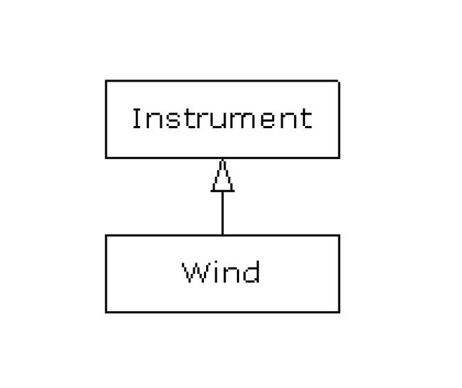

# Повторне використання класів

Можливість повторного використання коду належить до числа найважливіших переваг *Java*. Втім, по-справжньому масштабні зміни аж ніяк не зводяться до звичайного копіювання та виправлення коду.
 
Повторне використання на базі копіювання коду характерне для процедурних мов, подібних *C*, але воно працювало не дуже добре. Вирішення цієї проблеми в *Java*, як і багато іншого, будується на концепції класу. Замість того щоб створювати новий клас «з чистого аркуша», ви берете за основу вже існуючий клас, який хтось вже створив і перевірив на працездатність.
 
Хитрість полягає в тому, щоб використовувати класи без шкоди для існуючого коду. У цьому розділі розглядаються два шляхи реалізації цієї ідеї. Перший досить прямолінійний: об'єкти вже наявних класів просто створюються всередині вашого нового класу. Механізм побудови нового класу з об'єктів існуючих класів називається композицією (*composition*). Ви просто використовуєте функціональність готового коду, а не його структуру.
 
Другий спосіб набагато цікавіший. Новий клас створюється як спеціалізація вже існуючого класу. Взявши існуючий клас за основу, ви додаєте до нього свій код без зміни існуючого класу. Цей механізм називається успадкуванням (*inheritance*), і більшу частину роботи в ньому здійснює компілятор. Успадкування є одним з «наріжних каменів» об'єктно-орієнтованого програмування; деякі з його додаткових застосувань описані в розділі ["Поліморфізм"](#Поліморфізм).
 
Синтаксис і поведінка типів при використанні композиції і успадкування нерідко збігаються (що цілком логічно, так як обидва механізми призначені для побудови нових типів на базі вже існуючих). У цьому розділі розглядаються обидва механізмb повторного використання коду. 

## Синтаксис композиції

До цього моменту ми вже досить часто використовували композицію - посилання на впроваджуваний об'єкт просто включається в новий клас. Припустимо, вам знадобився об'єкт, що містить кілька об'єктів ***String***, пару полів примітивного типу та об'єкт ще одного класу. Для не-примітивних об'єктів в новий клас включаються посилання, а примітиви визначаються відразу:
 
``` java
//: reusing/SprinklerSystem.java
// Композиція для повторного використання коду.
class WaterSource {
    private String s;
    WaterSource() {
        System.out.println ( "WaterSource()");
        s = "Constructed";
    }
    public String toString() {return s; }
}

public class SprinklerSystem {
    private String valve1, valve2, valve3, valve4;
    private WaterSource source = new WaterSource();
    private int i;
    private float f;
    public String toString() {
        return
                "valve1 =" + valve1 + "" +
                "valve2 =" + valve2 + "" +
                "valve3 =" + valve3 + "" +
                "valve4 =" + valve4 + "\n" +
                "i =" + i + "" + "f =" + f + "" +
                "source =" + source;
    }
    public static void main (String [] args) {
        SprinklerSystem sprinklers = new SprinklerSystem();
        System.out.println (sprinklers);
    }
} /* Результат: 
WaterSource() 
valve1 = null valve2 = null valve3 = null valve4 = null 
i = 0 f = 0.0 source = Constructed 
*///: 
```
 
В обох класах визначається особливий метод ***toString()***. Пізніше ви довідаєтеся, що кожний не-примітивний об'єкт має метод ***toString()***, який викликається в спеціальних випадках, коли компілятор в своєму розпорядженні має об'єкт, а хоче отримати його строкове представлення в форматі ***String***. Тому в виразі з методу ***SрrinklerSystem.toString()***:

	"source =" + source;

компілятор бачить, що до рядка ***"source ="*** «додається» об'єкт класу ***WaterSource***. Компілятор не може це зробити, оскільки до рядка можна «додати» тільки рядок, тому він перетворює об'єкт ***source*** в ***String***, викликаючи метод ***toString()***. Після цього компілятор вже в стані з'єднати два рядки і передати результат в метод ***System.out.println()*** (або в статичний метод ***print()*** і ***printnb()***, що використовується в книзі). Щоб подібна поведінка підтримувалося вашим класом, досить включити в нього метод ***toString()***.
 
Примітивні типи, визначені в якості полів класу, автоматично проініціалізовані нульовими значеннями, як згадувалося в розділі ["Все є об'єктом"](# Все є об'єктом). Однак посилання на об'єкти заповнюються значеннями ***null***, і при спробі виклику методу по такому посиланню відбудеться виключення. На щастя, посилання ***null*** можна вивести без повернення виключення.
 
Компілятор не створює об'єкти для посилань «за замовчуванням», і це логічно, тому що в багатьох випадках це призвело б до зайвих витрат ресурсів. Якщо вам знадобиться проініціалізувати посилання, зробіть це самостійно:

1. в точці визначення об'єкта. Це означає, що об'єкт завжди ініціалізується перед викликом конструктора;
2. в конструкторі даного класу;
3. безпосередньо перед використанням об'єкта. Цей спосіб часто називають відкладеною ініціалізацією. Він може заощадити вам ресурси в ситуаціях, де створювати об'єкт кожного разу необов'язково і накладно;
4. з використанням ініціалізації екземплярів.

У наступному прикладі продемонстровані всі чотири способи:
 
``` java
//: reusing/Bath.java 
// Ініціалізація в конструкторі з композицією. 
import static net.mindview.util.Print.*; 
 
class Soap { 
  private String s;
  Soap() { 
    print("Soap()"); 
    s = "Constructed"; 
  } 
  public String toString() { return s; } 
}   
 
public class Bath { 
  private String // Ініціалізація в точці визначення: 
    s1 = "Happy", 
    s2 = "Happy", 
    s3, s4; 
  private Soap castille; 
  private int i; 
  private float toy; 
  public Bath() { 
    print("Inside Bath()"); 
    s3 = "Joy"; 
    toy = 3.14f; 
    castille = new Soap(); 
  }  
  // Ініціалізація примірника:
  { i = 47; } 
  public String toString() { 
    if(s4 == null) // Відкладена ініціалізація: 
      s4 = "Joy"; 
    return 
      "s1 = " + s1 + "\n" + 
      "s2 = " + s2 + "\n" + 
      "s3 = " + s3 + "\n" + 
      "s4 = " + s4 + "\n" + 
      "i = " + i + "\n" + 
      "toy = " + toy + "\n" + 
      "castille = " + castille; 
  }  
  public static void main(String[] args) { 
    Bath b = new Bath(); 
    print(b); 
  } 
} /* Output: 
Inside Bath() 
Soap() 
s1 = Happy 
s2 = Happy 
s3 = Joy 
s4 = Joy 
i = 47 
toy = 3.14 
castille = Constructed 
*///:~ 
```
Зауважте, що в конструкторі класу ***Bath*** команда виконується до проведення будь-якої ініціалізації. Якщо ініціалізація в точці визначення не виконується, немає ніяких гарантій того, що вона буде виконана перед відправкою повідомлення по посиланню об'єкта - крім неминучих виключень часу виконання. При виклику методу ***toString()*** в ньому присвоюється значення посиланню ***s4***, щоб всі поля були належним чином проініціалізовані до моменту їх використання. 

## Синтаксис успадкування

Спадкування є невід'ємною частиною *Java* (і будь-якої іншої мови ООП). Фактично воно завжди використовується при створенні класу, тому що, навіть якщо клас не оголосити похідним від іншого класу, він автоматично стає похідним від кореневого класу *Java* ***Object***.
 
Синтаксис композиції очевидний, але для успадкування існує зовсім інша форма запису. При використанні успадкування ви фактично говорите: «Цей новий клас схожий на той старий клас». У програмі цей факт виражається перед фігурною дужкою, що відкриває тіло класу: спочатку записується ключове слово ***extends***, а потім ім'я базового (*base*) класу. Тим самим ви автоматично отримується доступ до всіх полів і методів базового класу. Наприклад:
 
``` java
//: reusing/Detergent.java
// Синтаксис успадкування та його властивості.
import static net.mindview.util.Print.*;

class Cleanser {
    private String s = "Cleanser";
    public void append (String a) {s + = a; }
    public void dilute() {append ( "dilute()"); }
    public void apply() {append ( "apply()"); }
    public void scrub() {append ( "scrub()"); }
    public String toString() {return s; }
    public static void main (String [] args) {
        Cleanser x = new Cleanser();
        x.dilute(); x.apply(); x.scrub();
        print (x);
    }
}

public class Detergent extends Cleanser {
    // Змінюємо метод:
    public void scrub() {
        append ( "Detergent.scrub()");
        super.scrub(); // Викликаємо метод базового класу
    }
    // Додаємо нові методи до інтерфейсу   :
    public void foam() {append("foam()"); }
    // Перевіряємо новий клас:
    public static void main (String [] args) {
        Detergent x = new Detergent();
        x.dilute();
        x.apply();
        x.scrub();
        x.foam();
        print(x);
        print( "Testing base class:");
        Cleanser.main(args);
    }
} /* Output: 
Cleanser dilute() apply() Detergent.scrub() scrub() foam() 
Testing base class: 
Cleanser dilute() apply() scrub() 
*///:~
```

Приклад демонструє відразу кілька особливостей успадкування. По-перше, в методі класу ***Cleanser.append()*** нові рядки приєднуються до рядка ***s*** оператором ***+=***, одним з операторів, спеціально «перевантажених» творцями *Java* для рядків (***String***).
 
По-друге, як ***Cleanser***, так і ***Detergent*** містять метод ***main()***. Ви можете визначити метод ***main()*** в кожному зі своїх класів; це дозволяє вбудовувати тестовий код прямо в клас. Метод ***main()*** навіть не обов'язково видаляти після завершення тестування, його цілком можна залишити на майбутнє.
 
Навіть якщо у вас в програмі є безліч класів, з командного рядка виконується тільки один (так як метод ***main()*** завжди оголошується як ***public***, то неважливо, чи оголошений клас, в якому він описаний, як ***public***). У нашому прикладі команда ***java
Detergent*** викликає метод ***Detergent.main()***. Однак ви також можете використовувати команду ***java Cleanser*** для виклику методу ***Cleanser.main()***, хоча клас ***Cleanser*** не оголошений відкритим. Навіть якщо клас отримує доступ в межах класу, відкритий метод ***main()*** залишається доступним.
 
Тут метод ***Detergent.main()*** викликає ***Cleanser.main()*** явно, передаючи йому власний масив аргументів командного рядка (втім, для цього годиться будь-який масив рядків).
 
Важливо, що всі методи класу ***Cleanser*** оголошені відкритими. Пам'ятайте, що при відсутності специфікатора доступу, член класу автоматично отримує доступ «в межах пакету», що дозволяє звертатися до нього тільки з поточного пакета. Таким чином, в межах даного пакета при відсутності специфікатор доступу виклик цих методів дозволений кому завгодно - наприклад, це легко може зробити клас ***Detergent***.
 
Але якби якийсь клас з іншого пакета був оголошений похідним від класу ***Cleanser***, то він отримав би доступ тільки до його ***public***-членів. З урахуванням можливості успадкування всі поля зазвичай позначаються як ***private***, а всі методи - як ***public***. (Похідний клас також отримує доступ до захищених (***protected***) членів базового класу, але про це пізніше.) Звичайно, іноді ви будете відступати від цих правил, але в будь-якому випадку корисно їх запам'ятати.
 
Клас ***Cleanser*** містить ряд методів: ***append(), dilute(), apply(), scrub()*** і ***toString()***. Так як клас ***Detergent***
створений на основі класу ***Cleanser*** (за допомогою ключового слова ***extends***), він автоматично отримує всі ці методи в своєму інтерфейсі, хоча вони і не визначаються явно в класі ***Detergent***. Таким чином, успадкування забезпечує повторне використання класу.
 
Як показано на прикладі методу ***scrub()***, розробник може взяти вже існуючий метод базового класу і змінити його. Можливо, в цьому випадку буде потрібно викликати метод базового класу з нової версії цього методу. Однак в методі ***scrub()*** ви не можете просто викликати ***scrub()*** - це призведе до рекурсії, а нам потрібно не це. Для вирішення проблеми в *Java* існує ключове слово ***super***, яке позначає «суперклас», тобто клас, похідним від якого є поточний клас. Таким чином, вираз ***super.scrub()*** звертається до методу ***scrub()*** з базового класу.
 
При успадкуванні ви не обмежені використанням методів базового класу. У похідний клас можна додавати нові методи тим же способом, що і раніше, тобто просто визначаючи їх. Метод ***foam()*** - наочний приклад такого підходу.
 
У методі ***Detergent.main()*** для об'єкта класу ***Detergent*** викликаються всі методи, доступні як з класу ***Cleanser***, так і з класу ***Detergent*** (мається на увазі метод ***foam()***).
 
### Ініціалізація базового класу
 
Так як в успадкуванні беруть участь два класи, базовий і похідний, не відразу зрозуміло, який же об'єкт вийде в результаті. Зовні все виглядає так, немов новий клас має той же інтерфейс, що і базовий клас, плюс ще кілька додаткових методів і полів. Однак успадкування не просто копіює інтерфейс базового класу. Коли ви створюєте об'єкт похідного класу, всередині нього міститься підоб'єкт базового класу. Цей підоб'єкт виглядає точно так само, як виглядав би створений звичайним порядком об'єкт базового класу. Тому ззовні видається, ніби-то в об'єкті похідного класу «упакований» об'єкт базового класу.
 
Звичайно, дуже важливо, щоб підоб'єкт базового класу був правильно ініцілізований, і гарантувати це можна тільки одним способом:
виконати ініціалізацію в конструкторі, викликаючи при цьому конструктор базового класу, у якого є необхідні знання та привілеї для проведення ініціалізації базового класу. *Java* автоматично вставляє виклики конструктора базового класу в конструктор похідного класу. У наступному прикладі задіяно три рівні успадкування:
 
``` java
//: reusing/Cartoon.java
// Виклики конструкторів при проведенні успадкування 
import static net.mindview.util.Print.*;

class Art {
    Art() {print ( "Art constructor"); }
}

class Drawing extends Art {
    Drawing() {print ( "Drawing constructor"); }
}

public class Cartoon extends Drawing {
    public Cartoon() {print ( "Cartoon constructor"); }
    public static void main (String [] args) {
        Cartoon x = new Cartoon();
    }
} /* Output: 
Art constructor 
Drawing constructor 
Cartoon constructor 
*///:~ 
```

Як бачите, конструювання починається з «самого внутрішнього» базового класу, тому базовий клас ініціалізується ще до того, як він стане доступним для конструктора похідного класу. Навіть якщо конструктор класу ***Cartoon*** не визначений, компілятор згенерує конструктор за замовчуванням, в якому також викликається конструктор базового класу.
 
#### Конструктори з аргументами
 
У попередньому прикладі використовувалися конструктори за замовчанням, тобто конструктори без аргументів. У компілятора не виникає проблем з викликом таких конструкторів, так як питань про передачу аргументів не виникає. Якщо клас не має конструктора за замовчуванням, або вам знадобиться викликати конструктор базового класу з аргументами, цей виклик доведеться оформити явно, із зазначенням ключового слова ***super*** і передачею аргументів:
 
``` java
//: Reusing/Chess.java
// Успадкування, конструктори і аргументи. 
import static net.mindview.util.Print.*;

class Game {
    Game (int i) {
        print ( "Game constructor");
    }
}

class BoardGame extends Game {
    BoardGame (int i) {
        super (i);
        print ( "BoardGame constructor");
    }
}

public class Chess extends BoardGame {
    Chess() {
        super (11);
        print ( "Chess constructor");
    }
    public static void main (String [] args) {
        Chess x = new Chess();
    }
} /* Output: 
Game constructor 
BoardGame constructor 
Chess constructor 
*///:~ 
```
 
Якщо не викликати конструктор базового класу в ***BoardGame()***, то компілятор «поскаржиться» на те, що не може виявити конструктор  форми ***Game()***. До того ж виклик конструктора базового класу повинен бути першою командою в конструкторі похідного класу. (Якщо ви раптом забудете про це, компілятор вам тут же нагадає.)
 
## Делегування
 
Третій вид відносин, який не підтримується в *Java* безпосередньо, називається делегуванням. Він займає проміжне положення між успадкуванням і композицією: екземпляр існуючого класу включається в створюваний клас (як при композиції), але в той же час всі методи вбудованого об'єкта стають доступними в новому класі (як при успадкуванні). Наприклад, клас ***SpaceShipControls*** імітує модуль управління космічним кораблем:
 
``` java
//: reusing/SpaceShipControls.java

public class SpaceShipControls {
    void up (int velocity) {}
    void down (int velocity) {}
    void left (int velocity) {}
    void right (int velocity) {}
    void forward (int velocity) {}
    void back (int velocity) {}
    void turboBoost() {}
}
```
 
Для побудови космічного корабля можна скористатися успадкуванням:
 
``` java
//: reusing/SpaceShip.java

public class SpaceShip extends SpaceShipControls {
    private String name;
    public SpaceShip (String name) {this.name = name; }
    public String toString() {return name; }
    public static void main (String [] args) {
        SpaceShip protector = new SpaceShip ( "NSEA Protector");
        protector.forward (100);
    }
}
```
 
Однак космічний корабель не може розглядатися як окремий випадок свого управляючого модуля - не дивлячись на те, що йому, наприклад, можна наказати рухатися вперед (***forward()***). Точніше сказати, що ***SpaceShip*** містить ***SpaceShipControls***, і в той же час всі методи останнього надаються класу ***SpaceShip***. Проблема вирішується за допомогою делегування:
 
``` java
//: Reusing/SpaceShipDelegation.java

public class SpaceShipDelegation {
    private String name;
    private SpaceShipControls controls =
            new SpaceShipControls();
    public SpaceShipDelegation (String name) {
        this.name = name;
    }
    // Делеговані методи:
    public void back (int velocity) {
        controls.back (velocity);
    }
    public void down (int velocity) {
        controls.down (velocity);
    }
    public void forward (int velocity) {
        controls.forward (velocity);
    }
    public void left (int velocity) {
        controls.left (velocity);
    }
    public void right (int velocity) {
        controls.right (velocity);
    }
    public void turboBoost() {
        controls.turboBoost();
    }
    public void up (int velocity) {
        controls.up (velocity);
    }
    public static void main (String [] args) {
        SpaceShipDelegation protector =
                new SpaceShipDelegation ( "NSEA Protector");
        protector.forward (100);
    }
}
```
 
Як бачите, виклики методів переадресовуються вбудованому об'єкту ***controls***, а інтерфейс залишається таким же, як і при успадкуванні. З іншого боку, делегування дозволяє краще управляти тим, що відбувається, тому що ви можете обмежитися невеликою підмножиною методів вбудованого об'єкта. Хоча й делегування не підтримується мовою *Java*, його підтримка присутня в багатьох середовищах розробки. Наприклад, наведений приклад був автоматично згенерований в *JetBrains Idea IDE*. 

## Поєднання композиції і успадкування

Композиція дуже часто використовується разом з успадкуванням. Наступний приклад демонструє процес створення більш складного класу з об'єднанням композиції і успадкування, з виконанням необхідної ініціалізації в конструкторі:
 
``` java
//: reusing/PlaceSetting.java
// Поєднання композиції і успадкування. 
import static net.mindview.util.Print.*;

class Plate {
    Plate (int i) {
        print ( "Plate constructor");
    }
}

class DinnerPlate extends Plate {
    DinnerPlate (int i) {
        super (i);
        print ( "DinnerPlate constructor");
    }
}

class Utensil {
    Utensil (int i) {
        print ( "Utensil constructor");
    }
}

class Spoon extends Utensil {
    Spoon (int i) {
        super (i);
        print ( "Spoon constructor");
    }
}

class Fork extends Utensil {
    Fork (int i) {
        super (i);
        print ( "Fork constructor");
    }
}

class Knife extends Utensil {
    Knife (int i) {
        super (i);
        print ( "Knife constructor");
    }
}

// A cultural way of doing something:
class Custom {
    Custom (int i) {
        print ( "Custom constructor");
    }
}

public class PlaceSetting extends Custom {
    private Spoon sp;
    private Fork frk;
    private Knife kn;
    private DinnerPlate pl;
    public PlaceSetting (int i) {
        super (i + 1);
        sp = new Spoon (i + 2);
        frk = new Fork (i + 3);
        kn = new Knife (i + 4);
        pl = new DinnerPlate (i + 5);
        print ( "PlaceSetting constructor");
    }
    public static void main (String [] args) {
        PlaceSetting x = new PlaceSetting (9);
    }
} /* Output: 
Custom constructor 
Utensil constructor 
Spoon constructor 
Utensil constructor 
Fork constructor 
Utensil constructor 
Knife constructor 
Plate constructor 
DinnerPlate constructor 
PlaceSetting constructor 
*///:~ 
```

Незважаючи на те, що компілятор змушує вас форматувати базові класи і вимагає, щоб ви робили це прямо на початку конструктора, він не стежить за ініціалізацією вбудованих об'єктів, тому ви повинні самі пам'ятати про це.
 
### Забезпечення правильного завершення
 
В *Java* відсутнє поняття деструкції з *C++* - методу, що автоматично викликається при знищенні об'єкта. В *Java* програмісти просто «забувають» про об'єкти, не знищуючи їх самостійно, так як функції очищення пам'яті покладені на збирача сміття.
 
У багатьох випадках ця модель працює, але іноді клас виконує деякі операції, що вимагають завершальних дій. Як згадувалося в розділі 5, ви не знаєте, коли буде викликаний збирач сміття і чи відбудеться це взагалі. Тому, якщо в класі повинні виконуватися дії з очищення, вам доведеться написати для цього особливий метод і зробити так, щоб програмісти-клієнти знали про необхідність виклику цього методу. Більш того, як описано в главі 10, вам доведеться передбачити можливі виключення і виконати завершальні дії в секції ***finally***. Уявімо приклад системи автоматизованого проектування, яка малює на екрані зображення:
 
``` java
//: Reusing/CADSystem.java
// Забезпечення необхідного завершення. package reusing;
import static net.mindview.util.Print.*;

class Shape {
    Shape (int i) {print ( "Shape constructor"); }
    void dispose() {print ( "Shape dispose"); }
}

class Circle extends Shape {
    Circle (int i) {
        super (i);
        print ( "Drawing Circle");
    }
    void dispose() {
        print ( "Erasing Circle");
        super.dispose();
    }
}

class Triangle extends Shape {
    Triangle (int i) {
        super (i);
        print ( "Drawing Triangle");
    }
    void dispose() {
        print ( "Erasing Triangle");
        super.dispose();
    }
}

class Line extends Shape {
    private int start, end;
    Line (int start, int end) {
        super (start);
        this.start = start;
        this.end = end;
        print ( "Drawing Line:" + start + "," + end);
    }
    void dispose() {
        print ( "Erasing Line:" + start + "," + end);
        super.dispose();
    }
}

public class CADSystem extends Shape {
    private Circle c;
    private Triangle t;
    private Line [] lines = new Line [3];
    public CADSystem (int i) {
        super (i + 1);
        for (int j = 0; j <lines.length; j ++)
            lines [j] = new Line (j, j * j);
        c = new Circle (1);
        t = new Triangle (1);
        print ( "Combined constructor");
    }
    public void dispose() {
        print ( "CADSystem.dispose()");
// Завершення здійснюється в порядку,
// Зворотному порядку ініціалізації t.dispose();
        c.dispose();
        for (int i = lines.length - 1; i> = 0; i--)
            lines [i] .dispose();
        super.dispose();
    }
    public static void main (String [] args) {
        CADSystem x = new CADSystem (47);
        try {
// Код та обробка винятків ...} finally {
            x.dispose();
        }
    }
} /* Output: 
Shape constructor 
Shape constructor 
Drawing Line: 0, 0 
Shape constructor 
Drawing Line: 1, 1 
Shape constructor 
Drawing Line: 2, 4 
Shape constructor 
Drawing Circle 
Shape constructor 
Drawing Triangle 
Combined constructor 
CADSystem.dispose() 
Erasing Triangle 
Shape dispose 
Erasing Circle 
Shape dispose 
Erasing Line: 2, 4 
Shape dispose 
Erasing Line: 1, 1 
Shape dispose 
Erasing Line: 0, 0 
Shape dispose 
Shape dispose 
*///:~ 
```
 
Все в цій системі є деяким різновидом класу ***Shape*** (який, в свою чергу, неявно успадковується від кореневого класу ***Object***). Кожен клас перевизначає метод ***dispose()*** класу ***Shape***, викликаючи при цьому версію методу з базового класу за допомогою ключового слова ***super***.
 
Всі конкретні класи, успадковані від ***Shape*** - ***Circle, Triangle*** і ***Line***, мають конструктори, які просто виводять повідомлення, хоча під час життя об'єкта будь-який метод може зробити щось, що вимагає очищення. У кожному класі є свій власний метод ***dispose()***, який відновлює ресурси, не пов'язані з пам'яттю, до вихідного стану до створення об'єкта.
 
У методі ***main()*** ви можете помітити два нових ключових слова, які будуть детально розглянуті в главі 10: ***try*** і ***finally***. Ключове слово ***try*** показує, що наступний за ним блок (обмежений фігурними дужками) є захищеною секцією. Код в секції ***finally*** виконується завжди, незалежно від того, як минуло виконання блоку ***try***. (При обробці виключень можна вийти з блоку ***try*** деякими незвичайними способами.) В даному прикладі секція ***finally*** означає: «Що б не сталося, в кінці завжди викликати метод ***x.dispose()***».
 
Також зверніть особливу увагу на порядок виклику завершальних методів для базового класу і об'єктів-членів в тому випадку, якщо вони залежать один від одного. В основному потрібно слідувати тим же принципом, що використовує компілятор *C++* при виклику деструкторів: спочатку провести завершальні дії для вашого класу в послідовності, зворотної порядку їх створення. (Зазвичай для цього потрібно, щоб елементи базових класів продовжували існувати.) Потім викликаються завершальні методи з базових класів, як і показано в програмі.
 
У багатьох випадках завершальні дії не є проблемою; досить дати збирачеві сміття виконати свою роботу. Але вже якщо знадобилося провести їх явно, зробіть це з усією можливою ретельністю і увагою, так як в процесі складання сміття важко в чому-небудь бути впевненим. Збирач сміття взагалі може не бути викликані, а якщо він почне працювати, то об'єкти будуть знищуватися в довільному порядку. Краще не покладатися на збирач сміття в ситуаціях, де справа не стосується звільнення пам'яті. Якщо ви хочете провести завершальні дії, створіть для цієї мети свій власний метод і не покладайтеся на метод ***finalize()***.
 
### Приховування імен
 
Якщо який-небудь з методів базового класу *Java* був перевантажений декілька разів, перевизначення імені цього методу в похідному класі не приховає ні одну з базових версій (на відміну від *C++*). Тому перевантаження працює незалежно від того, де був визначений метод -
на поточному рівні, або в базовому класі:
 
``` java
//: Reusing/Hide.java
// Перевантаження імені методу з базового класу // в похідному класі не приховає базову версію методу. 
import static net.mindview.util.Print.*;

class Homer {
    char doh (char c) {
        print ( "doh (char)");
        return 'd';
    }
    float doh (float f) {
        print ( "doh (float)");
        return 1.0f;
    }
}

class Milhouse {}

class Bart extends Homer {
    void doh (Milhouse m) {
        print ( "doh (Milhouse)");
    }
}

public class Hide {
    public static void main (String [] args) {
        Bart b = new Bart();
        b.doh (1);
        b.doh ( 'x');
        b.doh (1.0f);
        b.doh (new Milhouse());
    }
} /* Output: 
doh(float) 
doh(char) 
doh(float) 
doh(Milhouse) 
*///:~ 
```
 
Ми бачимо, що всі перевантажені методи класу ***Homer*** доступні класу ***Bart***, хоча клас ***Bart*** і додає новий перевантажений метод (в *C++* така дія приховала би всі методи базового класу). Як ви побачите в наступному розділі, на практиці при перевизначенні методів набагато частіше використовується точно такий ж опис і список аргументів, як і в базовому класі. Інакше легко можна заплутатися (і тому *C++* забороняє це, щоб запобігти вчиненню можливої ​​помилки).
 
В *Java SE5* з'явився запис ***@Override***; який не є ключовим словом, але може використовуватися так, як якщо б був ним. Якщо ви збираєтеся перевизначити метод, використовуйте ***@Override***, і компілятор видасть повідомлення про помилку, якщо замість перевизначення буде випадково виконано перевантаження:
 
``` java
//: Reusing/Lisa.java
// {CompileTimeError} (Will not compile)

class Lisa extends Homer {
    @Override
    void doh (Milhouse m) {
        System.out.println ( "doh (Milhouse)");
    }
}
```
 
## Композиція в порівнянні з успадкуванням
 
І композиція, і успадкування дозволяють вам поміщати підоб'єкти всередину вашого нового класу (при композиції це відбувається явно, а в успадкуванні - опосередковано). Ви можете поцікавитися, в чому між ними різниця і коли слід вибирати одне, а коли - інше.
 
Композиція в основному застосовується, коли в новому класі необхідно використовувати функціональність вже існуючого класу, але не його інтерфейс. Тобто ви вбудовуєте об'єкт, щоб використовувати його можливості в новому класі, а користувач класу бачить об'явлений вами інтерфейс, але не помічає вбудованих об'єктів. Для цього впроваджуються об'єкти, що оголошуються зі специфікатором ***private***.
 
Іноді потрібно надати користувачеві прямий доступ до композиції вашого класу, тобто зробити вбудований об'єкт відкритим (***public***). Вбудовані об'єкти і самі використовують приховування реалізації, тому відкритий доступ безпечний. Коли користувач знає, що клас складається із складових частин, йому значно легше зрозуміти його інтерфейс. Хорошим прикладом служить об'єкт ***Саr*** (машина):
 
``` java
//: Reusing/Car.java
// Композиція з використанням відкритих об'єктів
class Engine {
    public void start() {}
    public void rev() {}
    public void stop() {}
}

class Wheel {
    public void inflate (int psi) {}
}

class Window {
    public void rollup() {}
    public void rolldown() {}
}

class Door {
    public Window window = new Window();
    public void open() {}
    public void close() {}
}

public class Car {
    public Engine engine = new Engine();
    public Wheel [] wheel = new Wheel [4];
    public Door
            left = new Door(), right = new Door(); // 2-door
    public Car() {
        for (int i = 0; i <4; i ++)
            wheel [i] = new Wheel();
    }
    public static void main (String [] args) {
        Car car = new Car();
        car.left.window.rollup();
        car.wheel [0] .inflate (72);
    }
}
```
 
Так як композиція об'єкта є частиною проведеного аналізу завдання (а не просто частиною реалізації класу), оголошення членів класу відкритими (***public***) допомагає програмісту-клієнту зрозуміти, як використовувати клас, і полегшує творцеві класу написання коду. Однак потрібно все-таки пам'ятати, що описаний випадок є специфічним і в основному поля класу слід оголошувати як ***private***.
 
При використанні успадкування ви берете вже існуючий клас і створюєте його спеціалізовану версію. В основному це означає, що клас загального призначення адаптується для конкретного завдання. Якщо трохи подумати, то ви зрозумієте, що не мало б сенсу використовувати композицію машини і засобу пересування - машина не містить засобу пересування, вона сама є цей засіб. Взаємозв'язок «є»
виражається успадкуванням, а взаємозв'язок «має» описується композицією.
 
## protected
 
Після знайомства з успадкуванням ключове слово ***protected*** нарешті знайшло сенс. В ідеалі закритих членів ***private*** повинно було бути досить. У реальності існують ситуації, коли вам необхідно заховати що-небудь від навколишнього світу, проте залишивши доступ для похідних класів.
 
Ключове слово ***protected*** - данина прагматизму. Воно означає: «Член класу є закритим (***private***) для користувача класу, але для всіх, хто успадковує від класу, і для сусідів по пакету він доступний». (В *Java* ***protected*** автоматично надає доступ в межах пакету.)

Найкраще, звичайно, оголошувати поля класу як ***private*** - завжди варто залишити за собою право змінювати лежачу в основі реалізацію. Керований доступ спадкоємцям класу надається через методи ***protected***:
 
``` java
//: Reusing/Orc.java
// Ключове слово protected
import static net.mindview.util.Print.*;

class Villain {
    private String name;
    protected void set (String nm) {name = nm; }
    public Villain (String name) {this.name = name; }
    public String toString() {
        return "I'm a Villain and my name is" + name;
    }
}

public class Orc extends Villain {
    private int orcNumber;
    public Orc (String name, int orcNumber) {
        super (name);
        this.orcNumber = orcNumber;
    }
    public void change (String name, int orcNumber) {
        set (name); // Доступно, так як оголошено protected
        this.orcNumber = orcNumber;
    }
    public String toString() {
        return "Orc" + orcNumber + ":" + super.toString();
    }
    public static void main (String [] args) {
        Orc orc = new Orc ( "Limburger", 12);
        print (orc);
        orc.change ( "Bob", 19);
        print (orc);
    }
} /* Output: 
Orc 12: I’m a Villain and my name is Limburger 
Orc 19: I’m a Villain and my name is Bob 
*///:~ 
```
 
Як бачите, метод ***change()*** має доступ до методу ***set()***, оскільки той оголошений як ***protected***. Також зверніть увагу, що метод ***toString()*** класу ***ORС*** визначається з використанням версії цього методу з базового класу.
 
## Висхідне перетворення типу
 
Найважливіша особливість успадкування полягає зовсім не в тому, що воно надає методи для нового класу, - успадкування висловлює відносини між новим і базовим класом. Його можна виразити наступним чином: «Новий клас має тип існуючого класу».
 
Дане формулювання - не просто химерний спосіб опису успадкування, воно безпосередньо підтримується мовою. Як приклад розглянемо базовий клас з ім'ям ***Instrument*** для подання музичних інструментів і його похідний клас ***Wind***. Так як успадкування означає, що всі методи базового класу також доступні в похідному класі, будь-яке повідомлення, яке ви в змозі відправити базовому класу, можна відправити і похідному класу.
 
Якщо в класі ***Instrument*** є метод ***play()***, то він буде присутній і в класі ***Wind***. Таким чином, ми можемо з усією визначеністю стверджувати, що об'єкти ***Wind*** також мають тип ***Instrument***. Наступний приклад показує, як компілятор підтримує таке поняття:
 
``` java
//: reusing/Wind.java
// Успадкування та висхідне перетворення.
class Instrument {
    public void play() {}
    static void tune (Instrument i) {
	// ... i.play();
    }
}

// Об'єкти Wind також є об'єктами Instrument,
// Оскільки вони мають той же інтерфейс:
public class Wind extends Instrument {
    public static void main (String [] args) {
        Wind flute = new Wind();
        Instrument.tune (flute); // висхідне перетворення
    }
}    
```
 
Найбільший інтерес у цьому прикладі представляє метод ***tune()***, який одержує посилання на об'єкт ***Instrument***. Однак в методі ***Wind.main()*** методу ***tune()*** передається посилання на об'єкт ***Wind***. З урахуванням всього, що говорилося про сувору перевірку типів в *Java*, здається дивним, що метод з готовністю бере один тип замість іншого. Але варто згадати, що об'єкт ***Wind*** також є об'єктом ***Instrument***, і не існує методу, який можна викликати в методі ***tune()*** для об'єктів ***Instrument***, але не можна для об'єктів ***Wind***. У методі ***tune()*** код працює для ***Instrument*** і для будь-яких об'єктів, похідних від ***Instrument***, а перетворення посилання на об'єкт ***Wind*** на посилання на об'єкт ***Instrument*** називається висхідним перетворенням типу (*upcasting*).
 
### Чому «висхідне перетворення типу»?
 
Термін виник з історичних причин: традиційно на діаграмах успадкування корінь ієрархії зображувався у верхнього краю сторінки, а діаграма розросталася до нижнього краю сторінки. (Звичайно, ви можете малювати свої діаграми так, як вважаєте за потрібне.) Для файлу ***Wind.java*** діаграма успадкування виглядає так:



Перетворення від похідного типу до базового вимагає руху вгору по діаграмі, тому це часто називається висхідним перетворенням. Висхідне перетворення завжди безпечно, так як це перехід від конкретного типу до більш загального типу. Інакше кажучи, похідний клас є надбудовою базового класу. Він може містити більше методів, ніж базовий клас, але зобов'язаний включати в себе всі методи базового класу.
 
Єдине, що може статися з інтерфейсом класу при висхідному перетворенні, - втрата методів, але ніяк не їх надбання. Саме тому компілятор завжди дозволяє виконувати висхідне перетворення, не вимагаючи явних перетворень, або інших спеціальних позначень.
 
Перетворення також може виконуватися і в зворотному напрямку - так зване спадне перетворення (*downcasting*). Але при цьому виникає проблема, яка розглядається в наступному розділі, та в розділі ["Інформація про типи"](# Інформація про типи).
 
### Знову про композиції з успадкуванням
 
В об'єктно-орієнтованому програмуванні розробник зазвичай упаковує дані разом з методами в класі, а потім працює з об'єктами цього класу. Існуючі класи також використовуються для створення нових класів за допомогою композиції. Успадкування на практиці застосовується рідше. Тому, хоча під час вивчення ООП успадкуванню приділяється дуже багато уваги, це не означає, що його слід без розбору застосовувати всюди, де це можливо. Навпаки, користуватися ним слід обачно - тільки там, де корисність успадкування не викликає сумнівів. Один з хороших критеріїв вибору між композицією і успадкуванням - запитати себе, чи збираєтеся ви згодом проводити висхідне перетворення від похідного класу до базового класу. Якщо висхідне перетворення актуально, вибирайте успадкування, а якщо ні - подумайте, чи не можна вчинити інакше.
 
## Ключове слово final
 
В *Java* сенс ключового слова ***final*** залежить від контексту, але в основному воно означає: «Це не можна змінити». Заборона на зміни може пояснюватися двома причинами: архітектурою програми або ефективністю. Ці дві причини грунтовно розрізняються, тому в програмі можливо невірне вживання ключового слова ***final***. У наступних розділах обговорюються три можливих застосування ***final***: для даних, методів і класів. 

### Постійні дані

У багатьох мовах програмування існує той чи інший спосіб сказати компілятору, що частка даних є «константою». Константи корисні в двох ситуаціях:
- константа часу компіляції, яка ніколи не змінюється;
- значення, ініціалізуємі під час роботи програми, які не можна змінювати.

Компілятор підставляє значення константи часу компіляції в усі вирази, де вони використовуються; таким чином зменьшується час при виконанні. В *Java* подібні константи повинні відноситись до примітивних типів, а для їх визначення використовується ключове слово ***final***. Значення такої константи присвоюється під час визначення.
 
Поле, одночасно оголошене з ключовими словами ***static*** і ***final***, існує в пам'яті в єдиному екземплярі і не може бути змінено.
 
При використанні слова ***final*** з посиланнями на об'єкти його сенс не настільки очевидний. Для примітивів ***final*** робить постійним значення, але для посилання на об'єкт постійним стає посилання. Після того як таке посилання буде пов'язане з об'єктом, воно вже не зможе вказувати на інший об'єкт. Втім, сам об'єкт при цьому може змінюватися; в *Java* немає механізмів, що дозволяють зробити довільний об'єкт незмінним. (Втім, ви самі можете написати ваш клас так, щоб його об'єкти фактично були константами.) Дане обмеження стосується і до масивів, які теж є об'єктами.
 
Наступний приклад демонструє використання ***final*** для полів класів:
 
``` java
//: Reusing/FinalData.java
// Дія ключового слова final для полів. import java.util.*;
import static net.mindview.util.Print.*;

class Value {
    int i; // Доступ в межах пакету public Value (int i) {this.i = i; }
}

public class FinalData {
    private static Random rand = new Random (47);
    private String id;
    public FinalData (String id) {this.id = id; }
    // Можуть бути константами часу компіляції:
    private final int valueOne = 9;
    private static final int VALUE_TWO = 99;
    // Типова відкрита константа:
    public static final int VALUE_THREE = 39;
    // He може бути константою часу компіляції:
    private final int i4 = rand.nextInt (20);
    static final int INT_5 = rand.nextInt (20);
    private Value v1 = new Value (11);
    private final Value v2 = new Value (22);
    private static final Value VAL_3 = new Value (33);
    // Масиви:
    private final int [] a = {1, 2, 3, 4, 5, 6};
    public String toString() {
        return id + ":" + "i4 =" + i4 + ", INT_5 =" + INT_5;
    }
    public static void main (String [] args) {
        FinalData fd1 = new FinalData ( "fd1");
//! fd1.valueOne ++; // Помилка значення не можна змінити fd1.v2.i ++; // Об'єкт не є незмінним!
        fd1.v1 = new Value (9); // OK - не є незмінним for (int i = 0; i <fd1.a.length; i ++)
        fd1.a [i] ++; // Об'єкт не є незмінним!
//! fd1.v2 = new Value (0); // Помилка: посилання //! fd1.VAL_3 = new Value (1); // Не можна змінити //! fd1.a = new int [3];
        print (fd1);
        print ( "Creating new FinalData");
        FinalData fd2 = new FinalData ( "fd2");
        print (fd1);
        print (fd2);
    }
} /* Output: 
fd1: i4 = 15, INT_5 = 18 
Creating new FinalData 
fd1: i4 = 15, INT_5 = 18 
fd2: i4 = 13, INT_5 = 18 
*///:~ 
```

Так як ***valueOne*** і ***VALUE_TWO*** є примітивними типами зі значеннями, заданими на стадії компіляції, вони обидва можуть використовуватися в якості констант часу компіляції, і принципових відмінностей між ними немає. Константа ***VALUE_THREE***
демонструє загальноприйнятий спосіб визначення подібних полів: специфікатор ***public*** відкриває до неї доступ за межами пакета;
ключове слово ***static*** вказує, що вона існує в однині, а ключове слово ***final*** вказує, що її значення залишається незмінним. Зауважте, що примітиви ***final static*** з незмінними початковими значеннями (тобто константи часу компіляції) записуються цілком великими літерами, а слова поділяються підкресленням (ця схема запису констант запозичена з мови *C*).
 
Саме по собі присутність ***final*** ще не означає, що значення змінної відомо вже на стадії компіляції. Даний факт продемонстрований на прикладі ініціалізації ***i4*** і ***INT_5*** з використанням випадкових чисел. Ця частина програми також показує різницю між статичними і нестатичних константами. Вона проявляється тільки при ініціалізації під час виконання, так як всі величини часу компіляції обробляються компілятором однаково (і зазвичай просто усуваються з метою оптимізації). Різниця проявляється в результатах запуску програми. Зауважте, що значення поля ***i4*** для об'єктів ***fd1*** і ***fd2*** унікальні, але значення поля ***INT_5*** не змінюється при створенні другого об'єкта ***FinalData***. Справа в тому, що поле ***INT_5*** оголошено як ***static***, тому воно ініціалізується тільки один раз під час завантаження класу.
 
Змінні від ***v1*** до ***VAL_3*** пояснюють сенс оголошення посилань з ключовим словом ***final***. Як видно з методу ***main()***, оголошення посилання ***v2*** як ***final*** ще не означає, що її об'єкт залишається незмінним. Однак приєднати посилання ***v2*** до нового об'єкту не вийде, як раз через те, що воно було оголошене як ***final***. Саме такий зміст має ключове слово ***final*** по відношенню до них коментарів. Ви також можете переконатися, що це вірно і для масивів, які є просто іншим різновидом посилання. Мабуть, для посилань ключове слово ***final*** має меншу практичною цінністю, ніж для примітивів. 

#### Порожні константи

В *Java* дозволяється створювати порожні константи - поля, оголошені як ***final***, яким, однак, не було присвоєно початкове значення. У всіх випадках порожню константу обов'язково потрібно форматувати перед використанням, і компілятор стежить за цим. Втім, порожні константи розширюють свободу дій при використанні ключового слова ***final***, так як, наприклад, поле ***final*** в класі може бути різним для кожного об'єкта, і при цьому воно зберігає свою незмінність. Наприклад:
 
``` java
//: Reusing/BlankFinal.java
// "Порожні" незмінні поля. 
class Poppet {
    private int i;
    Poppet (int ii) {i = ii; }
}

public class BlankFinal {
    private final int i = 0; // Ініціалізованих константа
    private final int j;     // Порожня константа
    private final Poppet p;  // Порожня константа-посилання
    // Порожні константи НЕОБХІДНО форматувати в конструкторі:
    public BlankFinal() {
        j = 1;               // Ініціалізація порожної константи 
        p = new Poppet (1);  // Ініціалізація порожної константи незмінним посилання
    }
    public BlankFinal (int x) {
        j = x;              // Ініціалізація порожній константи 
        p = new Poppet (x); // Ініціалізація порожній незмінною посилання
    }
    public static void main (String [] args) {
        new BlankFinal();
        new BlankFinal (47);
    }
}
```
 
Значення незмінних (***final***) змінних обов'язково повинні присвоюватися, або в виразі, що записується в точці визначення змінної, або в кожному з конструкторів класу. Тим самим гарантується ініціалізація полів, оголошених як ***final***, перед їх використанням. 

#### Незмінні аргументи

*Java* дозволяє вам оголошувати незмінними аргументи методу, оголошуючи їх з ключовим словом ***final*** в списку аргументів. Це означає, що метод не може змінити значення, на яке вказує передане посилання:
 
``` java
//: Reusing/FinalArguments.java
// Використання final з аргументами методу
class Gizmo {
    public void spin() {}
}

public class FinalArguments {
    void with (final Gizmo g) {
	//! g = new Gizmo(); // Заборонено - g оголошено final
    }
    void without (Gizmo g) {
        g = new Gizmo(); // Дозволено - g не є final
        g.spin();
    }
    // Void f (final int i) {i ++; } // Не можна змінювати 
	// незмінні примітиви доступні тільки для читання:
    int g (final int i) {return i + 1; }
    public static void main (String [] args) {
        FinalArguments bf = new FinalArguments();
        bf.without (null);
        bf.with (null);
    }
}
```
 
Методи ***f()*** і ***g()*** показують, що відбувається при передачі методу примітивів з позначкою ***final***: їх значення можна прочитати, але змінити його не вдасться.
 
### Незмінні методи
 
Незмінні методи використовуються з двох причин. Перша причина - «Блокування» методу, щоб похідні класи не могли змінити його зміст. Це робиться з міркувань проектування, коли вам точно треба знати, що поведінка методу не зміниться при успадкуванні.
 
Другою причиною в минулому вважалася ефективність. У більш ранніх реалізаціях *Java* оголошення методу з ключовим словом ***final***
дозволяло компілятору перетворювати всі виклики такого методу на вбудовані (*inline*). Коли компілятор бачить метод, оголошений як ***final***, він може (на свій розсуд) пропустити стандартний механізм вставки коду для проведення виклику методу (занести аргументи в стек, перейти до тіла методу, виконати код що там знаходиться, повернути управління, видалити аргументи з стека і розпорядитися повернутим значенням) і замість цього підставити на місце виклику копію реального коду, що знаходиться в тілі методу. Таким чином усуваються витрати звичайного виклику методу. Звичайно, для великих методів підстановка призведе до «розбухання» програми, і, швидше за все, ніяких переваг від використання прямого вбудовування не буде.
 
В останніх версіях *Java* віртуальна машина виявляє подібні ситуації і усуває зайві передачі управління при оптимізації, тому використовувати ***final*** для методів вже не обов'язково - і більш того, небажано. 

#### *C* спеціфікатори final і private

Будь закритий (***private***) метод в класі неявно є незмінним (***final***) методом. Так як ви не в силах отримати доступ до закритого методу, то не зможете і перевизначити його. Ключове слово ***final*** можна додати до закритого методу, але його присутність ні на що не вплине.
 
Це може викликати непорозуміння, так як при спробі перевизначення закритого (***private***) методу, також неявно є ***final***, все начебто працює і компілятор не видає повідомлень про помилки:
 
``` java
//: Reusing/FinalOverridingIllusion.java
// Все виглядає так, ніби закритий (і незмінний) метод 
// можна перевизначити, але це помилка. 
import static net.mindview.util.Print.*;

class WithFinals {
    // To ж, що і просто private:
    private final void f() {print ( "WithFinals.f()"); }
    // Також автоматично є final:
    private void g() {print ( "WithFinals.g()"); }
}

class OverridingPrivate extends WithFinals {
    private final void f() {
        print ( "OverridingPrivate.f()");
    }
    private void g() {
        print ( "OverridingPrivate.g()");
    }
}

class OverridingPrivate2 extends OverridingPrivate {
    public final void f() {
        print ( "OverridingPrivate2.f()");
    }
    public void g() {
        print ( "OverridingPrivate2.g()");
    }
}

public class FinalOverridingIllusion {
    public static void main (String [] args) {
        OverridingPrivate2 op2 = new OverridingPrivate2 ();
        op2.f();
        op2.g();
        // Можна провести висхідний перетворення:
        OverridingPrivate op = op2;
        // Але методи при цьому викликати неможливо:
        //! op.f();
        //! op.g();
        // І те ж саме тут:
        WithFinals wf = op2;
        //! wf.f();
        //! wf.g();
    }
} /* Output: 
OverridingPrivate2.f() 
OverridingPrivate2.g() 
*///:~ 
```
 
«Перевизначення» може бути застосовано тільки до компонентів інтерфейсу базового класу. Інакше кажучи, ви повинні мати можливість виконати висхідне перетворення об'єкта до його базового типу і викликати той же самий метод (це твердження детальніше обговорюється в наступному розділі). Якщо метод оголошений як ***private***, він не є частиною інтерфейсу базового класу; це просто деякий код, прихований всередині класу, у якого виявилося те ж ім'я. Якщо ви створюєте в похідному класі однойменний метод зі специфікатором ***public***, ***protected***, або з доступом в межах пакету, то він ніяк не пов'язаний з закритим методом базового класу. Так як ***private*** - метод недоступний і фактично невидимий для навколишнього світу, він не впливає ні на що, крім внутрішньої організації коду в класі, де він був описаний. 

### Незмінні класи

Оголошуючи клас незмінним (записуючи в його визначенні ключове слово ***final***), ви показуєте, що не збираєтеся використовувати цей клас в якості базового при успадкуванні та забороняєте це робити іншим. Іншими словами, з якоїсь причини структура вашого класу повинна залишатися незмінною - або ж поява субкласів небажана з міркувань безпеки.
 
``` java
//: Reusing/Jurassic.java
// Оголошення незмінним всього класу.
class SmallBrain {}

final class Dinosaur {
    int i = 7;
    int j = 1;
    SmallBrain x = new SmallBrain();
    void f() {}
}

//! class Further extends Dinosaur {}
// Помилка: Не можна розширити незмінний клас Dinosaur

public class Jurassic {
    public static void main (String [] args) {
        Dinosaur n = new Dinosaur();
        nf();
        ni = 40;
        n.j ++;
    }
}
```
 
Зауважте, що поля класу можуть бути, а можуть і не бути незмінними, за вашим вибором. Ті ж правила вірні і для незмінних методів незалежно від того, чи оголошений клас цілком як ***final***. Оголошення класу зі специфікатором ***final*** забороняє успадкування від нього - і нічого більше. Втім, через те, що це запобігає успадкуванню, всі методи в незмінному класі також є незмінними, оскільки немає способу перевизначити їх. Тому компілятор має той же вибір для забезпечення ефективності виконання, що і у випадку з явним оголошенням методів як ***final***. І якщо ви додасте специфікатор ***final*** до методу в класі, оголошеному цілком як ***final***, то це нічого не означатиме. 

### Застереження

На перший погляд ідея оголошення незмінних методів (***final***) під час розробки класу виглядає досить заманливо - ніхто не зможе перевизначити ваші методи. Іноді це дійсно так. Але будьте обережнішими в своїх припущеннях. Важко передбачити всі можливості повторного використання класу, особливо для класів загального призначення. Визначаючи метод як ***final***, ви блокуєте можливість використання класу в проектах інших програмістів тільки тому, що самі не могли передбачити таку можливість.
 
Добрим прикладом служить стандартна бібліотека *Java*. Клас ***Vector*** *Java* 1.0/1.1 часто використовувався на практиці і був би ще кориснішим, якби з міркувань ефективності (в даному випадку ефемерної) всі його методи не були оголошені як ***final***. Можливо, вам хотілося б створити на основі ***Vector*** похідний клас і перевизначити деякі методи, але розробники чомусь вважають це зайвим.
 
Ситуація виглядає ще більш парадоксальною з двох причин. По-перше, клас ***Stack*** успадкований від ***Vector***, і це значить, що ***Stack*** є ***Vector***, а це невірно з точки зору логіки . Проте ми бачимо приклад ситуації, в якій самі проектувальники *Java*
використовують успадкування від ***Vector***.
 
По-друге, багато корисних методів класу ***Vector***, такі як ***addElement()*** і ***elementAt()***, оголошені з ключовим словом ***synchronized***. Як ви побачите в главі 12, синхронізація пов'язана зі значними витратами під час виконання, які, ймовірно, зводять до нуля всі переваги від оголошення методу як ***final***.
 
Все це лише підтверджує теорію про те, "що програмісти не вміють правильно знаходити області для застосування оптимізації. Дуже погано, що такий незграбний дизайн проник в стандартну бібліотеку *Java*. (На щастя, сучасна бібліотека контейнерів *Java* замінює ***Vector***
класом ***ArrayList***, який зроблений набагато акуратніше і за загальноприйнятими нормами. На жаль, існує дуже багато готового коду, написаного з використанням старої бібліотеки контейнерів.)
 
## Ініціалізація і завантаження класів
 
У традиційних мовах програми завантажуються цілком в процесі запуску. Далі слідує ініціалізація, а потім програма починає роботу. Процес ініціалізації в таких мовах повинен ретельно контролюватися, щоб порядок ініціалізації статичних об'єктів не створював проблем. Наприклад, в *C++* можуть виникнути проблеми, коли один з статичних об'єктів вважає, що іншим статичним об'єктом вже можна користуватися, хоча останній ще не був проініціалізований.
 
У мові *Java* таких проблем не існує, оскільки в ньому використовується інший підхід до завантаження. Згадайте, що скомпільований код кожного класу зберігається в окремому файлі. Цей файл не завантажується, поки не виникне така необхідність. По суті, код класу завантажується тільки в точці його першого використання. Зазвичай це відбувається при створенні першого об'єкта класу, але завантаження також виконується при зверненнях до статичних полей або методів.
 
Точкою першого використання також є точка виконання ініціалізації статичних членів. Всі статичні об'єкти і блоки коду ініціалізуються при завантаженні класу в тому порядку, в якому вони записані в визначенні класу. Звичайно, статичні об'єкти ініціалізуються лише один раз. 

### Ініціалізація з успадкуванням

Корисно розібрати процес ініціалізації повністю, включаючи успадкування, щоб отримати загальну картину того, що відбувається. Розглянемо наступний приклад:
 
``` java
//: Reusing/Beetle.java
// Повний процес ініціалізації. 
import static net.mindview.util.Print.*;

class Insect {
    private int i = 9;
    protected int j;
    Insect() {
        print ( "i =" + i + ", j =" + j);
        j = 39;
    }
    private static int x1 =
            printInit ( "static Insect.x1 initialized");
    static int printInit (String s) {
        print (s);
        return 47;
    }
}

public class Beetle extends Insect {
    private int k = printInit ( "Beetle.k initialized");
    public Beetle() {
        print ( "k =" + k);
        print ( "j =" + j);
    }
    private static int x2 =
            printInit ( "static Beetle.x2 initialized");
    public static void main (String [] args) {
        print ( "Beetle constructor");
        Beetle b = new Beetle();
    }
} /* Output: 
static Insect.x1 initialized 
static Beetle.x2 initialized 
Beetle constructor 
i = 9, j = 0 
Beetle.k initialized 
k = 47 
j = 39 
*///:~
```
 
Запуск класу ***Beetle*** в *Java* починається з виконання методу ***Beetle.main()*** (статичного), тому завантажувач намагається знайти скомпільований код класу ***Beetle*** (він повинен перебувати в файлі ***Beetle.class***). При цьому завантажувач виявляє, що у класу є базовий клас (про що говорить ключове слово ***extends***), який потім і завантажується. Це відбувається незалежно від того, чи збираєтеся ви створювати об'єкт базового класу чи ні. (Щоб переконатися в цьому, спробуйте закоментувати створення об'єкта.)
Якщо у базового класу є свій базовий клас, цей другий базовий клас буде завантажений в свою чергу, і т.д. Потім проводиться ***static***-ініціалізація кореневого базового класу (в даному випадку це ***Insect*** ), потім наступного за ним похідного класу, і т.д. Це важливо, тому що похідний клас і ініціалізація його ***static***-об'єктів можуть залежати від ініціалізації членів базового класу.
 
У цій точці всі необхідні класи вже завантажені, і можна переходити до створення об'єкта класу. Спочатку всім примітивам даного об'єкта присвоюються значення за замовчуванням, а посиланнями на об'єкти задається значення ***null*** - це робиться за один прохід за допомогою обнулення пам'яті. Потім викликається конструктор базового класу. У нашому випадку виклик відбувається автоматично, але ви можете явно вказати в програмі виклик конструктора базового класу (записавши його в першому рядку опису конструктора ***Beetle()***) за допомогою ключового слова ***super***. Конструювання базового класу виконується за тими ж правилами і в тому ж порядку, що і для похідного класу. Після завершення роботи конструктора базового класу буде проініціалізовано змінні, в порядку їх визначення. Нарешті, виконується решта тіла конструктора. 

## Резюме

Як успадкування, так і композиція дозволяють створювати нові типи на основі вже існуючих. Композиція зазвичай застосовується для повторного використання реалізації в новому типі, а успадкування - для повторного використання інтерфейсу. Так як похідний клас має інтерфейс базового класу, до нього можна застосувати висхідне перетворення до базового класу; це дуже важливо для роботи поліморфізму (див. наступну главу). Незважаючи на особливу увагу, яку приділяють успадкуванню в ООП, при початковому проектуванні зазвичай перевага віддається композиції, а до успадкування слід звертатися тільки там, де це абсолютно необхідно.
 
Композиція забезпечує трохи більшу гнучкість. До того ж, застосовуючи хитрощі успадкування до вбудованих типів, можна змінювати точний тип і, відповідно, поведінку цих вбудованих об'єктів під час виконання. Таким чином, з'являється можливість зміни поведінки складного об'єкта під час виконання програми. При проектуванні системи ви прагнете створити ієрархію, в якій кожен клас має певну мету, щоб він не був ні занадто великим (не містив занадто багато функціональності, що утрудняє його повторне використання), ні дратівливо малий (так, що його не можна використовувати сам по собі, не додаючи перед цим додаткові властивості). Якщо архітектура стає занадто складною, часто варто внести в нього нові об'єкти, розбивши існуючі об'єкти на менші складні частини.
 
Важливо розуміти, що проектування програми є покроковим, послідовним процесом, як і навчання людини. Воно засноване на експериментах; скільки б ви не аналізували і не планували, на початку роботи над проектом у вас ще залишаться неясності. Процес піде успішніше - і ви швидше досягнете результатів, якщо почнете «вирощувати» свій проект як живу, еволюційну істоту, ніж «поставити» його відразу, як хмарочос зі скла і металу. Успадкування і композиція - два найважливіших інструменти об'єктно-орієнтованого програмування, які допоможуть вам виконувати експерименти такого роду.
 