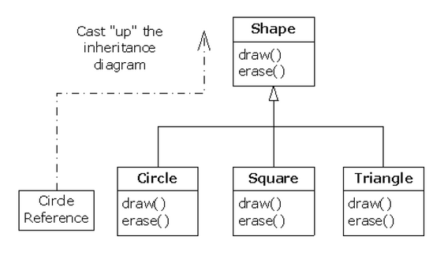
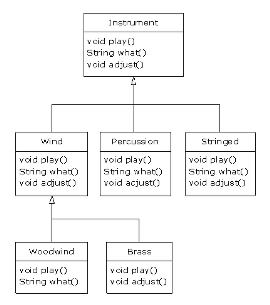

# Поліморфізм
 
Поліморфізм є третьою невід'ємною рисою об'єктно-орієнтованої мови, після абстракції даних і успадкування.
 
Він надає ще одну ступінь відділення інтерфейсу від реалізації, відокремлення *що* від *як*. Поліморфізм покращує організацію коду і його читабельність, а також сприяє створенню розширюваних програм, які можуть «рости» не тільки в процесі початкової розробки проекту, але і при додаванні нових можливостей.
 
Інкапсуляція створює нові типи даних за рахунок об'єднання характеристик і поведінки. Приховування реалізації відокремлює інтерфейс від реалізації за рахунок ізоляції технічних подробиць в ***private*** частинах класу. Подібне механічне розділення зрозуміло будь-кому, хто мав досвід роботи з процедурними мовами. Але поліморфізм має справу з логічним поділом в контексті типів. У попередньому розділі ви побачили, що успадкування дозволяє працювати з об'єктом, використовуючи як його власний тип, так і як його базовий тип.
 
Цей факт дуже важливий, тому що він дозволяє працювати з багатьма типами (похідними від одного базового типу) як з єдиним типом, що дає можливість єдиному коду працювати з безліччю різних типів однотипно. Виклик поліморфного методу дозволяє одному типу показати свою відмінність від іншого, схожого типу, хоча вони і походять від одного базового типу. Ця відмінність виражається відмінністю поведінки методів, що викликаються через базовий клас.
 
У цьому розділі розглядається поліморфізм (також званий динамічним зв'язуванням, або пізнім зв'язуванням, або зв'язуванням під час виконання). Ми почнемо з азів, а виклад матеріалу буде пояснюватися простими прикладами, повністю акцентованими на полиморфній поведінці програми.
 
## Знову про висхідне перетворення
 
Як було показано в главі 7, з об'єктом можна працювати з використанням як його власного типу, так і його базового типу. Інтерпретація посилання на об'єкт як посилання на базовий тип називається висхідним перетворенням.
 
Також були представлені проблеми, що виникають при висхідному перетворенні і наочно втілені в наступній програмі з музичними інструментами. Оскільки ми будемо програвати з їх допомогою об'єкти ***Note*** (нота), логічно створити ці об'єкти в окремому пакеті:
 
``` java
//: Polymorphism/music/Note.java
// Ноти для гри на музичних інструментах. 
package polymorphism.music;

public enum Note {
	MIDDLE_C, C_SHARP, B_FLAT; // Etc. 
}
```
 
Перерахування були представлені в розділі 5. У наступному прикладі ***Wind*** є окремим випадком інструменту (***Instrument***), тому клас ***Wind*** успадковується від ***Instrument***:
 
``` java
//: polymorphism/music/Instrument.java 
package polymorphism.music;
import static net.mindview.util.Print.*;

class Instrument {
    public void play(Note n) {
        print("Instrument.play()");
    }
}
///:~

//: polymorphism/music/Wind.java 
package polymorphism.music;

// Об'єкти Wind також є об'єктами Instrument
// Оскільки мають той же інтерфейс:
public class Wind extends Instrument {
    // Redefine interface method:
    public void play(Note n) {
        System.out.println("Wind.play() " + n);
    }
} ///:~ 

//: polymorphism/music/Music.java 
// Успадкування та висхідне перетворення
package polymorphism.music;

public class Music {
    public static void tune(Instrument i) {
        // ...
        i.play(Note.MIDDLE_C);
    }
    public static void main(String[] args) {
        Wind flute = new Wind();
        tune(flute); // Upcasting
    }
} /* Output: 
Wind.play() MIDDLE_C 
*///:~ 
```

Метод ***Music.tune()*** отримує посилання на ***Instrument***, але останнє також може вказувати на об'єкт будь-якого класу, похідного від ***Instrument***. У методі ***main()*** посилання на об'єкт ***Wind*** передається методу ***tune()*** без явних перетворень. Це нормально; інтерфейс класу ***Instrument*** повинен існувати і в класі ***Wind***, оскільки останній був успадкований від ***Instrument***. Висхідне перетворення від ***Wind*** до ***Instrument*** здатне «звузити» цей інтерфейс, але не зробить його «меншим», ніж повний інтерфейс класу ***Instrument***. 

### Втрата типу об'єкта

Програма ***Music.java*** виглядає трохи дивно. Навіщо навмисне ігнорувати фактичний тип об'єкта? Саме це ми спостерігаємо при висхідному перетворенні, і здавалося б, програма стала яснішою, якби методу ***tune()*** передавалася посилання на об'єкт ***Wind***. Але при цьому ми стикаємося з дуже важливою обставиною: якщо вчинити подібним чином, то потім доведеться писати новий метод ***tune()*** для кожного типу ***Instrument***, присутнього в системі. Припустимо, що в систему були додані нові класи ***Stringed*** і ***Brass***:
 
``` java
//: Polymorphism/music/Music2.java
// Перевантаження замість висхідного перетворення
package polymorphism.music;
import static net.mindview.util.Print. *;

class Stringed extends Instrument {
    public void play (Note n) {
        print ( "Stringed.play ()" + n);
    }
}

class Brass extends Instrument {
    public void play (Note n) {
        print ( "Brass.play ()" + n);
    }
}

public class Music2 {
    public static void tune (Wind i) {
        i.play (Note.MIDDLE_C);
    }
    public static void tune (Stringed i) {
        i.play (Note.MIDDLE_C);
    }
    public static void tune (Brass i) {
        i.play (Note.MIDDLE_C);
    }
    public static void main (String [] args) {
        Wind flute = new Wind ();
        Stringed violin = new Stringed ();
        Brass frenchHorn = new Brass ();
        tune (flute); // Без висхідного перетворення tune (violin);
        tune (frenchHorn);
    }
} /* Output: 
Wind.play() MIDDLE_C 
Stringed.play() MIDDLE_C 
Brass.play() MIDDLE_C 
*///:~ 
```
 
Програма працює, але у неї є величезний недолік:
для кожного нового класу ***Instrument*** доводиться писати новий метод ***tune()***, який залежить від конкретного типу. Обсяг програмного коду збільшується, а при додаванні нового методу (такого, як ***tune()***), або нового типу інструменту доведеться виконати чимало додаткової роботи. А якщо врахувати, що компілятор не виводить повідомлень про помилки, якщо ви забудете перевантажити один з ваших методів, весь процес роботи з типами стане абсолютно некерованим.
 
Хіба не краще було б написати єдиний метод, в аргументі якого передається базовий клас, а не один з похідних класів? Хіба не зручніше було б забути про похідні класи і написати узагальнений код для базового класу?
Саме це і дозволяє робити поліморфізм. Однак більшість програмістів з досвідом роботи на процедурних мовах при роботі з поліморфізмом відчувають деякі труднощі.
 
## Особливості

Складнощі з програмою ***Music.java*** проявляються після її запуску. Вона виводить рядок ***Wind.play()***. Саме це і потрібно, але не зрозуміло, звідки береться такий результат. Погляньте на метод ***tune()***:
 
``` java
public static void tune(Instrument i) { 
  // ... 
  i.play(Note.MIDDLE_C); 
}
```
 
Метод отримує посилання на об'єкт ***Instrument***. Як компілятор дізнається, що посилання на ***Instrument*** в даному випадку вказує на об'єкт ***Wind***, а не на ***Brass*** або ***Stringed***? Компілятор і не знає. Щоб повною мірою розібратися в суті того, що відбувається, необхідно розглянути поняття зв'язування (*binding*).
 
### Зв'язування типу «метод-виклик»
 
Приєднання виклику методу до тіла методу називається зв'язуванням. Якщо зв'язування проводиться перед запуском програми (компілятором і компоновщиком, якщо він є), воно називається раннім зв'язуванням (*early binding*). Можливо, раніше вам не доводилося чути цей термін, тому що в процедурних мовах ніякого вибору зв'язування не було. Компілятори *C* підтримують тільки один тип виклику - раннє зв'язування.
 
Неоднозначність попередньої програми криється саме в ранньому зв'язуванні:
компілятор не може знати, який метод потрібно викликати, коли у нього є тільки посилання на об'єкт ***Instrument***. Проблема вирішується завдяки пізньому зв'язуванню (*late binding*), тобто зв'язування, що проводиться під час виконання програми, в залежності від типу об'єкта. Пізнє зв'язування також називають динамічним (*dynamic*), або зв'язуванням на стадії виконання (*runtime binding*).
 
У мовах, що реалізують пізнє зв'язування, повинен існувати механізм визначення фактичного типу об'єкта під час роботи програми, для виклику відповідного методу. Інакше кажучи, компілятор не знає тип об'єкта, але механізм виклику методів визначає його і викликає відповідне тіло методу. Механізм пізнього зв'язування залежить від конкретної мови, але неважко припустити, що для його реалізації в об'єкти повинна включатися якась додаткова інформація.
 
Для всіх методів *Java* використовується механізм пізнього зв'язування, якщо тільки метод не був оголошений як ***static***, або ***final*** (приватні методи є ***final*** за замовчуванням). Отже, вам не доведеться приймати рішень щодо використання пізнього зв'язування - воно здійснюється автоматично. 

Навіщо оголошувати метод як ***final***? Як вже було відмічено в попередньому розділі, це забороняє перевизначення відповідного методу. Що ще важливіше, це фактично «відключає» пізніше зв'язування або, скоріше, вказує компілятору на те, що пізніше зв'язування не є необхідним. Тому для методів ***final*** компілятор генерує трохи ефективніший код. Втім, в більшості випадків вплив на продуктивність вашої програми незначний, тому ***final*** краще використовувати в якості продуманого елемента свого проекту, а не як засіб поліпшення продуктивності. 

### Отримання потрібного результату

Тепер, коли ви знаєте, що зв'язування всіх методів в *Java* здійснюється поліморфно, через пізнє скріплення, ви можете писати код для базового класу, не сумніваючись у тому, що для всіх похідних класів він також буде працювати правильно. Іншими словами, ви «посилаєте повідомлення об'єкту і дозволяєте йому вирішити, що слід робити далі».
 
Класичним прикладом поліморфізму в ООП є приклад з геометричними фігурами. Він часто використовується завдяки своїй наочності, але, на жаль, деякі новачки починають думати, що ООП має на увазі графічне програмування - а це, звичайно ж, не так.
 
У прикладі з фігурами є базовий клас з ім'ям ***Shape*** (фігура) і різні похідні типи: ***Circle*** (окружність), ***Square***
(прямокутник), ***Triangle*** (трикутник) і т.п. Вирази типу «коло є фігура» очевидні і не уявляють труднощів для розуміння. Взаємозв'язок показані на наступній діаграмі успадкування:



Висхідне перетворення має місце навіть у такій простій команді:
 
``` java
Shape s = new Circle();
```
 
Тут створюється об'єкт ***Circle***, і отриманя посилання негайно присвоюється типу ***Shape***. На перший погляд це може здатися помилкою (привласнення одного типу іншому), але в дійсності все правильно, тому що тип ***Circle*** (окружність) є типом ***Shape*** (фігура) за допомогою успадкування. Компілятор приймає команду і не видає повідомлення про помилку.
 
Припустимо, викликається один з методів базового класу (з тих, що були перевизначені в похідних класах):
 
``` java
s.draw();
```
 
Знову можна подумати, що викликається метод ***draw()*** з класу ***Shape***, раз є посилання на об'єкт ***Shape*** - як компілятор може зробити щось інше? І все ж буде викликаний правильний метод ***Circle.draw()***, так як в програмі використовується пізнє зв'язування (поліморфізм). Наступний приклад показує дещо інший підхід:
 
``` java
//: Polymorphism/shape/Shape.java
package polymorphism.shape;
public class Shape {
    public void draw () {}
    public void erase () {}
}

//: Polymorphism/shape/Circle.java
package polymorphism.shape;
        import static net.mindview.util.Print. *;
public class Circle extends Shape {
    public void draw () {print ( "Circle.draw ()"); }
    public void erase () {print ( "Circle.erase ()"); }
}

//: Polymorphism/shape/Triangle.java
package polymorphism.shape;
        import static net.mindview.util.Print. *;
public class Triangle extends Shape {
    public void draw () {print ( "Triangle.draw ()"); }
    public void erase () {print ( "Triangle.erase ()"); }
}

//: Polymorphism/shape/Square.java
package polymorphism.shape;
        import static net.mindview.util.Print. *;
public class Square extends Shape {
    public void draw () {print ( "Square.draw ()"); }
    public void erase () {print ( "Square.erase ()"); }
}

//: Polymorphism/shape/RandomShapeGenerator.java
// "Фабрика" випадкових фігур. 
package polymorphism.shape;
        import java.util. *;
public class RandomShapeGenerator {
    private Random rand = new Random (47);
    public Shape next () {
        switch (rand.nextInt (3)) {
            default:
            case 0: return new Circle ();
            case 1: return new Square ();
            case 2: return new Triangle ();
        }
    }
}


//: Polymorphism/Shapes.java
// Polymorphism in Java. 
import polymorphism.shape. *;

public class Shapes {
    private static RandomShapeGenerator gen =
            new RandomShapeGenerator ();
    public static void main (String [] args) {
        Shape [] s = new Shape [9];
// Fill up the array with shapes:
        for (int i = 0; i <s.length; i ++)
            s [i] = gen.next ();
// Make polymorphic method calls:
        for (Shape shp   : S)
            shp.draw ();
    }
} /* Output: 
Triangle.draw() 
Triangle.draw() 
Square.draw() 
Triangle.draw() 
Square.draw() 
Triangle.draw() 
Square.draw() 
Circle.draw() 
*///:~ 
```
 
 Базовий клас ***Shape*** встановлює загальний інтерфейс для всіх класів, похідних від ***Shape*** - тобто будь-яку фігуру можна намалювати (***draw()***) і стерти (***erase()***). Похідні класи скасовують цей інтерфейс, щоб реалізувати унікальну поведінку для кожної конкретної фігури.
 
Клас ***RandomShapeGenerator*** - свого роду «фабрика», при кожному виклику методу ***next()*** створюється посилання на випадково обраний об'єкт ***Shape***. Зауважте, що висхідне перетворення виконується в командах ***return***, кожна з яких отримує посилання на об'єкт ***Circle***, ***Square***, або ***Triangle***, а видає її за межі ***next()*** в вигляді повертаємого типу ***Shape***. Таким чином, при виклику цього методу ви не зможете визначити конкретний тип об'єкта, оскільки завжди отримуєте просто ***Shape***.
 
Метод ***main()*** містить масив посилань на ***Shape***, який заповнюється послідовними викликами ***RandomShapeGenerator.next()***. До цього моменту вам відомо, що є об'єкти ***Shape***, але ви не знаєте про ці об'єкти нічого конкретного (так само, як і компілятор). Але якщо перебрати вміст масиву і викликати ***draw()*** для кожного його елемента, то, як за помахом чарівної палички, відбудеться вірна, властива для певного типу дія - в цьому неважко переконатися, поглянувши на результат роботи програми.
 
Випадковий вибір фігур в нашому прикладі всього лише допомагає зрозуміти, що компілятор під час компіляції коду не має інформації про те, яку реалізацію слід викликати. Всі виклики методу ***draw()*** проводяться із застосуванням пізнього зв'язування. 

### Розширюваність

Тепер повернемося до програми ***Music.java***. Завдяки поліморфізму ви можете додати в неї скільки завгодно нових типів, не змінюючи метод ***tune()***. У добре спланованій ООП-програмі велика частина ваших методів (або навіть всі методи) слідують моделі методу ***tune()***, оперуючи тільки з інтерфейсом базового класу.
 
Така програма є розширювана, оскільки в неї можна додати додаткову функціональність, визначаючи нові типи даних від загального базового класу. Методи, що працюють на рівні інтерфейсу базового класу, зовсім не потрібно змінювати, щоб пристосувати їх до нових класів.
 
Давайте візьмемо приклад з об'єктами ***Instrument*** і включимо додаткові методи в базовий клас, а також визначимо кілька нових класів. Розглянемо діаграму.
 


Всі нові класи правильно працюють зі старим, незміненим методом ***tune()***. Навіть якщо метод ***tune()*** знаходиться в іншому файлі, а до класу ***Instrument*** приєднуються нові методи, він все одно буде працювати правильно без повторної компіляції. Нижче приведена реалізація розглянутої діаграми:
 
``` java
//: polymorphism/music3/Music3.java 
// An extensible program. 
package polymorphism.music3;
import polymorphism.music.Note;
import static net.mindview.util.Print.*;

class Instrument {
    void play(Note n) { print("Instrument.play() " + n); }
    String what() { return "Instrument"; }
    void adjust() { print("Adjusting Instrument"); }
}

class Wind extends Instrument {
    void play(Note n) { print("Wind.play() " + n); }
    String what() { return "Wind"; }
    void adjust() { print("Adjusting Wind"); }
}

class Percussion extends Instrument {
    void play(Note n) { print("Percussion.play() " + n); }
    String what() { return "Percussion"; }
    void adjust() { print("Adjusting Percussion"); }
}

class Stringed extends Instrument {
    void play(Note n) { print("Stringed.play() " + n); }
    String what() { return "Stringed"; }
    void adjust() { print("Adjusting Stringed"); }
}

class Brass extends Wind {
    void play(Note n) { print("Brass.play() " + n); }
    void adjust() { print("Adjusting Brass"); }
}

class Woodwind extends Wind {
    void play(Note n) { print("Woodwind.play() " + n); }
    String what() { return "Woodwind"; }
}

public class Music3 {
    // Doesn’t care about type, so new types 
    // added to the system still work right: 
    public static void tune(Instrument i) {
        // ... 
        i.play(Note.MIDDLE_C);
    }
    public static void tuneAll(Instrument[] e) {
        for(Instrument i : e)
            tune(i);
    }
    public static void main(String[] args) {
        // Upcasting during addition to the array: 
        Instrument[] orchestra = {
                new Wind(),
                new Percussion(),
                new Stringed(),
                new Brass(),
                new Woodwind()
        };
        tuneAll(orchestra);
    }
} /* Output: 
Wind.play() MIDDLE_C 
Percussion.play() MIDDLE_C 
Stringed.play() MIDDLE_C 
Brass.play() MIDDLE_C 
Woodwind.play() MIDDLE_C 
*///:~ 
```
 
Новий метод ***what()*** повертає рядок (***String***) з інформацією про клас, а метод ***adjust()*** призначений для настроювання інструментів.
 
У методі ***main()*** збереження будь-якого об'єкта в масиві orchestra автоматично призводить до виконання висхідного перетворення до типу ***Instrument***.
 
Ви можете бачити, що метод ***tune()*** ізольований від оточуючих змін коду, але при цьому все одно працює правильно. Для досягнення такої функціональності і використовується поліморфізм. Зміни в коді не зачіпають ті частини програми, які не залежать від них. Іншими словами, поліморфізм допомагає відокремити «змінне від незмінного». 

### Проблема: «перевизначення» закритих методів

Перед вами одна з помилок, що здійснюються по наївності:
 
``` java
//: polymorphism/PrivateOverride.java 
// Trying to override a private method. 
package polymorphism;
import static net.mindview.util.Print.*;

public class PrivateOverride {
    private void f() { print("private f()"); }
    public static void main(String[] args) {
        PrivateOverride po = new Derived();
        po.f();
    }
}

class Derived extends PrivateOverride {
    public void f() { print("public f()"); }
} /* Output: 
private f() 
*///:~ 
```
 
Цілком природно було б очікувати, що програма виведе повідомлення ***public f()***, але закритий (***private***) метод автоматично є незмінним (***final***), а заодно і прихованим від похідного класу. Так що метод ***f()*** класу ***Derived*** в нашому випадку є повністю новим - він навіть не був перевантажений, тому що метод ***f()*** базового класу класу ***Derived*** недоступний.
 
З цього можна зробити висновок, що перевизначаються тільки методи, які не є закритими. Будьте уважні: компілятор в подібних ситуаціях не видає повідомлень про помилку, але і не робить того, що ви від нього очікуєте. Іншими словами, методам похідного класу слід присвоювати імена, відмінні від імен закритих методів базового класу.
 
## Конструктори і поліморфізм
 
Конструктори відрізняються від звичайних методів, і ці відмінності виявляються і при використанні поліморфізму. Хоча конструктори самі по собі не поліморфні (фактично вони являють собою статичні методи, тільки ключове слово ***static*** опущено), ви повинні добре розуміти, як працюють конструктори в складних поліморфних ієрархіях. Таке розуміння в подальшому допоможе уникнути деяких скрутних ситуацій. 

### Порядок виклику конструкторів

Порядок виклику конструкторів коротко обговорювався в розділах 5 і 7, але в той час ми ще не розглядали поліморфізм. Конструктор базового класу завжди викликається в процесі конструювання похідного класу. Виклик автоматично проходить вгору по ланцюжку успадкування, так що в кінцевому підсумку викликаються конструктори всіх базових класів по всьому ланцюжку успадкування. Це дуже важливо, оскільки конструктору відводиться особлива роль - забезпечувати правильну побудову об'єктів.
 
Похідний клас зазвичай має доступ тільки до своїх членів, але не до членів базового класу (які найчастіше з'являються зі специфікатором ***private***). Тільки конструктор базового класу володіє необхідними знаннями і правами доступу, щоб правильно форматувати свої внутрішні елементи.
 
Саме тому компілятор наполягає на виклику конструктора для будь-якої частини похідного класу. Він непомітно підставить конструктор за замовчуванням, якщо ви явно не викличете конструктор базового класу в тілі конструктора похідного класу. Якщо конструктора за замовчуванням не існує, компілятор повідомить про це. (Якщо у класу взагалі немає користувальницьких конструкторів, компілятор автоматично генерує конструктор за замовчуванням.)

Наступний приклад показує, як композиція, успадкування і поліморфізм впливають на порядок конструювання:
 
``` java
//: polymorphism/Sandwich.java 
// Order of constructor calls. 
package polymorphism;
import static net.mindview.util.Print.*;

class Meal {
    Meal() { print("Meal()"); }
}

class Bread {
    Bread() { print("Bread()"); }
}

class Cheese {
    Cheese() { print("Cheese()"); }
}

class Lettuce {
    Lettuce() { print("Lettuce()"); }
}

class Lunch extends Meal {
    Lunch() { print("Lunch()"); }
}

class PortableLunch extends Lunch {
    PortableLunch() { print("PortableLunch()");}
}

public class Sandwich extends PortableLunch {
    private Bread b = new Bread();
    private Cheese c = new Cheese();
    private Lettuce l = new Lettuce();
    public Sandwich() { print("Sandwich()"); }
    public static void main(String[] args) {
        new Sandwich();
    }
} /* Output: 
Meal() 
Lunch() 
PortableLunch() 
Bread() 
Cheese() 
Lettuce() 
Sandwich() 
*///:~ 
```
 
У цьому прикладі створюється складний клас, зібраний з інших класів, і в кожному класі є конструктор, який повідомляє про своє виконання. Найважливіший клас - ***Sandwich***, з трьома рівнями успадкування (чотирма, якщо вважати неявне успадкування від класу ***Object***) і трьома вбудованими об'єктами. Результат видно при створенні об'єкта ***Sandwich*** в методі ***main()***. Це означає, що конструктори для складного об'єкта викликаються в наступній послідовності:

- Спочатку викликається конструктор базового класу. Цей крок повторюється рекурсивно: спочатку конструюється корінь ієрархії, потім наступний за ним клас, потім наступний за цим класом клас і т.д., Поки не досягається «нижчий» похідний клас.
- Проводиться ініціалізація членів класу в порядку їх оголошення.
- Викликається тіло конструктора похідного класу.

Порядок виклику конструкторів має велике значення. При успадкуванні ви маєте в своєму розпорядженні повну інформацію про базовий клас і можете отримати доступ до будь-якого з його відкритих (***public***), або захищених (***protected***) членів. Отже, при цьому мається на увазі, що всі члени базового класу є дійсними в похідному класі.
 
При виклику нормального методу відомо, що конструювання вже було проведено, тому всі частини об'єкта ініціалізовані. Однак в конструкторі ви також повинні бути впевнені в тому, що всі використовувані члени вже проініціалізовані. Це можна гарантувати тільки одним способом - спочатку викликати конструктор базового класу.
 
Надалі при виконанні конструктора похідного класу можна бути впевненим в тому, що всі члени базового класу вже ініційовані. Гарантія дійсності всіх членів в конструкторі - важлива причина, по якій всі вбудовані об'єкти (тобто об'єкти, поміщені в клас за допомогою композиції) започатковано на місці їх визначення (як в розглянутому прикладі зроблено з об'єктами ***b***, ***с*** і ***l***). Якщо ви будете дотримуватися цього правила, це посилить впевненість в тому, що всі члени базового класу і об'єкти-члени були проініціалізовані. На жаль, це допомагає не завжди, в чому ви переконаєтеся в наступному розділі. 

### Успадкування і завершальні дії

Якщо при створенні нового класу використовується композиція і успадкування, зазвичай вам не доводиться турбуватися про проведення завершальних дій - підоб'єкти знищуються збиральником сміття. Але якщо вам необхідно провести завершальні дії, створіть в своєму класі метод ***dispose()*** (в даному розділі я вирішив використовувати таке ім'я; можливо, ви придумаєте більш вдалу назву). Перевизначаючи метод ***dispose()*** в похідному класі, важливо пам'ятати про виклик цього методу з базового класу, оскільки інакше не будуть виконані завершальні дії базового класу. Наступний приклад доводить справедливість цього твердження:
 
``` java
//: Polymorphism/Frog.java
// Успадкування та завершальні дії.
package polymorphism;
import static net.mindview.util.Print.*;

class Characteristic {
    private String s;
    Characteristic(String s) {
        this.s = s;
        print("Creating Characteristic " + s);
    }
    protected void dispose() {
        print("disposing Characteristic " + s);
    }
}

class Description {
    private String s;
    Description(String s) {
        this.s = s;
        print("Creating Description " + s);
    }
    protected void dispose() {
        print("disposing Description " + s);
    }
}
// Жива істота
class LivingCreature {
    private Characteristic p =
            new Characteristic("is alive");
    private Description t =
            new Description("Basic Living Creature");
    LivingCreature() {
        print("LivingCreature()");
    }
    protected void dispose() {
        print("LivingCreature dispose");
        t.dispose();
        p.dispose();
    }
}
// Тварина 
class Animal extends LivingCreature {
    private Characteristic p =
            new Characteristic("has heart");
    private Description t =
            new Description("Animal not Vegetable");
    Animal() { print("Animal()"); }
    protected void dispose() {
        print("Animal dispose");
        t.dispose();
        p.dispose();
        super.dispose();
    }
}
// Земноводне
class Amphibian extends Animal {
    private Characteristic p =
            new Characteristic("can live in water");
    private Description t =
            new Description("Both water and land");
    Amphibian() {
        print("Amphibian()");
    }
    protected void dispose() {
        print("Amphibian dispose");
        t.dispose();
        p.dispose();
        super.dispose();
    }
}
// Жаба 
public class Frog extends Amphibian {
    private Characteristic p = new Characteristic("Croaks");
    private Description t = new Description("Eats Bugs");
    public Frog() { print("Frog()"); }
    protected void dispose() {
        print("Frog dispose");
        t.dispose();
        p.dispose();
        super.dispose();
    }
    public static void main(String[] args) {
        Frog frog = new Frog();
        print("Bye!");
        frog.dispose();
    }
} /* Output: 
Creating Characteristic is alive 
Creating Description Basic Living Creature 
Polymorphism  207 LivingCreature() 
Creating Characteristic has heart 
Creating Description Animal not Vegetable 
Animal() 
Creating Characteristic can live in water 
Creating Description Both water and land 
Amphibian() 
Creating Characteristic Croaks 
Creating Description Eats Bugs 
Frog() 
Bye! 
Frog dispose 
disposing Description Eats Bugs 
disposing Characteristic Croaks 
Amphibian dispose 
disposing Description Both water and land 
disposing Characteristic can live in water 
Animal dispose 
disposing Description Animal not Vegetable 
disposing Characteristic has heart 
LivingCreature dispose 
disposing Description Basic Living Creature 
disposing Characteristic is alive 
*///:~ 
```
 
Кожен клас в ієрархії містить об'єкти класів ***Characteristic*** і ***Description***, які також необхідно «завершувати». Черговість завершення має бути зворотною порядку ініціалізації в тому випадку, якщо об'єкти залежать один від одного. Для полів це означає порядок, зворотний послідовності оголошення полів в класі (ініціалізація відповідає порядку оголошення).
 
У базових класах спочатку слід виконувати фіналізації для похідного класу, а потім - для базового класу. Це пояснюється тим, що завершальний метод похідного класу може викликати деякі методи базового класу, для яких необхідні дійсні компоненти базового класу. З результатів роботи програми видно, що всі частини об'єкта ***Frog*** будуть фіналізовани в порядку, протилежному черговості їх створення.
 
Також зверніть увагу на те, що в описаному прикладі об'єкт ***Frog*** є «власником» вбудованих об'єктів. Він створює їх, визначає тривалість їх існування (до тих пір, поки існує ***Frog***) і знає, коли викликати ***dispose()*** для вбудованих об'єктів.
 
Але якщо вбудований об'єкт використовується спільно з іншими об'єктами, ситуація ускладнюється і ви вже не можете просто викликати ***dispose()***. У таких випадках для відстеження кількості об'єктів, що працюють з вбудованим об'єктом, доводиться використовувати підрахунок посилань. Ось як це виглядає:
 
``` java
//: Polymorphism/ReferenceCounting.java
// Знищення спільно використовуваних вбудованих об'єктів 
import static net.mindview.util.Print. *;

class Shared {
    private int refcount = 0;
    private static long counter = 0;
    private final long id = counter ++;
    public Shared () {
        print ( "Creating" + this);
    }
    public void addRef () {refcount ++; }
    protected void dispose () {
        if (- refcount == 0)
            print ( "Disposing" + this);
    }
    public String toString () {return "Shared" + id; }
}

class Composing {
    private Shared shared;
    private static long counter = 0;
    private final long id = counter ++;
    public Composing (Shared shared) {
        print ( "Creating" + this);
        this.shared = shared;
        this.shared.addRef ();
    }
    protected void dispose () {
        print ( "disposing" + this);
        shared.dispose();
    }
    public String toString () {return "Composing" + id; }
}

public class ReferenceCounting {
    public static void main (String [] args) {
        Shared shared = new Shared ();
        Composing [] composing = {new Composing (shared), new Composing (shared), new Composing (shared), new Composing (shared), new Composing (shared)};
        for (Composing c   : composing)
            c.dispose ();
    }
} /* Output: 
Creating Shared 0 
Creating Composing 0 
Creating Composing 1 
Creating Composing 2 
Creating Composing 3 
Creating Composing 4 
disposing Composing 0 
disposing Composing 1 
disposing Composing 2 
disposing Composing 3 
disposing Composing 4 
Disposing Shared 0 
*///:~ 
```
 
В змінної ***static long counter*** зберігається кількість створених примірників ***Shared***. Для лічильника обрано тип ***long*** замість ***int*** для того, щоб запобігти переповненню (це всього лише хороший стиль програмування; в розглянутих прикладах переповнення навряд чи можливо). Поле ***id*** оголошено зі специфікатором ***final***, оскільки його значення залишається постійним протягом життєвого циклу об'єкта.
 
Приєднуючи до класу загальний об'єкт, необхідно викликати ***addRef()***, але метод ***dispose()*** стежитиме за станом лічильника посилань і сам вирішить, коли потрібно виконати завершальні дії. Підрахунок посилань вимагає додаткових зусиль з боку програміста, але при спільному використанні об'єктів, що вимагають завершення, у вас немає особливого вибору.
 
### Поведінка поліморфних методів при виклику з конструкторів
 
У ієрархіях конструкторів виникає цікаве питання. Що відбувається, якщо викликати в конструкторі динамічно зв'язаний метод конструюємого об'єкта?

У звичайних методах уявити, що відбувається неважко - динамічно зв'язаний виклик обробляється під час виконання, так як об'єкт не знає, чи належить цей виклик класу, в якому визначено метод, або класу, похідному від цього класу. Здавалося б, те ж саме повинно відбуватися і в конструкторах. Але нічого подібного. Коли Ви викликаєте динамічно зв'язаний метод в конструкторі використовується перевизначення опису цього методу. Однак наслідки такого виклику можуть бути вельми несподіваними, і тут можуть критися деякі підступні помилки.
 
За визначенням, завдання конструктора - дати об'єкту життя (і це аж ніяк не просте завдання). Усередині будь-якого конструктора об'єкт може бути сформований лише частково - відомо тільки те, що об'єкти базового класу були проініціалізовані. Якщо конструктор є лише черговим кроком на шляху побудови об'єкта класу, похідного від класу даного конструктора, «похідні» частини ще не були ініційовані на момент виклику поточного конструктора.
 
Однак динамічно зв'язуваний виклик може перейти на «зовнішню» частину ієрархії, тобто до похідних класів. Якщо він викличе метод похідного класу в конструкторі, це може призвести до маніпуляцій з неініціалізованими даними - а це напевно призведе до катастрофи. Наступний приклад пояснює суть проблеми:
 
``` java
//: Polymorphism/PolyConstructors.java
// Конструктори і поліморфізм дають не той
// Результат, який можна було б очікувати
import static net.mindview.util.Print. *;

class Glyph {
    void draw () {print ( "Glyph.draw ()"); }
    Glyph () {
        print ( "Glyph () before draw ()");
        draw ();
        print ( "Glyph () after draw ()");
    }
}

class RoundGlyph extends Glyph {
    private int radius = 1;
    RoundGlyph (int r) {
        radius = r;
        print ( "RoundGlyph.RoundGlyph (), radius =" + radius);
    }
    void draw () {
        print ( "RoundGlyph.draw (), radius =" + radius);
    }
}

public class PolyConstructors {
    public static void main (String [] args) {
        new RoundGlyph (5);
    }
} /* Output: 
Glyph() before draw() 
RoundGlyph.draw(), radius = 0 
Glyph() after draw() 
RoundGlyph.RoundGlyph(), radius = 5 
*///:~ 
```
 
Метод ***Glyph.draw()*** спочатку призначений для перевизначення в похідних класах, що і відбувається в ***RoundGlyph***. Але конструктор ***Glyph*** викликає цей метод, і в результаті це призводить до виклику методу ***RoundGlyph.draw()***, що начебто і передбачалося.
 
Однак з результатів роботи програми видно - коли конструктор класу ***Glyph*** викликає метод ***draw()***, змінної ***radius*** ще не присвоєно навіть значення за замовчуванням *1*. Зміння дорівнює *0*. В результаті клас може не виконати своє завдання, а вам доведеться довго вдивлятися в код програми, щоб визначити причину неправильного результату.
 
Порядок ініціалізації, описаний в попередньому розділі, трохи неповний, і саме тут криється ключ до цієї загадки. Насправді процес ініціалізації проходить наступним чином:

- Пам'ять, виділена під новий об'єкт, заповнюється двійковими нулями.
- Конструктори базових класів викликаються в описаному раніше порядку. У цей момент викликається перевизначення метод draw() (так, перед викликом конструктора класу RoundGlyph), де виявляється, що змінна radius дорівнює нулю через першого етапу.
- Викликаються ініціалізатор членів класу в порядку їх визначення.
- Виповнюється тіло конструктора похідного класу.

У того, що відбувається є і позитивна сторона - принаймні, дані ініціалізовано нулями (або тим, що розуміється під нульовим значенням для певного типу даних), а не випадковим «сміттям» в пам'яті. Це відноситься і до посилань на об'єкти, впроваджені в клас за допомогою композиції. Вони приймають особливе значення ***null***.
 
Якщо ви забудете форматувати таке посилання, то отримаєте виключення під час виконання програми. Інші дані заповнюються нулями, а це зазвичай легко помітити по вихідним даним програми. З іншого боку, результат програми виглядає досить моторошно. Начебто все логічно, а програма поводиться загадково і некоректно без найменших пояснень з боку компілятора. (В мові *C++* такі ситуації обробляються більш раціональним способом.) Пошук подібних помилок займає багато часу.
 
При написанні конструктора керуйтеся наступним правилом: не намагайтеся зробити більше для того, щоб привести об'єкт в потрібний стан, і по можливості уникайте виклику будь-яких методів. Єдині методи, які можна викликати в конструкторі без побоювання - незмінні (***final***) методи базового класу. (Сказане стосується і до закритих (***private***) методів, оскільки вони автоматично є незмінними.) Такі методи неможливо перевизначити, і тому вони застраховані від «сюрпризів». 

## Коваріант повертаємих типів

В *Java SE5* з'явилася концепція коваріантності повеотаємих типів; цей термін означає, що перевизначення метод похідного класу може повернути тип, похідний від типу, що повертається методом базового класу:
 
``` java
//: Polymorphism/CovariantReturn.java

class Grain {
    public String toString () {return "Grain"; }
}

class Wheat extends Grain {
    public String toString () {return "Wheat"; }
}

class Mill {
    Grain process () {return new Grain (); }
}

class WheatMill extends Mill {
    Wheat process () {return new Wheat (); }
}

public class CovariantReturn {
    public static void main (String [] args) {
        Mill m = new Mill ();
        Grain g = m.process ();
        System.out.println (g);
        m = new WheatMill ();
        g = m.process ();
        System.out.println (g);
    }
} /* Output: 
Grain 
Wheat 
*///:~ 
```
 
Головна відмінність *Java SE5* від попередніх версій *Java* полягає в тому, що старі версії змушували перевизначений ***process()*** повертати ***Grain*** замість ***Wheat***, хоча тип ***Wheat***, похідний від ***Grain***, є допустимим повертаємим типом. Коваріантність повертаємих типів дозволяє повернути більш спеціалізований тип ***Wheat***.
 
## Розробка зі успадкуванням
 
Після знайомства з поліморфізмом може здатися, що його слід застосовувати скрізь і завжди. Однак зловживання поліморфізмом погіршить архітектуру ваших додатків.
 
Краще для початку використовувати композицію, поки ви точно не впевнені в тому, який саме механізм слід вибрати. Композиція не обмежує розробку рамками ієрархії успадкування. До того ж механізм композиції більш гнучкий, так як він дозволяє динамічно вибирати тип (а отже, і поведінку), тоді як успадкування вимагає, щоб точний тип був відомий вже під час компіляції. Наступний приклад демонструє це:
 
``` java
//: Polymorphism/Transmogrify.java
// Динамічна зміна поведінки об'єкта
// За допомогою композиції (шаблон проектування «Стан»)
import static net.mindview.util.Print. *;

class Actor {
    public void act () {}
}

class HappyActor extends Actor {
    public void act () {print ( "HappyActor"); }
}

class SadActor extends Actor {
    public void act () {print ( "SadActor"); }
}

class Stage {
    private Actor actor = new HappyActor ();
    public void change () {actor = new SadActor (); }
    public void performPlay () {actor.act (); }
}

public class Transmogrify {
    public static void main (String [] args) {
        Stage stage = new Stage ();
        stage.performPlay ();
        stage.change ();
        stage.performPlay ();
    }
} /* Output: 
HappyActor 
SadActor 
*///:~ 
```
 
Об'єкт Stage містить посилання на об'єкт ***Actor***, яка ініціалізується об'єктом ***HappyActor***. Це означає, що метод ***performPlay()*** має певну поведінку. Але так як посилання на об'єкт можна заново приєднати до іншого об'єкта під час виконання програми, посиланню ***actor*** призначається об'єкт ***SadActor***, і після цього поведінка методу ***performPlay()*** змінюється.
 
Таким чином значно поліпшується динаміка поведінки на стадії виконання програми. З іншого боку, переключитися на інший спосіб успадкування під час роботи програми неможливо; ієрархія успадкування раз і назавжди визначається в процесі компіляції програми.
 
### Спадне перетворення і динамічне визначення типів
 
Так як при проведенні висхідного перетворення (пересування вгору по ієрархії успадкування) втрачається інформація, характерна для певного типу, виникає природне бажання відновити її за допомогою спадного перетворення. Втім, ми знаємо, що висхідне перетворення абсолютно безпечно; базовий клас не може мати «більший» інтерфейс, ніж похідний клас, і тому будь-яке повідомлення, надіслане базовому класу, гарантовано дійде до одержувача.
 
Але при використанні спадного перетворення ви не знаєте достовірно, що фігура (наприклад) в дійсності є колом. З такою ж ймовірністю вона може виявитися трикутником, прямокутником, або іншим типом. Повинен існувати якийсь механізм, який гарантує правильність спадного перетворення; в іншому випадку ви можете випадково використовувати невірний тип, пославши йому повідомлення, яке він не в змозі прийняти. Це було б небезпечно.
 
У деяких мовах (наприклад *C++*) для проведення безпечного спадного перетворення типів необхідно провести спеціальну операцію, але в *Java* кожне перетворення контролюється! Тому, хоча зовні все виглядає як звичайне приведення типів в круглих дужках, під час виконання програми це перетворення проходить перевірку на фактичну відповідність типу. Якщо типи не збігаються, відбувається виключення ***ClassCastException***. Процес перевірки типів під час виконання програми називається динамічним вибором типів (*run-time type identification, RTTI*). Наступний приклад демонструє дію *RTTI*:
 
``` java
//: Polymorphism/RTTI.java
// Спадне перетворення і динамічне визначення типів (RTTI).
// {ThrowsException}

class Useful {
    public void f() {}
    public void g() {}
}

class MoreUseful extends Useful {
    public void f() {}
    public void g() {}
    public void u() {}
    public void v() {}
    public void w() {}
}

public class RTTI {
    public static void main(String[] args) {
        Useful[] x = {
                new Useful(), new MoreUseful()
        };
        x[0].f();
        x[1].g();
        // Стадія компіляціі- метод не знайдений в класі Useful:
        //! x[1].u();
        ((MoreUseful) x[1]).U(); // Нісх. перетворення/RTTI
        ((MoreUseful) x[0]).U(); // Відбувається виключення
    }
}
```
 
Клас ***MoreUseful*** розширює інтерфейс класу ***Useful***. Але завдяки успадкуванню він також може бути перетворений до типу ***Useful***. Ви бачите, як це відбувається, при ініціалізації масиву ***x*** в методі ***main()***. Так як обидва об'єкти в масиві є похідними від ***Useful***, ви можете надіслати повідомлення (викликати методи) ***f()*** і ***g()*** для обох об'єктів, але при спробі виклику методу ***u()*** (який існує тільки в класі ***MoreUseful***) ви отримаєте повідомлення про помилку компіляції.
 
Щоб отримати доступ до розширеного інтерфейсу об'єкта ***MoreUseful***, використовуйте спадне перетворення. Якщо тип вказано правильно, все пройде успішно; інакше станеться виключення ***ClassCastException***. Вам не знадобиться писати додатковий код для цього виключення, оскільки воно вказує на загальну помилку, яка може статися в будь-якому місці програми.
 
Втім, *RTTI* не зводиться до простої перевірки перетворень. Наприклад, можна дізнатися, з яким типом ви маєте справу, перш ніж проводити спадне перетворення. Глава 11 повністю присвячена вивченню різних аспектів динамічного визначення типів *Java*.
 
## Резюме
 
Поліморфізм означає «різноманіття форм». В об'єктно-орієнтованому програмуванні базовий клас надає загальний інтерфейс, а різні версії динамічно зв'язованих методів - різні форми використання інтерфейсу.
 
Як було показано в цьому розділі, неможливо зрозуміти чи створити приклади з використанням поліморфізму, не вдавшись до абстракції даних і успадкування. Поліморфізм - це можливість мови, яка не може розглядатися ізольовано; вона працює тільки узгоджено, як частина «загальної картини» взаємин класів.
 
Щоб ефективно використовувати поліморфізм - а значить, всі об'єктно орієнтовані прийоми - в своїх програмах, необхідно розширити свої уявлення про програмування, щоб вони охоплювали не тільки члени і повідомлення окремого класу, а й загальні аспекти класів, їх взаємовідносини. Хоча це потребує значних зусиль, результат вартий того. Нагородою стане прискорення розробки програм, поліпшення структури коду, розгортання програми і скорочення зусиль по супроводу коду.
 