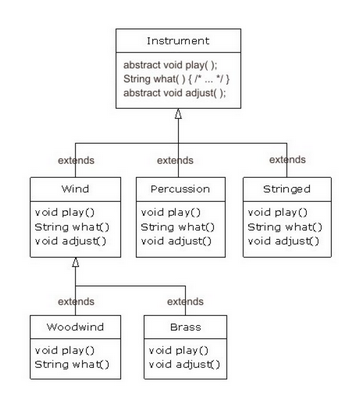
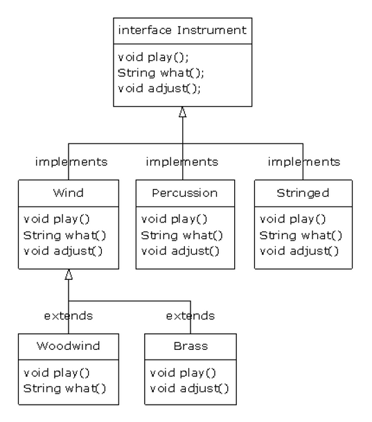
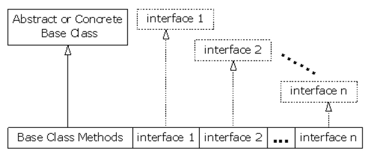

# Інтерфейси

Інтерфейси і абстрактні класи покращують структуру коду і сприяють відділенню інтерфейсу від реалізації. У традиційних мовах програмування такі механізми не отримали особливого поширення. Наприклад, в *C++* існує лише непряма підтримка цих концепцій. Сам факт їх існування в *Java* показує, що ці концепції вважались досить важливими для прямої підтримки в мові.
 
Ми почнемо з поняття абстрактного класу, який представляє собою свого роду проміжний щабель між звичайним класом і інтерфейсом. Абстрактні класи - важливий і необхідний інструмент для створення класів, що містять нереалізовані методи. Застосування «чистих»
інтерфейсів можливо не завжди. 

## Абстрактні класи та методи

У прикладі з класами музичних інструментів з попереднього розділу методи базового класу ***Instrument*** завжди залишалися «фіктивними». Спроба здійснити виклик такого методу означала, що в програмі сталася якась помилка. Це пояснювалося тим, що клас ***Instrument*** створювався для визначення загального інтерфейсу всіх класів, похідних від нього.
 
У цих прикладах загальний інтерфейс створювався для єдиної мети - його різної реалізації в кожному похідному типі. Інтерфейс визначає базову форму, спільність всіх похідних класів. Такі класи, як ***Instrument***, також називають абстрактними базовими класами, або просто абстрактними класами.

Якщо в програмі визначається абстрактний клас на зразок ***Instrument***, створення об'єктів такого класу практично завжди безглуздо. Абстрактний клас створюється для роботи з набором класів через загальний інтерфейс. А якщо ***Instrument*** тільки виражає інтерфейс, а створення об'єктів того класу не має сенсу, ймовірно, користувачеві краще заборонити створювати такі об'єкти. Звичайно, можна змусити всі методи ***Instrument*** видавати помилки, але в цьому випадку отримання інформації відкладається до стадії виконання. Помилки такого роду краще виявляти під час компіляції.
 
У мові *Java* для вирішення подібних завдань застосовуються абстрактні методи. Абстрактний метод незавершений; він складається тільки з оголошення і не має тіла. Синтаксис оголошення абстрактних методів виглядає так:
 
``` java
abstract void f();
```
 
Клас, що містить абстрактні методи, називається абстрактним класом. Такі класи теж повинні позначатися ключовим словом ***abstract*** (в іншому випадку компілятор видає повідомлення про помилку).
 
Якщо ви об'являєте клас, що похідний від абстрактного класу, але хочете мати можливість створення об'єктів нового типу, вам доведеться надати визначення для всіх абстрактних методів базового класу. Якщо цього не зробити, похідний клас теж залишиться абстрактним, і компілятор змусить позначити новий клас ключовим словом ***abstract***.
 
Можна створювати клас з ключовим словом ***abstract*** навіть тоді, коли в ньому немає жодного абстрактного методу. Це буває корисно в ситуаціях, де в класі абстрактні методи просто не потрібні, але необхідно заборонити створення екземплярів цього класу.
 
Клас ***Instrument*** дуже легко можна зробити абстрактним. Тільки деякі з його методів стануть абстрактними, оскільки оголошення класу як ***abstract*** не має на увазі, що всі його методи повинні бути абстрактними. Ось що вийде:



А ось як виглядає реалізація прикладу оркестру з використанням абстрактних класів і методів:
 
``` java
//: Interfaces/music4/Music4.java
// Абстрактні класи та методи 
package interfaces.music4;

import polymorphism.music.Note;
import static net.mindview.util.Print.*;

abstract class Instrument {
    private int i; // Пам'ять виділяється для кожного об'єкта
    public abstract void play (Note n);
    public String what() {return "Instrument"; }
    public abstract void adjust();
}

class Wind extends Instrument {
    public void play(Note n) {
        print( "Wind.play()" + n);
    }
    public String what() {return "Wind"; }
    public void adjust() {}
}

class Percussion extends Instrument {
    public void play(Note n) {
        print ( "Percussion.play ()" + n);
    }
    public String what() {return "Percussion"; }
    public void adjust() {}
}

class Stringed extends Instrument {
    public void play(Note n) {
        print("Stringed.play()" + n);
    }
    public String what() {return "Stringed"; }
    public void adjust() {}
}

class Brass extends Wind {
    public void play (Note n) {
        print ("Brass.play()" + n);
    }
    public void adjust() {print ("Brass.adjust()"); }
}

class Woodwind extends Wind {
    public void play(Note n) {
        print("Woodwind.play ()" + n);
    }
    public String what() {return "Woodwind"; }
}

public class Music4 {
    // Робота методу не залежить від фактичного типу об'єкта.
    // Тому типи, додані в систему, працюватимуть правильно:
    static void tune(Instrument i) {
        // ...
        i.play(Note.MIDDLE_C);
    }
    static void tuneAll(Instrument[] e) {
        for (Instrument i: E)
            tune (i);
    }
    public static void main(String [] args) {
        // Висхідне перетворення при додаванні в масив
        Instrument [] orchestra = {
                new Wind(), new Percussion(), new Stringed(), new Brass(), new Woodwind()
        };
        tuneAll (orchestra);
    }
} /* Output: 
Wind.play() MIDDLE_C 
Percussion.play() MIDDLE_C 
Stringed.play() MIDDLE_C 
Brass.play() MIDDLE_C 
Woodwind.play() MIDDLE_C 
*///:~ 
```
 
Як бачите, обсяг змін мінімальний. Створювати абстрактні класи і методи корисно, так як вони підкреслюють абстрактність класу, а також повідомляють і користувачеві класу, і компілятору, як слід з ним обходитися. Крім того, абстрактні класи грають корисну роль при переробці програм, тому що вони дозволяють легко переміщати загальні методи вгору по ієрархії успадкування. 

## Інтерфейси

Ключове слово ***interface*** стає наступним кроком на шляху до абстракції. Воно використовується для створення повністю абстрактних класів, що взагалі не мають реалізації. Творець інтерфейсу визначає імена методів, списки аргументів і типи значень, що повертаються, але не тіла методів.
 
Ключове слово ***interface*** фактично означає: «Саме так повинні виглядати всі класи, які реалізують даний інтерфейс». Таким чином, будь-який код, який використовує конкретний інтерфейс, знає тільки те, які методи викликаються для цього інтерфейсу, але не більше того. Інтерфейс визначає свого роду «протокол взаємодії» між класами. Однак інтерфейс є чимось більшим, ніж абстрактним класом у своєму крайньому прояві, тому що він дозволяє реалізувати подобу «множинного успадкування» *C++*: інакше кажучи, створюваний клас може бути перетворений до декількох базових типів.
 
Щоб створити інтерфейс, використовуйте ключове слово ***interface*** замість ***class***. Як і у випадку з класами, ви можете додати перед словом ***interface*** специфікатор доступу ***public*** (але тільки якщо інтерфейс визначений у файлі, що має те ж ім'я), або залишити для нього доступ в межах пакету, якщо він буде використовуватися тільки в межах свого пакету. Інтерфейс також може містити поля, але вони автоматично є статичними (***static***) і незмінними (***final***).
 
Для створення класу, що реалізує певний інтерфейс (або групу інтерфейсів), використовується ключове слово ***implements***. Фактично воно означає: «Інтерфейс лише визначає форму, а зараз буде показано, як це працює». У всьому іншому це виглядає як звичайне успадкування. Розглянемо реалізацію на прикладі ієрархії класів ***Instrument***:



Як ви можете бачити по класах ***Woodwind*** і ***Brass*** реалізація інтерфейсу являє собою звичайний клас, від якого можна створювати похідні класи.
 
При описі методів в інтерфейсі ви можете явно оголосити їх відкритими (***public***), хоча вони є такими навіть без специфікатора. Однак при реалізації інтерфейсу його методи повинні бути оголошені як ***public***. В іншому випадку буде використовуватися доступ в межах пакету, а це призведе до зменшення рівня доступу під час успадкування, що забороняється компілятором *Java*.
 
Все сказане можна побачити в наступному прикладі з об'єктами ***Instrument***. Зауважте, що кожен метод інтерфейсу обмежується простим оголошенням; нічого більшого компілятор не дозволить. До того ж жоден з методів інтерфейсу ***Instrument*** не оголошений зі специфікатором ***public***, але всі методи автоматично є відкритими:
 
``` java
//: interfaces/music5/Music5.java
// Інтерфейси.
package interfaces.music5;

import polymorphism.music.Note;
import static net.mindview.util.Print.*;

interface Instrument {
    // Константа часу компіляції:
    int VALUE = 5; // Static & final
    // Визначення методів неприпустимі:
    void play(Note n); // Автоматично оголошений як public
}

class Wind implements Instrument {
    public void play(Note n) {
        print (this + ".play()" + n);
    }
    public String toString() {return "Wind"; }
    public void adjust() {print (this + ".adjust()"); }
}

class Percussion implements Instrument {
    public void play(Note n) {
        print (this + ".play ()" + n);
    }
    public String toString() {return "Percussion"; }
    public void adjust() {print (this + ".adjust ()"); }
}

class Stringed implements Instrument {
    public void play(Note n) {
        print(this + ".play ()" + n);
    }
    public String toString() {return "Stringed"; }
    public void adjust() {print (this + ".adjust ()"); }
}

class Brass extends Wind {
    public String toString () {return "Brass"; }
}

class Woodwind extends Wind {
    public String toString() {return "Woodwind"; }
}

public class Music5 {
    // Робота методу не залежить від фактичного типу об'єкта.
    // Тому типи, додані в систему, працюватимуть правильно:
    static void tune(Instrument i) {
        // ...
        i.play(Note.MIDDLE_C);
    }
    static void tuneAll(Instrument [] e) {
        for (Instrument i : E)
            tune(i);
    }
    public static void main(String [] args) {
        // Сходить перетворення при додаванні в масив:
        Instrument [] orchestra = {
                new Wind(), new Percussion(), new Stringed(), new Brass(), new Woodwind()
        };
        tuneAll(orchestra);
    }
} /* Output: 
Wind.play() MIDDLE_C 
Percussion.play() MIDDLE_C 
Stringed.play() MIDDLE_C 
Brass.play() MIDDLE_C 
Woodwind.play() MIDDLE_C 
*///:~ 
```
 
У цій версії є ще одна зміна: метод ***what()*** був замінений на ***toString()***. Так як метод ***toString()*** входить в кореневий клас ***Object***, його присутність в інтерфейсі не обов'язково.
 
Решта коду працює так само, як раніше. Неважливо, чи проводите ви висхідне перетворення до «звичайного» класу з ім'ям ***Instrument***, до абстрактного класу з ім'ям ***Instrument***, чи до інтерфейсу з ім'ям ***Instrument*** - дія буде однакова. У методі ***tune()***
ніщо не вказує на те, є клас ***Instrument*** «звичайним», чи абстрактним, чи це взагалі не клас, а інтерфейс. 

## Відділення інтерфейсу від реалізації

У будь-якій ситуації, коли метод працює з класом замість інтерфейсу, ви обмежені використанням цього класу, або його субкласів. Якщо метод повинен бути застосований до класу, що не входить в цю ієрархію, - значить, вам не пощастило. Інтерфейси значною мірою послаблюють це обмеження. В результаті код стає більш універсальним, придатним для повторного використання.
 
Уявіть, що у нас є клас ***Processor*** з методами ***name()*** і ***process()***. Останній отримує вхідні дані, змінює їх і видає результат. Базовий клас розширюється для створення різних спеціалізованих типів ***Processor***. У наступному прикладі похідні типи змінюють об'єкти ***String*** (зверніть увагу: коваріантними можуть бути повертаємі значення, але не типи аргументів):

``` java
//: interfaces/classprocessor/Apply.java 
package interfaces.classprocessor;
import java.util.*;
import static net.mindview.util.Print.*;

class Processor {
    public String name() {
        return getClass().getSimpleName();
    }
    Object process(Object input) { return input; }
}

class Upcase extends Processor {
    String process(Object input) { // Covariant return 
        return ((String)input).toUpperCase();
    }
}

class Downcase extends Processor {
    String process(Object input) {
        return ((String)input).toLowerCase();
    }
}

class Splitter extends Processor {
    String process(Object input) {
        // The split() argument divides a String into pieces: 
        return Arrays.toString(((String)input).split(" "));
    }
}

public class Apply {
    public static void process(Processor p, Object s) {
        print("Using Processor " + p.name());
        print(p.process(s));
    }
    public static String s =
            "Disagreement with beliefs is by definition incorrect";
    public static void main(String[] args) {
        process(new Upcase(), s);
        process(new Downcase(), s);
        process(new Splitter(), s);
    }
} /* Output: 
Using Processor Upcase 
DISAGREEMENT WITH BELIEFS IS BY DEFINITION INCORRECT 
Using Processor Downcase 
disagreement with beliefs is by definition incorrect 
Using Processor Splitter 
[Disagreement, with, beliefs, is, by, definition, incorrect] 
*///:~ 
```
 
Метод ***Apply.process()*** отримує будь-який різновид ***Processor***, застосовує його до ***Object***, а потім виводить результат. 

Метод ***split()*** є частиною класу ***String***. Він отримує об'єкт ***String***, розбиває його на кілька фрагментів обмежувачем, що передаються в аргументі, і повертає ***String[]***. Тут він використовується як більш компактний спосіб створення масиву ***String***. 

Тепер припустимо, що ви виявили якесь сімейство електронних фільтрів, які теж було б доречно використовувати з методом ***Apply.process()***:
 
``` java
//: interfaces/filters/Waveform.java 
package interfaces.filters; 
 
public class Waveform { 
  private static long counter; 
  private final long id = counter++; 
  public String toString() { return "Waveform " + id; } 
} ///:~ 
 
//: interfaces/filters/Filter.java 
package interfaces.filters; 
 
public class Filter { 
  public String name() { 
    return getClass().getSimpleName(); 
  } 
  public Waveform process(Waveform input) { return input; } 
} ///:~ 
 
//: interfaces/filters/LowPass.java 
package interfaces.filters; 
 
public class LowPass extends Filter { 
  double cutoff; 
  public LowPass(double cutoff) { this.cutoff = cutoff; } 
  public Waveform process(Waveform input) { 
    return input; // Dummy processing 
  } 
} ///:~ 
 
//: interfaces/filters/HighPass.java 
package interfaces.filters; 
 
public class HighPass extends Filter { 
  double cutoff; 
  public HighPass(double cutoff) { this.cutoff = cutoff; } 
  public Waveform process(Waveform input) { return input; } 
} ///:~ 
 
//: interfaces/filters/BandPass.java 
package interfaces.filters; 
 
public class BandPass extends Filter { 
  double lowCutoff, highCutoff; 
  public BandPass(double lowCut, double highCut) { 
    lowCutoff = lowCut; 
    highCutoff = highCut; 
  } 
  public Waveform process(Waveform input) { return input; } 
} ///:~ 
```
 
 
Клас ***Filter*** містить ті ж інтерфейсні елементи, що і ***Processor***, але, оскільки він не є похідним від ***Processor*** (творець класу ***Filter*** і не підозрював, що ви захочете використовувати його як ***Processor***), він не може використовуватися з методом ***Apply.process()***, хоча це виглядало б цілком природно.
 
Логічний зв'язок між ***Apply.process()*** і ***Processor*** виявляється сильнішим, ніж реально необхідно, і ця обставина перешкоджає повторному використанню коду ***Apply.process()***. Також зверніть увагу, що вхідні і вихідні дані відносяться до типу ***Waveform***. 

Але, якщо перетворити клас ***Processor*** в інтерфейс, обмеження послаблюються і з'являється можливість повторного використання ***Apply.process()***. Оновлені версії ***Processor*** і ***Apply*** виглядають так:
 
``` java
//: interfaces/interfaceprocessor/Processor.java 
package interfaces.interfaceprocessor; 
 
public interface Processor { 
  String name(); 
  Object process(Object input); 
} ///:~ 
 
//: interfaces/interfaceprocessor/Apply.java 
package interfaces.interfaceprocessor; 
import static net.mindview.util.Print.*; 
 
public class Apply { 
  public static void process(Processor p, Object s) { 
    print("Using Processor " + p.name()); 
    print(p.process(s)); 
  } 
} ///:~ 
```
 
У першому варіанті повторного використання коду клієнтські програмісти пишуть свої класи з підтримкою інтерфейсу:
 
``` java
//: interfaces/interfaceprocessor/StringProcessor.java
package interfaces.interfaceprocessor;
import java.util.*;

public abstract class StringProcessor implements Processor{
    public String name() {
        return getClass().getSimpleName();
    }
    public abstract String process(Object input);
    public static String s =
            "If she weighs the same as a duck, she’s made of wood";
    public static void main(String[] args) {
        Apply.process(new Upcase(), s);
        Apply.process(new Downcase(), s);
        Apply.process(new Splitter(), s);
    }
}

class Upcase extends StringProcessor {
    public String process(Object input) { // Covariant return
        return ((String)input).toUpperCase();
    }
}

class Downcase extends StringProcessor {
    public String process(Object input) {
        return ((String)input).toLowerCase();
    }
}

class Splitter extends StringProcessor {
    public String process(Object input) {
        return Arrays.toString(((String)input).split(" "));
    }
} /* Output:
Using Processor Upcase
IF SHE WEIGHS THE SAME AS A DUCK, SHE’S MADE OF WOOD
Using Processor Downcase
if she weighs the same as a duck, she’s made of wood
Using Processor Splitter
[If, she, weighs, the, same, as, a, duck,, she’s, made, of, wood]
*///:~ 
```
 
Втім, досить часто модифікація тих класів, які ви збираєтеся використовувати, неможлива. Наприклад, в прикладі з електронними фільтрами бібліотека була отримана із зовнішнього джерела. У таких ситуаціях застосовується патерн «адаптер»: ви пишете код, який отримує наявний інтерфейс, і створюєте той інтерфейс, який вам потрібен:
 
``` java
//: interfaces/interfaceprocessor/FilterProcessor.java 
package interfaces.interfaceprocessor; 
import interfaces.filters.*; 
 
class FilterAdapter implements Processor { 
  Filter filter; 
  public FilterAdapter(Filter filter) { 
    this.filter = filter; 
  } 
  public String name() { return filter.name(); } 
  public Waveform process(Object input) { 
    return filter.process((Waveform)input); 
  } 
}   
 
public class FilterProcessor { 
  public static void main(String[] args) { 
    Waveform w = new Waveform(); 
    Apply.process(new FilterAdapter(new LowPass(1.0)), w); 
    Apply.process(new FilterAdapter(new HighPass(2.0)), w); 
    Apply.process( 
      new FilterAdapter(new BandPass(3.0, 4.0)), w); 
  } 
} /* Output: 
Using Processor LowPass 
Waveform 0 
Using Processor HighPass 
Waveform 0 
Using Processor BandPass 
Waveform 0 
*///:~ 
```
 
Конструктор ***FilterAdapter*** отримує вихідний інтерфейс (***Filter***) і створює об'єкт з потрібним інтерфейсом ***Processor***. Також зверніть увагу на застосування делегування в класі ***FilterAdapter***. Відділення інтерфейсу від реалізації дозволяє застосовувати інтерфейс до різних реалізацій, а отже, розширює можливості повторного використання коду. 

## «Множинне успадкування» в *Java*

Так як інтерфейс за визначенням не має реалізації (тобто не володіє пам'яттю для зберігання даних), немає нічого, що могло б перешкодити поєднанню кількох інтерфейсів. Це дуже корисна можливість, так як в деяких ситуаціях потрібно висловити твердження: «Ікс є і А, і Б, і В одночасно». В *C++* подібне поєднання інтерфейсів декількох класів називається множинним успадкуванням, і воно має ряд дуже неприємних аспектів, оскільки кожен клас може мати свою реалізацію. В *Java* можна домогтися аналогічного ефекту, але, оскільки реалізацією володіє всього один клас, проблеми, що виникають при поєднанні декількох інтерфейсів в *C++*, в *Java* принципово неможливі:



При успадкуванні базовий клас зовсім не зобов'язано повинен бути абстрактним, або «реальним» (без абстрактних методів). Якщо успадкування дійсно здійснюється не від інтерфейсу, то серед прямих «предків» класу може бути тільки один - всі інші повинні бути інтерфейсами. Імена інтерфейсів перераховуються слідом за ключовим словом ***implements*** і розділяються комами. Інтерфейсів може бути скільки завгодно, причому до них можна проводити висхідне перетворення. Наступний приклад показує, як створити новий клас на основі реального класу і декількох інтерфейсів:
 
``` java
//: interfaces/Adventure.java
// Використання декількох інтерфейсів.
interface CanFight {
    void fight();
}

interface CanSwim {
    void swim();
}

interface CanFly {
    void fly();
}

class ActionCharacter {
    public void fight() {}
}

class Hero extends ActionCharacter
        implements CanFight, CanSwim, CanFly {
    public void swim() {}
    public void fly() {}
}

public class Adventure {
    public static void t(CanFight x) { x.fight(); }
    public static void u(CanSwim x) { x.swim(); }
    public static void v(CanFly x) { x.fly(); }
    public static void w(ActionCharacter x) { x.fight(); }
    public static void main(String[] args) {
        Hero h = new Hero();
        t(h); // Використовуємо об'єкт в якості типу CanFight
        u(h); // Використовуємо об'єкт в якості типу CanSwim
        v(h); // Використовуємо об'єкт в якості типу CanFly
        w(h); // Використовуємо об'єкт в якості ActionCharacter
    }
} ///:~ 
```
 
 
Ми бачимо, що клас ***Hero*** поєднує реальний клас ***ActionCharacter*** з інтерфейсами ***CanFight, CanSwim*** і ***CanFly***. При об'єднанні реального класу з інтерфейсами на першому місці має стояти реальний клас, а за ним слідують інтерфейси (інакше компілятор видасть помилку).
 
Зауважте, що оголошення методу ***fight()*** в інтерфейсі ***CanFight*** збігається з тим, що є в класі ***ActionCharacter***, і тому в класі ***Hero*** немає визначення методу ***fight()***.
 
Інтерфейси можна розширювати, але при цьому виходить інший інтерфейс. Необхідною умовою для створення об'єктів нового типу є наявність всіх визначень. Хоча клас ***Неrо*** не має явного визначення методу ***fight()***, це визначення існує в класі ***ActionCharacter***, що і робить можливим створення об'єктів класу ***Неrо***.
 
Клас ***Adventure*** містить чотири методи, які приймають в якості аргументів різноманітні інтерфейси і реальний клас. Створений об'єкт ***Неrо*** передається всім цим методам, а це значить, що виконується висхідне перетворення об'єкта до кожного інтерфейсу по черзі. Система інтерфейсів *Java* спроектована так, що вона нормально працює без особливих зусиль з боку програміста.
 
Пам'ятайте, що головна причина введення в мову інтерфейсів представлена ​​в наведеному прикладі: це можливість виконувати висхідне перетворення до декількох базових типів. Друга причина використання інтерфейсів збігається з призначенням абстрактних класів: заборонити програмісту-клієнту створення об'єктів цього класу.
 
Виникає природне запитання: що краще - інтерфейс, чи абстрактний клас? Якщо можна створити базовий клас без визначень методів і змінних-членів, вибирайте саме інтерфейс, а не абстрактний клас. В загальному, якщо відомо, що щось буде використовуватися як базовий клас, насамперед постарайтеся зробити це «щось» інтерфейсом.
 
## Розширення інтерфейсу через успадкування
 
Успадкування дозволяє легко додати в інтерфейс оголошення нових методів, а також поєднати кілька інтерфейсів в одному. В обох випадках виходить новий інтерфейс, як показано в наступному прикладі:
 
``` java
//: interfaces/HorrorShow.java
// Розширення інтерфейсу за допомогою успадкування
 
interface Monster { 
  void menace(); 
} 
 
interface DangerousMonster extends Monster { 
  void destroy(); 
} 
 
interface Lethal { 
  void kill(); 
} 
 
class DragonZilla implements DangerousMonster { 
  public void menace() {} 
  public void destroy() {} 
}   
 
interface Vampire extends DangerousMonster, Lethal { 
  void drinkBlood(); 
} 
 
class VeryBadVampire implements Vampire { 
  public void menace() {} 
  public void destroy() {} 
  public void kill() {} 
  public void drinkBlood() {} 
}   
 
public class HorrorShow { 
  static void u(Monster b) { b.menace(); } 
  static void v(DangerousMonster d) { 
    d.menace(); 
    d.destroy(); 
  } 
  static void w(Lethal l) { l.kill(); } 
  public static void main(String[] args) { 
    DangerousMonster barney = new DragonZilla(); 
    u(barney); 
    v(barney); 
    Vampire vlad = new VeryBadVampire(); 
    u(vlad); 
    v(vlad); 
    w(vlad); 
  } 
} ///:~ 
```
 
 
***DangerousMonster*** являє собою просте розширення ***Monster***, в результаті якого утворюється новий інтерфейс. Він реалізується класом ***DragonZilla***.
 
Синтаксис, використаний в інтерфейсі ***Vampire***, працює тільки при успадкуванні інтерфейсів. Зазвичай ключове слово ***extends*** може використовуватися тільки з одним класом, але, так як інтерфейс може складатись з декількох інших інтерфейсів, ***extends*** підходить для написання декількох імен інтерфейсів при створенні нового інтерфейсу. Як неважко помітити, імена кількох інтерфейсів розділяються при цьому комами.
 
## Конфлікти імен при суміщенні інтерфейсів
 
При реалізації декількох інтерфейсів може виникнути невелика проблема. У щойно розглянутому прикладі інтерфейс ***CanFight*** і клас ***ActionCharacter*** мають ідентичні методи ***void fight()***. Добре, якщо методи повністю тотожні, але що, якщо вони відрізняються по сигнатурі, або типу значення, що повертається? Розглянемо такий приклад:
 
``` java
//: interfaces/InterfaceCollision.java 
package interfaces; 
 
interface I1 { void f(); } 
interface I2 { int f(int i); } 
interface I3 { int f(); } 
class C { public int f() { return 1; } } 
 
class C2 implements I1, I2 { 
  public void f() {} 
  public int f(int i) { return 1; } // overloaded 
} 
 
class C3 extends C implements I2 { 
  public int f(int i) { return 1; } // overloaded 
} 
 
class C4 extends C implements I3 { 
  // Identical, no problem: 
  public int f() { return 1; } 
} 
 
// Methods differ only by return type: 
//! class C5 extends C implements I1 {} 
//! interface I4 extends I1, I3 {} ///:~ 
```
 
 
Труднощі виникають через те, що перевизначення, реалізація і перевантаження утворюють небезпечну «суміш». Крім того, перевантажені методи не можуть відрізнятися тільки повертаємими значеннями. Якщо прибрати коментар в двох останніх рядках програми, повідомлення про помилку роз'яснить суть того, що відбувається:

*InterfaceCollіsion.java.23 f() в C не може реалізувати f() в I1;*
*виявлено спробу використовувати несумісні повертаємі типи: int*
*потрібно - void*
*InterfaceCollіsi on java: 24 - інтерфейси І1 і I1 несумісні; обидва визначають f(), але з різними повертаємими типами*

Використання однакових імен методів в інтерфейсах, призначених для суміщення, зазвичай призводить до плутанини і важкого для читання коду. Постарайтеся по можливості уникати таких ситуацій.
 
## Інтерфейси як засіб адаптації
 
Однією з найбільш переконливих причин для використання інтерфейсів є можливість визначення декількох реалізацій для одного інтерфейсу. У простих ситуаціях така схема набуває вигляду методу, який при виклику передається інтерфейсу; від вас буде потрібно реалізувати інтерфейс і передати об'єкт методу.
 
Відповідно, інтерфейси часто застосовуються в архітектурному паттернті «Стратегія». Ви пишете метод, що виконує кілька операцій; при виклику метод отримує інтерфейс, який теж вказуєте ви. Фактично ви говорите: «Мій метод може використовуватися з будь-яким об'єктом, що задовольняє мій інтерфейс». Метод стає більш гнучким і універсальним.
 
Наприклад, конструктор класу *Java* *SE5* ***Scanner*** отримує інтерфейс ***Readable***. Аналіз показує, що ***Readable*** не є аргументом будь-якого іншого методу зі стандартної бібліотеки *Java* - цей інтерфейс створювався виключно для ***Scanner***, щоб його аргументи не обмежувалися певним класом. При такому підході можна змусити ***Scanner*** працювати з іншими типами. Якщо ви хочете створити новий клас, який може використовуватися зі ***Scanner***, реалізуйте в ньому інтерфейс ***Readable***:
 
``` java
//: Interfaces/RandomWords.java
// Реалізація інтерфейсу для виконання вимог методу 
import java.nio.*;
import java.util.*;

public class RandomWords implements Readable {
    private static Random rand = new Random(47);
    private static final char[] capitals =
            "ABCDEFGHIJKLMNOPQRSTUVWXYZ".toCharArray();
    private static final char[] lowers =
            "abcdefghijklmnopqrstuvwxyz".toCharArray();
    private static final char[] vowels =
            "aeiou".toCharArray();
    private int count;
    public RandomWords(int count) { this.count = count; }
    public int read(CharBuffer cb) {
        if(count-- == 0)
            return -1; // Ознака кінця вхідних даних
        cb.append(capitals[rand.nextInt(capitals.length)]);
        for(int i = 0; i < 4; i++) {
            cb.append(vowels[rand.nextInt(vowels.length)]);
            cb.append(lowers[rand.nextInt(lowers.length)]);
        }
        cb.append(" ");
        return 10; // Кількість приєднаних символів
    }
    public static void main(String[] args) {
        Scanner s = new Scanner(new RandomWords(10));
        while(s.hasNext())
            System.out.println(s.next());
    }
} /* Output: 
Yazeruyac 
Fowenucor 
Goeazimom 
Raeuuacio 
Nuoadesiw 
Hageaikux 
Ruqicibui 
Numasetih 
Kuuuuozog 
*///:~ 
```

Інтерфейс ***Readable*** вимагає тільки присутності методу ***read()***. Метод ***read()***, або додає дані в аргумент ***CharBuffer*** (це можна зробити кількома способами; звертайтеся до документації ***CharBuffer***), або повертає *-1* при відсутності вхідних даних.
 
Припустимо, у нас є клас, який не реалізує інтерфейс ***Readable***, - як змусити його працювати з ***Scanner***? Перед вами приклад класу, що генерує дійсні числа:
 
``` java
//: Interfaces/RandomDoubles.java
import java.util.*;

public class RandomDoubles {
    private static Random rand = new Random(47);
    public double next() { return rand.nextDouble(); }
    public static void main(String[] args) {
        RandomDoubles rd = new RandomDoubles();
        for(int i = 0; i < 7; i ++)
            System.out.print(rd.next() + " ");
    }
} /* Output: 
0.7271157860730044 0.5309454508634242 0.16020656493302599 
0.18847866977771732 0.5166020801268457 0.2678662084200585 
0.2613610344283964 
*///:~ 
```
 
Ми знову можемо скористатися схемою адаптера, але на цей раз адаптовуємий клас створюється успадкуванням і реалізацією інтерфейсу ***Readable***. Псевдомножинне успадкування, яке забезпечується ключовим словом ***interface***, дозволяє створити новий клас, який одночасно є і ***RandomDoubles***, і ***Readable***:
 
``` java
//: Interfaces/AdaptedRandomDoubles.java
// Створення адаптера за допомогою успадкування 
import java.nio. *;
import java.util. *;

public class AdaptedRandomDoubles extends RandomDoubles
        implements Readable {
    private int count;
    public AdaptedRandomDoubles (int count) {
        this.count = count;
    }
    public int read (CharBuffer cb) {
        if (count-- == 0)
            return -1;
        String result = Double.toString (next ()) + "";
        cb.append (result);
        return result.length ();
    }
    public static void main (String [] args) {
        Scanner s = new Scanner (new AdaptedRandomDoubles (7));
        while (s.hasNextDouble ())
            System.out.print (s.nextDouble () + "");
    }
} /* Output:
0.7271157860730044 0.5309454508634242
0.16020656493302599 0.18847866977771732 0.5166020801268457
0.2678662084200585 0.2613610344283964
*///:~ 
```
 
Так як інтерфейси можна додавати подібним чином тільки до існуючих класів, це означає, що будь-який клас може бути адаптований для методу, який отримує інтерфейс. У цьому полягає перевага інтерфейсів перед класами.
 
## Поля в інтерфейсах 

### Оголошення полів інтерфейсів

Так як всі поля, що знаходяться в інтерфейсі, *автоматично є статичними (**static**) і незмінними (**final**)*, оголошення ***interface*** добре підходить для створення груп постійних значень. До виходу *Java* *SE5* тільки так можна було імітувати перераховуємий тип enum з мов *C* і *C++*:
 
``` java
//: Interfaces/Months.java
// Використання інтерфейсів для створення груп констант 
package interfaces;
 
public interface Months {
	int
		JANUARY = 1, FEBRUARY = 2, MARCH = 3, 
		APRIL = 4, MAY = 5, JUNE = 6, JULY = 7, 
		AUGUST = 8, SEPTEMBER = 9, OCTOBER = 10, 
		NOVEMBER = 11, DECEMBER = 12;
}
```
 
 
Відзначте стиль *Java* - використання тільки великих букв (з поділом слів підкресленням) для полів зі специфікаторами ***static*** і ***final***, яким присвоюються фіксовані значення при описі. Поля інтерфейсу автоматично є відкритими (***public***), тому немає необхідності явно вказувати це.
 
В *Java* *SE5* з'явилося набагато потужніше і зручне ключове слово ***enum***, тому потреба в застосуванні інтерфейсів для визначення констант відпала. Втім, ця стара ідіома ще може зустрічатися в деяких старих програмах. 

### Ініціалізація полів інтерфейсів

Поля, які визначаються в інтерфейсах, не можуть бути «порожніми константами», але можуть ініціалізуватись неконстантними виразами. наприклад:
 
``` java
//: Interfaces/RandVals.java
// Ініціалізація полів інтерфейсів
// неконстантними виразами 
import java.util.*;

public interface RandVals {
  Random RAND = new Random(47);
  int RANDOM_INT = RAND.nextInt(10);
  long RANDOM_LONG = RAND.nextLong() * 10;
  float RANDOM_FLOAT = RAND.nextLong() * 10;
  double RANDOM_DOUBLE = RAND.nextDouble() * 10;
} ///:~
```
 
Так як поля є статичними, вони не ініціалізовуються при першому завантаженні класу, яке відбувається при першому зверненні до будь-якого з полів інтерфейсу. Простий тест:
 
``` java
//: interfaces/TestRandVals.java 
import static net.mindview.util.Print.*; 
 
public class TestRandVals { 
  public static void main(String[] args) { 
    print(RandVals.RANDOM_INT); 
    print(RandVals.RANDOM_LONG); 
    print(RandVals.RANDOM_FLOAT); 
    print(RandVals.RANDOM_DOUBLE); 
  } 
} /* Output: 
8 
-32032247016559954 
-8.5939291E18 
5.779976127815049 
*///:~ 
```
 
Звичайно, поля не є частиною інтерфейсу. Дані зберігаються в статичній області пам'яті, відведеної для даного інтерфейсу.
 
## Вкладені інтерфейси
 
Інтерфейси можуть вкладатися в класи і в інші інтерфейси. При цьому виявляється кілька вельми цікавих особливостей:
 
``` java 
//: interfaces/nesting/NestingInterfaces.java 
package interfaces.nesting; 
 
class A { 
  interface B { 
    void f(); 
  } 
  public class BImp implements B { 
    public void f() {} 
  } 
  private class BImp2 implements B { 
    public void f() {} 
  } 
  public interface C { 
    void f(); 
  } 
  class CImp implements C { 
    public void f() {} 
  }  
  private class CImp2 implements C { 
    public void f() {} 
  } 
  private interface D { 
    void f(); 
  } 
  private class DImp implements D { 
    public void f() {} 
  } 
  public class DImp2 implements D { 
    public void f() {} 
  } 
  public D getD() { return new DImp2(); } 
  private D dRef; 
  public void receiveD(D d) { 
    dRef = d; 
    dRef.f(); 
  } 
}   
 
interface E { 
  interface G { 
    void f(); 
  } 
  // Надмірне оголошення public:
  public interface H { 
    void f(); 
  } 
  void g(); 
  // He може бути private всередині інтерфейсу:
  //! private interface I {}
}   
 
public class NestingInterfaces { 
                                                            
3  Thanks to Martin Danner for asking about this during a seminar.   public class BImp implements A.B { 
    public void f() {} 
  } 
  class CImp implements A.C { 
    public void f() {} 
  } 
  // Private-інтерфейс не може бути реалізований ніде,
  // Крім як усередині класу, де він був визначений:
  //! class DImp implements AD {
  //! public void f () {}
  //! }
  class EImp implements E { 
    public void g() {} 
  } 
  class EGImp implements E.G { 
    public void f() {} 
  } 
  class EImp2 implements E { 
    public void g() {} 
    class EG implements E.G { 
      public void f() {} 
    } 
  }  
  public static void main(String[] args) { 
    A a = new A(); 
	// Не вдається скористатися послугами AD:
	//! AD ad = a.getD();
	// He повертає нічого, крім AD:
	//! A.DImp2 di2 = a.getD();
	// Член інтерфейсу недоступний:
	//! a.getD().f();
    // Тільки інший об'єкт класу А може використовувати getD():
    A a2 = new A(); 
    a2.receiveD(a.getD()); 
  } 
} ///:~ 
```
 
 
Синтаксис вкладення інтерфейсу в клас досить очевидний. Вкладені інтерфейси, як і звичайні, можуть мати «пакетну», або відкриту (***public***) видимість.
 
Цікава подробиця: інтерфейси можуть бути оголошені закритими (***private***), як видно на прикладі ***A.D.*** (використовується той же синтаксис опису, що і для вкладених класів). Для чого потрібен закритий вкладений інтерфейс? Може скластися враження, що такий інтерфейс реалізується тільки у вигляді закритого (***private***) вкладеного класу, подібного ***DImp***, але ***A.DImp2*** показує, що він також може мати форму відкритого (***public***) класу. Проте клас ***A.DImp2*** «замкнутий» сам на себе. Факт реалізації ***private*** - інтерфейсу не може згадуватися в програмі, тому реалізація такого інтерфейсу - просто спосіб примусового визначення методів цього інтерфейсу без додавання інформації про додаткові типи (тобто висхідне перетворення стає неможливим).
 
Метод ***getD()*** посилює складності, пов'язані з ***private*** - інтерфейсом, - це відкритий (***public***) метод, який повертає посилання на закритий (***private***) інтерфейс. Що можна зробити з повертаємим значенням цього методу? У методі ***main()*** ми бачимо кілька спроб використовувати це значення, що повертається, і всі вони виявилися невдалими. Змусити метод працювати можна тільки одним способом - передати повертаєме значення деякого об'єкту, яким дозволено його використання (в нашому випадку це ще один об'єкт ***А***, у якого є необхідний метод ***receiveD()***).
 
Інтерфейс ***Е*** показує, що інтерфейси можуть бути вкладені один в інший. Втім, правила для інтерфейсів - особливо те, що всі елементи інтерфейсу повинні бути відкритими (***public***), - тут строго дотримуються, тому інтерфейс, вкладений всередину іншого інтерфейсу, автоматично оголошується відкритим і його не можна зробити закритим (***private***).
 
Приклад ***NestingInterfaces*** демонструє різноманітні способи реалізації вкладених інтерфейсів. Особливо варто відзначити той факт, що при реалізації інтерфейсу ви не зобов'язані реалізовувати вкладені в нього інтерфейси. Також закриті (***private***) інтерфейси можна реалізувати за межами класів, в яких вони описуються.
 
## Інтерфейси і фабрики
 
Передбачається, що інтерфейс надає свого роду «шлюз» до декількох альтернативних реалізацій. Типовим способом отримання об'єктів, відповідних інтерфейсу, є патерн «фабрика». Замість того, щоб викликати конструктор безпосередньо, ви викликаєте метод об'єкта-фабрики, який надає реалізацію інтерфейсу - в цьому випадку програмний код теоретично відділяється від реалізації інтерфейсу, завдяки чому стає можливим абсолютно прозора заміна реалізації. Наступний приклад демонструє типову структуру фабрики:
 
``` java
//: interfaces/Factories.java 
import static net.mindview.util.Print.*; 
 
interface Service { 
  void method1(); 
  void method2(); 
} 
 
interface ServiceFactory { 
  Service getService(); 
} 
 
class Implementation1 implements Service { 
  Implementation1() {} // Доступ в межах пакету
  public void method1() {print("Implementation1 method1");} 
  public void method2() {print("Implementation1 method2");} 
}   
 
class Implementation1Factory implements ServiceFactory { 
  public Service getService() { 
    return new Implementation1(); 
  } 
} 
 
class Implementation2 implements Service { 
  Implementation2() {} // Доступ в межах пакету 
  public void method1() {print("Implementation2 method1");} 
  public void method2() {print("Implementation2 method2");} 
} 
 
class Implementation2Factory implements ServiceFactory { 
  public Service getService() { 
    return new Implementation2(); 
  } 
}   
 
public class Factories { 
  public static void serviceConsumer(ServiceFactory fact) { 
    Service s = fact.getService(); 
    s.method1(); 
    s.method2(); 
   } 
  public static void main(String[] args) { 
    serviceConsumer(new Implementation1Factory()); 
    // Реалізації повністю взаємозамінні:
    serviceConsumer(new Implementation2Factory()); 
  } 
} /* Output: 
Implementation1 method1 
Implementation1 method2 
Implementation2 method1 
Implementation2 method2 
*///:~ 
```
 
Без застосування фабрики вам довелося б десь вказати точний тип створюваного об'єкта ***Service***, щоб він міг викликати відповідний конструктор.
 
Але навіщо вводити зайвий рівень абстракції? Даний патерн часто застосовується при створенні бібліотек. Припустимо, ви створюєте систему для ігор, яка дозволяла б грати в шашки і шахи на одній дошці:
 
``` java
//: Interfaces/Games.java
// Ігрова бібліотека з використанням фабрики import static net.mindview.util.Print. *;
 
import static net.mindview.util.Print.*; 
 
interface Game { boolean move(); } 
interface GameFactory { Game getGame(); } 
 
class Checkers implements Game { 
  private int moves = 0; 
  private static final int MOVES = 3; 
  public boolean move() { 
    print("Checkers move " + moves); 
    return ++moves != MOVES; 
  } 
} 
 
class CheckersFactory implements GameFactory { 
  public Game getGame() { return new Checkers(); } 
}   
 
class Chess implements Game { 
  private int moves = 0; 
  private static final int MOVES = 4; 
  public boolean move() { 
    print("Chess move " + moves); 
    return ++moves != MOVES; 
  } 
} 
 
class ChessFactory implements GameFactory { 
  public Game getGame() { return new Chess(); } 
}   
 
public class Games { 
  public static void playGame(GameFactory factory) { 
    Game s = factory.getGame(); 
    while(s.move()) 
      ; 
  } 
  public static void main(String[] args) { 
    playGame(new CheckersFactory()); 
    playGame(new ChessFactory()); 
240  Thinking in Java  Bruce Eckel   } 
} /* Output: 
Checkers move 0 
Checkers move 1 
Checkers move 2 
Chess move 0 
Chess move 1 
Chess move 2 
Chess move 3 
*///:~ 
```
 
Якщо клас ***Games*** представляє складний блок коду, таке рішення дозволить повторно використовувати його для різних типів ігор. У наступному розділі буде представлений більш елегантний спосіб реалізації фабрик на базі анонімних внутрішніх класів.
 
## Резюме
 
Після першого знайомства інтерфейси виглядають так добре, що може здатися, ніби їм завжди слід віддавати перевагу перед реальними класами. Звичайно, в будь-якій ситуації, коли ви створюєте клас, замість нього можна створити інтерфейс і фабрику.
 
Багато програмістів піддалися цій спокусі. Проте будь-яка абстракція повинна бути мотивована реальною потребою. Основне призначення інтерфейсів - можливість переробки реалізації в разі необхідності, а не введення зайвого рівня абстракції разом з додатковими складнощами. Додаткові складнощі можуть виявитися досить суттєвими. А уявіть, що хтось буде змушений розбиратися в вашому коді і в кінцевому підсумку зрозуміє, що інтерфейси були додані «про всяк випадок», без вагомих причин - в таких ситуаціях все проектування, яке виконувалося даними розробником, починає виглядати досить сумнівно.
 
У загальному випадку рекомендується віддавати перевагу класам перед інтерфейсами. Почніть з класів, а якщо необхідність інтерфейсів стане очевидною - переробіть архітектуру свого проекту. Інтерфейси - чудовий інструмент, але ними нерідко зловживають.
 